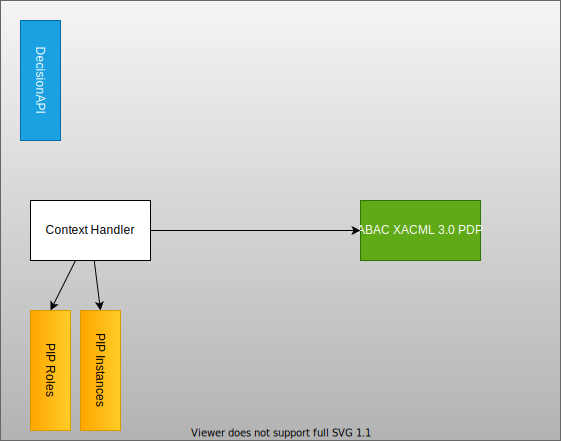

Se [løsningssidene](/nb/authorization/) for detaljer om funksjonaliteten denne komponenten tilbyr.

Diagrammet under viser hvor de ulike løsningskomponentene er plassert.

Autorisasjonskomponenten er bygget som en ASP.NET MVC-applikasjon som eksponerer API-er. API-ene kommuniserer med de ulike løsningskomponentene.

Diagrammet under viser dataflyten, inkludert PEP.

## Decision API

Decision API-et orkestrerer beslutningsprosessen.

API-et støtter både XACML XML og XACML JSON Profile-forespørsler.

Se [Decision Controller](https://github.com/Altinn/altinn-authorization/blob/main/src/Authorization/Controllers/DecisionController.cs) for kodedetaljer.

### Policy Decision Point - PDP

Dette er implementert som et eget [klassebibliotek](https://github.com/Altinn/altinn-authorization/tree/main/src/Altinn.Authorization.ABAC) som er [publisert på NuGet](https://www.nuget.org/packages/Altinn.Authorization.ABAC/).

Biblioteket inneholder alle modellene som er definert for XACML XML/JSON samt hjelpefunksjoner for å håndtere XACML-dokumenter.

Policy Decision Point er implementert i denne [klassen](https://github.com/Altinn/altinn-authorization/blob/main/src/Altinn.Authorization.ABAC/PolicyDecisionPoint.cs).

Den forventer både beslutningsforespørsel og policy som input.

### Policy Retrieval Point - PRP

Policy Retrieval Point-komponenten lagrer autorisasjonspolicyer for applikasjoner.

Policyene lagres som XACML (XML) dokumenter i en blob-lagring.

Når PDP mottar en autorisasjonsforespørsel, identifiserer PRP riktig policydokument i lagringen.

[See code](https://github.com/Altinn/altinn-authorization/blob/main/src/Authorization/Services/Implementation/PolicyRetrievalPoint.cs).

PRP er konfigurert som en tjeneste i autorisasjonskomponenten og kan enkelt erstattes med andre implementasjoner.

### Context Handler

Context Handler beriker autorisasjonsforespørselen med informasjon om brukeren og ressursen. Roller hentes fra SBL Bridge, mens ressursinformasjon hentes fra Instances i lagringen.

[See code](https://github.com/Altinn/altinn-authorization/blob/main/src/Authorization/Services/Implementation/ContextHandler.cs).

Context Handler er konfigurert som en tjeneste i autorisasjonskomponenten og kan enkelt erstattes med andre implementasjoner.

### Policy Information Point - Roles

PIP for roller kaller SBL Bridge for å hente reglene en bruker eller et system har for en ressurs-eier.

Dette er implementert som en tjeneste. [Se implementasjon](https://github.com/Altinn/altinn-authorization/blob/main/src/Authorization/Services/Implementation/RolesWrapper.cs)

Tjenesten kan enkelt erstattes med andre implementasjoner.

### Policy Information Point - Party

Denne funksjonen er implementert som en tjeneste. [Se implementasjon](https://github.com/Altinn/altinn-authorization/blob/main/src/Authorization/Services/Implementation/PartiesWrapper.cs)

Den kan enkelt erstattes med andre implementasjoner.

### Policy Information Point - Resources

PIP for ressurser henter instansinformasjon fra lagringen.

Dette er implementert som en tjeneste. [Se implementasjon](https://github.com/Altinn/altinn-authorization/blob/main/src/Authorization/Repositories/InstanceMetadataRepository.cs)

Tjenesten kan enkelt erstattes med andre implementasjoner.

## API-kontrollere

- [Decision](https://github.com/Altinn/altinn-authorization/blob/main/src/Authorization/Controllers/DecisionController.cs)
- [Policy](https://github.com/Altinn/altinn-authorization/blob/main/src/Authorization/Controllers/PolicyController.cs) (flyttes til Resource Registry)
- [Roles](https://github.com/Altinn/altinn-authorization/blob/main/src/Authorization/Controllers/RolesController.cs) (flyttes til Access Management)
- [Parties](https://github.com/Altinn/altinn-authorization/blob/main/src/Authorization/Controllers/PartiesController.cs) (flyttes til Access Management)

## Dependencies

Se [csproj-filen](https://github.com/Altinn/altinn-authorization/blob/main/src/Authorization/Altinn.Platform.Authorization.csproj).

## Slik bruker du Altinn Platform Authorization i egen løsning

PDP-en inneholder ingen Altinn-spesifikk funksjonalitet. Dette må du implementere i din egen løsning:

### Context Handler

Du må skrive din egen context handler som forstår domenet ditt og vet hvilken type berikelse som er nødvendig. I de enkleste scenarioene behøver den ikke gjøre noe dersom autorisasjonsforespørselen allerede inneholder all informasjon PDP trenger.

### PRP

Du må implementere funksjonalitet for å finne riktig XACML-policy. I Altinn har vi forskjellige policyer for ulike apper, men i enkle scenarioer kan det holde å referere til en statisk XACML-policy.

### PIP

Hvis context handler må berike
