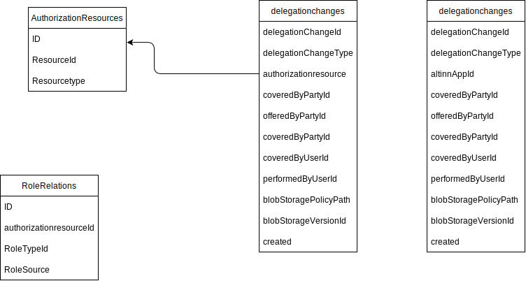

Se [løsningssiden](/nb/authorization/what-do-you-get/accessmanagement/) for en funksjonell beskrivelse av komponenten.


## Frontend

Frontend er utviklet som en frittstående React-applikasjon.

Den benytter følgende rammeverk:

- Axios
- Redux
- Redux Toolkit
- Redux Query

### Build & Deploy

Vi bruker GitHub Actions og Azure DevOps til å bygge frontend-applikasjonene.  
Kildekoden ligger i repoet [altinn-access-mangement-frontend](https://github.com/Altinn/altinn-access-management-frontend).

- [GitHub Actions](https://github.com/Altinn/altinn-access-management-frontend/actions)
- Azure DevOps-pipeline

### Hosting

Backend-en hoster den bygde frontend-applikasjonen.  
Filene ligger i mappen [wwwroot](https://github.com/Altinn/altinn-access-management/tree/main/backend/src/Altinn.Authorizationadmin/Altinn.Authorizationadmin/wwwroot/AuthorizationAdmin) i backend-prosjektet.

## Backend

Følgende API-kontrollere inngår i komponenten:

- [DelegationAPI](https://github.com/Altinn/altinn-access-management/blob/main/src/Altinn.AccessManagement/Controllers/DelegationsController.cs)
- [DelegationRequestAPI](https://github.com/Altinn/altinn-access-management/blob/main/src/Altinn.AccessManagement/Controllers/DelegationRequestsController.cs)
- DelegationResourcesAPI
- AuthenticationAPI

## Database

Data om delegasjoner lagres i PostgreSQL og Azure Blob Storage.

- `DelegationChange` – inneholder delegasjonsinformasjon for app-delegeringer
- `ResourceDelegationChange` – lagrer endringer for delegasjoner knyttet til ressurser
- `AuthorizationResources` – uttrekk fra ressursregisteret med de viktigste ressursopplysningene



## API

Følgende API-er er identifisert.

### Rights

Rights-API-et viser rettigheter mellom to parter (organisasjoner, brukere eller personer).

Rettighetene bygger på regler definert av tjenesteeier eller rettigheter som en avgiver har delegert videre.

Eksempler på konsumenter av API-et:

- Sluttbruker som vil se hvilke rettigheter vedkommende har på vegne av en avgiver
- Administrator for avgiveren
- Ressurseier som trenger oversikt over hvilke rettigheter part A har overfor part B

#### Outbound Rights

Outbound-API-et er rettet mot administratorer hos avgiveren.

```http
/accessmanagement/api/v1/{who}/rights/outbound/?resource={resource}&recevingParty={receivingparty}
```

**Eksempel**

```http
/accessmanagement/api/v1/234234/rights/outbound/?resource=app:skd_flyttemelding&recevingParty=556677
```

#### Inbound Rights

```http
/accessmanagement/api/v1/{who}/rights/inbound/?resource={resource}&recevingParty={receivingparty}
```

**Eksempel**

```http
/accessmanagement/api/v1/234234/rights/inbound/?resource=app_skd_flyttemelding&recevingParty=556677
```

#### Respons

Responsen inneholder alle rettigheter for relevante relasjoner:

- Rettigheter fra policy definert av tjenesteeier (f.eks. ER-roller eller Altinn-roller)
- Rettigheter fra delegerte policyer

```json
[
    {
        "PolicyId": "app:skd_flyttemelding",
         "PolicyVersion": "??",
        "RuleId" : "1",
        "OfferedByPartyId": "234234",
        "CoveredBy"[
            {
                "id": "urn:altinn:party",
                "value": "556677"
            }
        ],
        "Subject"[
            {
                "id": "urn:altinn:role",
                "value": "dagl"
            }
        ],
        "Resource"[
            {
                "id": "urn:altinn:org",
                "value": "skd"
            },
            {
                "id": "urn:altinn:app",
                "value": "flyttemelding"
            }
        ],
        "Action":
            {
                "id": "urn:altinn:action",
                "value": "read"
            }
        ,
        "RightSourceType":"Role",
        "HasPermit": true
    },
    {
        "PolicyId": "app:skd_flyttemelding",
         "PolicyVersion": "??",
        "RuleId" : "2",
        "OfferedByPartyId": "234234",
        "CoveredBy"[
            {
                "id": "urn:altinn:party",
                "value": "556677"
            }
        ],
        "Subject"[
            {
                "id": "urn:altinn:role",
                "value": "dagl"
            }
        ],
        "Resource"[
            {
                "id": "urn:altinn:org",
                "value": "skd"
            },
            {
                "id": "urn:altinn:app",
                "value": "flyttemelding"
            }
        ],
        "Action":
            {
                "id": "urn:altinn:action",
                "value": "write"
            }
        ,
        "RightSourceType":"Role",
        "HasPermit": true
    },
    {
        "PolicyId": "/skd_flyttemedling/234234/234234234",
        "PolicyVersion": "2010-12-10 10:35:123",
        "RuleId" : "1",
        "OfferedByPartyId": "234234",
        "CoveredBy"[
            {
                "id": "urn:altinn:party",
                "value": "556677"
            }
        ],
        "Subject"[
            {
                "id": "urn:altinn:user",
                "value": "234234"
            }
        ],
        "Resource"[
            {
                "id": "urn:altinn:org",
                "value": "skd"
            },
            {
                "id": "urn:altinn:app",
                "value": "flyttemelding"
            }
        ],
        "Action":
            {
                "id": "urn:altinn:action",
                "value": "sign"
            }
        ,
        "RightSourceType":"AppDelegation",
        "HasPermit": true
    }
]
```

### Rights delegations

#### Liste

Delegations-API-et viser at det finnes rettigheter mellom to parter for en spesifikk ressurs eller ressurstype.

I første iterasjon eksponerer vi et eget endepunkt for Maskinporten-skjemaer for å utsette behovet for et generisk endepunkt.

Endepunkt for sluttbrukere i portalen:

```http
/accessmanagement/api/v1/{who}/delegations/maskinportenscheme/outbound/
```

```http
/accessmanagement/api/v1/admin/delegations/maskinportenscheme/outbound/?supplierORg=234234&consumerOrg&scope=www.navn.no
```

Responsen er en liste over delegasjoner med mottaker, toppressurs og tidsinformasjon.

```json
[
  {
    "ResourceId": "resource:innteksapi",
    "ResourceTitle": "2022-01-22",
    "Delegation": [
      {
        "CoveredByName": "EVRY",
        "OfferedByName": "NAV",
        "OfferedByPartyId": 123134234,
        "CoveredByPartyId": 234234,
        "PerformedByUserId": 123123,
        "Created": "2020-01-01",
        "OfferedByOrganizationNumber": null,
        "CoveredByOrganizationNumber": null
      },
      {
        "CoveredByName": "KPMG",
        "OfferedByName": "NAV",
        "OfferedByPartyId": 123134234,
        "CoveredByPartyId": 234234,
        "PerformedByUserId": 123123,
        "Created": "2020-01-01",
        "OfferedByOrganizationNumber": null,
        "CoveredByOrganizationNumber": null
      }
    ]
  }
]
```

**POST**

Oppretter nye rettigheter ved å legge til nye regler.

### Rights delegation

Gir detaljer om en spesifikk delegasjon.

```http
/accessmanagement/api/v1/admin/delegations/rules/?offeredByPartyId=2324
```

```json
[
    {
        "PolicyId": "d9da781a-b8d0-46f6-ba33-882a2e47c0c6",
        "RuleId" : "asdfasdfsdaf",
        "OfferedByPartyId": "234234",
        "CoveredBy"[
            {
                "id": "urn:altinn:party",
                "value": "556677"
            }
        ],
        "Subject"[
            {
                "id": "urn:altinn:userid",
                "value": "123123"
            }
        ],
        "Resource"[
            {
                "id": "urn:altinn:org",
                "value": "skd"
            },
            {
                "id": "urn:altinn:app",
                "value": "flyttemelding"
            }
        ],
        "Action":
            {
                "id": "urn:altinn:action",
                "value": "read"
            }
        ,
        "RightSourceType":"Role",
        "HasPermit": true
    },
    {
        "PolicyId": "app:skd_flyttemelding",
        "RuleId" : "asdfasdfsdaf",
        "OfferedByPartyId": "234234",
        "CoveredBy"[
            {
                "id": "urn:altinn:party",
                "value": "556677"
            }
        ],
        "Subject"[
            {
                "id": "urn:altinn:role",
                "value": "dagl"
            }
        ],
        "Resource"[
            {
                "id": "urn:altinn:org",
                "value": "skd"
            },
            {
                "id": "urn:altinn:app",
                "value": "flyttemelding"
            }
        ],
        "Action":
            {
                "id": "urn:altinn:action",
                "value": "write"
            }
        ,
        "RightSourceType":"Role",
        "HasPermit": true
    }
]
```

##### Delegations

##### Access Groups

```
/accessmanagement/api/v1/accessgroups
/accessmanagement/api/v1/accessgroups/offeredBy/{partyId}/coveredBy/{partyId}
```

`GET` – Liste over grupper

```
/accessmanagement/api/v1/accessgroups/{group}/resorucerights/
/accessmanagement/api/v1/accessgroups/{group}/resorucerights/{resourceid}/
```

`GET`

```json
[
    {
        "PolicyId": "d9da781a-b8d0-46f6-ba33-882a2e47c0c6",
        "RuleId" : "asdfasdfsdaf",
        "OfferedByPartyId": "234234",
        "CoveredBy"[
            {
                "id": "urn:altinn:party",
                "value": "556677"
            }
        ],
        "Subject"[
            {
                "id": "urn:altinn:userid",
                "value": "123123"
            }
        ],
        "Resource"[
            {
                "id": "urn:altinn:org",
                "value": "skd"
            },
            {
                "id": "urn:altinn:app",
                "value": "flyttemelding"
            }
        ],
        "Action":
            {
                "id": "urn:altinn:action",
                "value": "read"
            }
        ,
        "RightSourceType":"Role",
        "HasPermit": true
    },
    {
        "PolicyId": "app:skd_flyttemelding",
        "RuleId" : "asdfasdfsdaf",
        "OfferedByPartyId": "234234",
        "CoveredBy"[
            {
                "id": "urn:altinn:party",
                "value": "556677"
            }
        ],
        "Subject"[
            {
                "id": "urn:altinn:role",
                "value": "dagl"
            }
        ],
        "Resource"[
            {
                "id": "urn:altinn:org",
                "value": "skd"
            },
            {
                "id": "urn:altinn:app",
                "value": "flyttemelding"
            }
        ],
        "Action":
            {
                "id": "urn:altinn:action",
                "value": "write"
            }
        ,
        "RightSourceType":"Role",
        "HasPermit": true
    }
]
```

####

### Sikkerhet

#### Autentisering

API-ene er beskyttet og krever at bruker eller virksomhet er autentisert.

Token leveres via informasjonskapsel for brukere av React-grensesnittet, eller som Bearer-token i headeren.

Altinn Access Management benytter JWTCookie-autentisering som støtter validering av både JWT-cookie og JWT-bearer-token.

Avklaring: Støtter vi Maskinporten-token direkte?

#### CSRF-beskyttelse

API-endepunktene er sikret mot CSRF.

#### API Management-abonnement

Noe funksjonalitet krever et spesifikt abonnement i API Management.  
Eksterne konsumenter må følge SLA og ha en avtale for bruk av API-et.

### Autorisasjon

Tilgangen til API-ene krever autorisasjon på ulike nivåer.

Noen API-er krever generell tilgang til en ressurs. Dette håndteres av standard Policy Enforcement Point eller en tilpasset variant.

I tillegg har API-ene ofte intern logikk som filtrerer data basert på forretningsregler. Dette er egne implementasjoner.

### Database-repositorium

Access Management eier de delegerte rettighetene.

- PostgreSQL lagrer informasjon om delegerte policyer
- Azure Blob Storage benyttes i tillegg

Se [migreringsskript](https://github.com/Altinn/altinn-access-management/tree/main/backend/src/Altinn.Authorizationadmin/Altinn.Authorizationadmin/Migration) for tabellstruktur og lagrede prosedyrer.

## Build & Deploy

- Bygg og kodeanalyse kjøres via en [GitHub Action](https://github.com/Altinn/altinn-resource-registry/actions)
- Bygg av container-image gjøres i [Azure DevOps](https://dev.azure.com/brreg/altinn-studio/_build?definitionId=385)
- Deploy av imaget gjøres i [Azure DevOps](https://dev.azure.com/brreg/altinn-studio/_release?_a=releases&view=all&definitionId=36)
