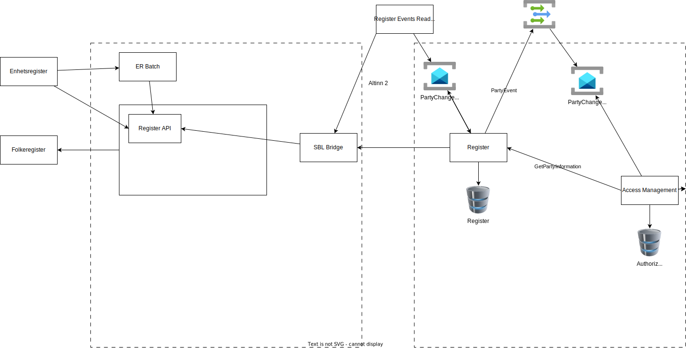

The register component is supporting component that is part of the authorization area of Altinn, but it supported include register information
to Apps and other components needing register information.

## Architecture

The register component itself is a .Net application exposing API.  Currently it just works as a proxy for Altinn 2 register
but we are now working on adding local storage of data for better performance and to be able to turn of Altinn 2 in 2026.

The planned design

## Database design

Database design

