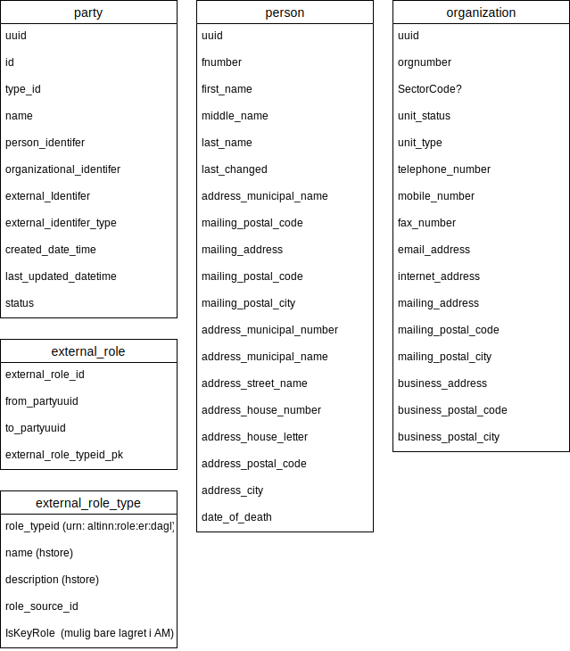

- ER - Enhetsregisteret - Information about organisations in Norway
- DSF - Det Sentrale Folkeregisteret - Information about citizens in Norway.

## ER - Enhetsregisteret
ER registeret can be used to prefill information, retrieve information based on user input or for validation of input of users.

Altinn Platform does not have a own copy of ER. It currently uses Altinn II plaform as source for register.


The register component is an ASP.Net Core MVC Application exposing REST-API to Altinn Apps.

The solution is now available at https://platform.altinn.cloud/register/api/v1 and all resources are avaiable through endpoints defined below.

Resource: Organizations, Parties, Persons

## /organizations

Get information about an organisation:

### Organization type

| Attribute | Type | Description |
| --------- | ---- | ----------- |
| OrgNumber | string  | the organisation number nine digits |
| Name |  string | the registered name of the organisation |
| UnitType | string  |    |
| TelephoneNumber | string   | the telephone number |
| MobileNumber |  string | the mobile number |
| FaxNumber |  string | the fax number |
| EMailAddress | string | the email adress  |
| InternetAddress | string | the url for a web site |
| MailingAddress | string | the adress for sending mail to the organisation |
| MailingPostalCode | string | the postal code for sending mail to the organisation |
| MailingPostalCity | string | the city for sending mail to the organisation  |
| BusinessAddress | string | the address of the daily business |
| BusinessPostalCode | string | the postal code for the daily business  |  
| BusinessPostalCity | string | the city for the daily business|  

### Operations

```http
GET /organizations/{orgNr}
```

## /persons

### Person type
| Attribute | Type | Description |
| --------- | ---- | ----------- |
| SSN | string |  Social security number |
| Name | string | the person's full name |
| FirstName | string | the person's first name |
| MiddleName | string | the person's middle name |
| LastName | string | the person's last name |
| TelephoneNumber | string | telephone number |
| MobileNumber | string  | mobile number |
| MailingAddress | string |  mailing address |
| MailingPostalCode | string | mailing postal code |
| MailingPostalCity | string | mailing postal city |
| AddressMunicipalNumber | string | adress municipal number |
| AddressMunicipalName | string | adress municipal name |
| AddressHouseNumber | string | address house number |
| AddressHouseLetter | string | address house letter |
| AddressPostalCode | string | address postal code |
| AddressCity |string  | adress city  |

### Operations

Get information about a person:
Send a GET-request with the persons SSN contained in the request body to

```http
GET /persons
```

## /parties

### Party type

| Attribute | Type | Description |
| --------- | ---- | ----------- |
| PartyId | int | the party ID |  
| PartyTypeName | PartyType | the type of the party; organisation or person |  
| OrgNumber | string | the organisation number. Empty string if party is person. |  
| SSN | string | the social security number. Empty string if party is organisation. |  
| UnitType | string |  |  
| Name | string | the full name of the person or name of the organisation |  
| IsDeleted | bool | true is the organisation has been deleted from the registery |  
| OnlyHiearhyElementWithNoAccess | bool | true if party is a parent unit with no access in current context|  
| Person | Person | the person the party represents |  
| Organization | Organization | the organisation the party represents |  
| ChildParties | List<Party> | List of sub units if the party is an organisation |  

### Operations

Get information about a party:

```http
GET /parties/{partyId}
```

Lookup a party id based on social secutiry number or organisation number:
(SSN or OrgNumber should be included in string format in the request body.)

```http
GET /parties/lookup
```

Lookup a party based on social secutiry number or organisation number:
(SSN or OrgNumber should be included in string format in the request body.)

```http
GET /parties/lookupObject
```


## Database design

