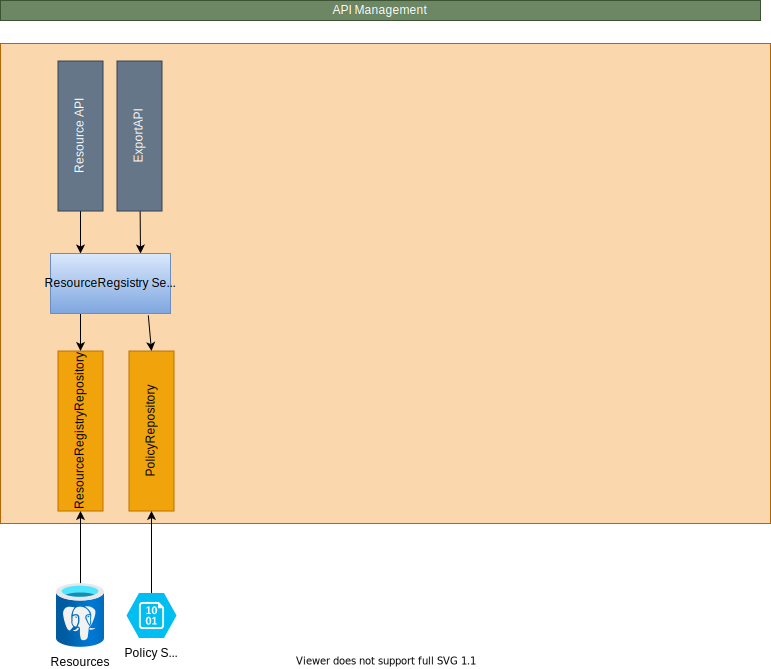

Se også [løsningskomponenter](/nb/authorization/what-do-you-get/resourceadministration/) for funksjonell beskrivelse.

## API

Komponenten eksponerer følgende API-er:

- [ResourceRegistryAPI](https://github.com/Altinn/altinn-resource-registry/blob/main/src/ResourceRegistry/Controllers/ResourceController.cs)
- [ExportAPI](https://github.com/Altinn/altinn-resource-registry/blob/main/src/ResourceRegistry/Controllers/ExportController.cs)

## Repository

Ressursene lagres som JSON i en PostgreSQL-database.

- [Table Setup](https://github.com/Altinn/altinn-resource-registry/blob/main/src/ResourceRegistry/Migration/v0.00-resource-registry/01-setup-tables.sql)

Policyer lagres som XML-dokumenter i Azure Blob Storage.

## Build & Deploy

- Bygg og kodeanalyse kjøres av en [GitHub Action](https://github.com/Altinn/altinn-resource-registry/actions)
- Container-image bygges i [Azure DevOps](https://dev.azure.com/brreg/altinn-studio/_build?definitionId=385)
- Deploy av imaget gjøres i [Azure DevOps](https://dev.azure.com/brreg/altinn-studio/_release?_a=releases&view=all&definitionId=36)
