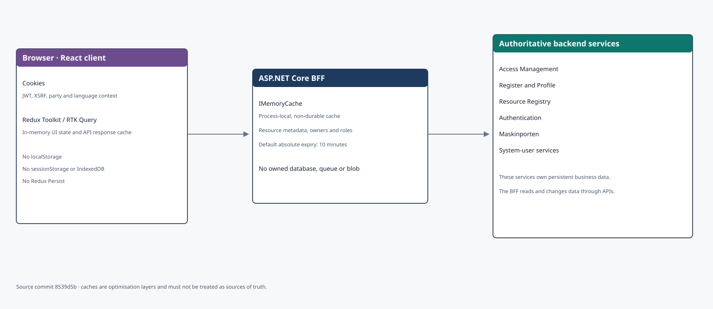
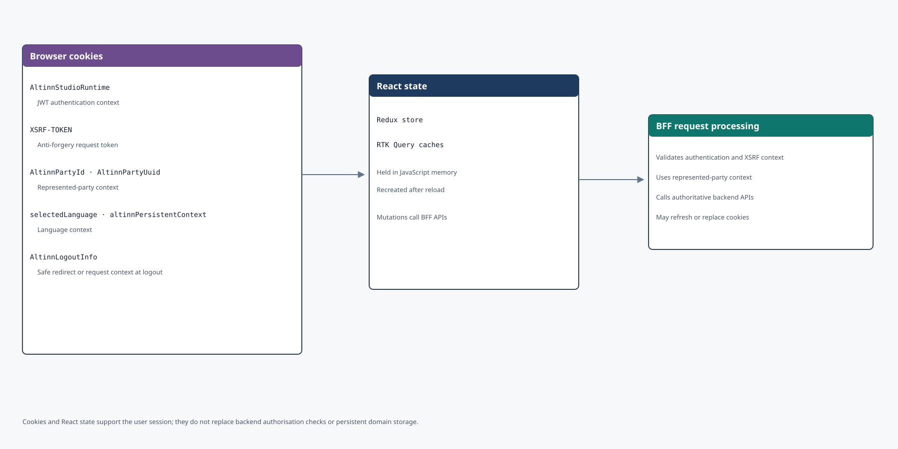

Access Management UI owns no database, message queue or blob container. The React client and BFF hold short-lived state, whilst backend services own the authoritative data. The model is based on [source commit `8539d5b`](https://github.com/Altinn/altinn-access-management-frontend/tree/8539d5bd44c1fbace079a65dfa42831a599f8806).

Select a diagram to open it at full size in a new tab.

## Storage boundary

The React client uses Redux Toolkit and RTK Query for state and API responses. The code does not use `localStorage`, `sessionStorage`, IndexedDB or Redux Persist. State disappears when the browser context is reloaded.

The BFF uses `IMemoryCache`. The cache is local to each process and is neither shared between instances nor an authoritative data source. Default configuration uses a ten-minute absolute expiry for resource metadata and resource owners.

## Browser cookies

The key cookie groups are:

- `AltinnStudioRuntime` contains the JWT used by the BFF when calling backend services
- `XSRF-TOKEN` protects against forged requests and is sent as `X-XSRF-TOKEN`
- `AltinnPartyId` and `AltinnPartyUuid` identify the represented party
- `selectedLanguage` and `altinnPersistentContext` affect language selection
- `AltinnLogoutInfo` supports controlled redirects and selected request identifiers during logout

Cookies are client state, not the component's business database. Changes to access, consent, system users and requests are persisted through APIs by the service that owns the data.

## External data ownership

The BFF composes data from Access Management, Register, Resource Registry, Profile, Authentication, Maskinporten and system-user services. The diagram presents these as external authoritative sources. Their database models are documented on the pages for the respective components.

## Scope and maintenance

Update this page if the component gains a database, distributed cache, browser storage or new security-critical cookies. Moving from process-local to distributed caching would also change the consistency and operational model.
