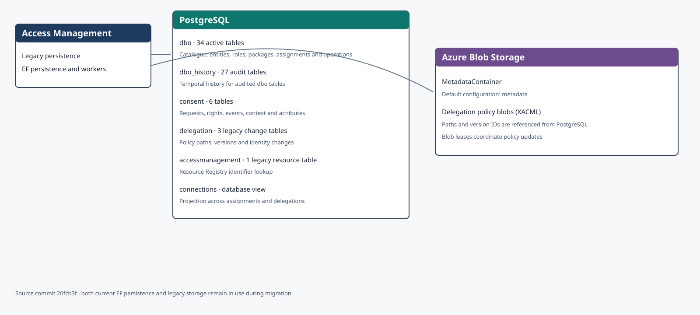
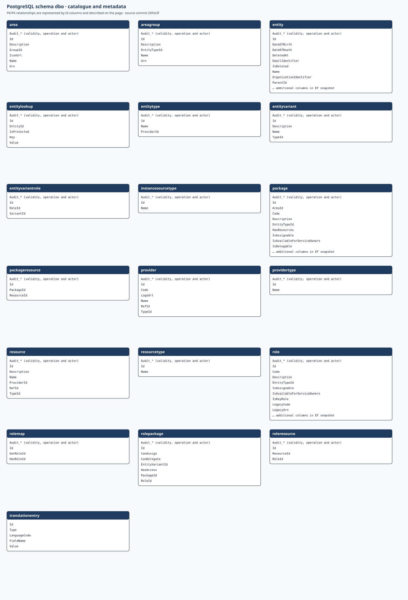
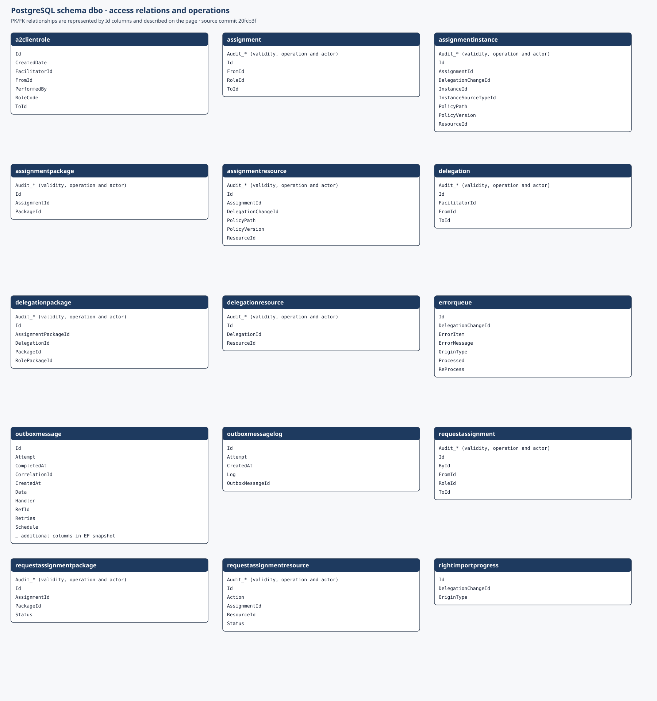
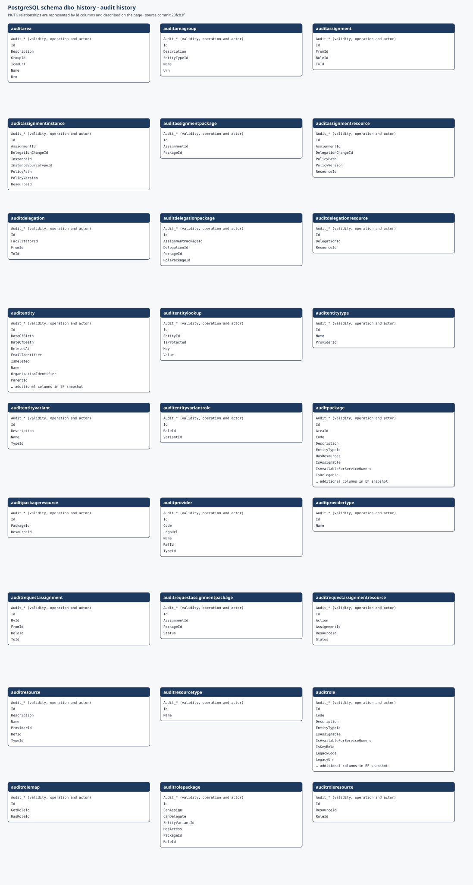
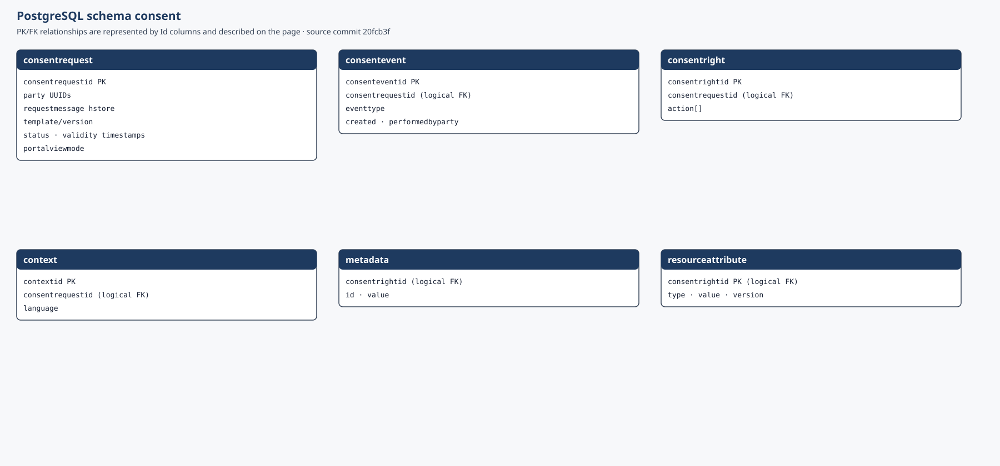
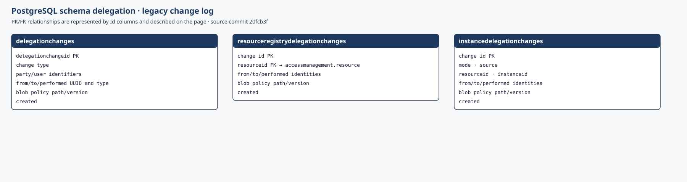
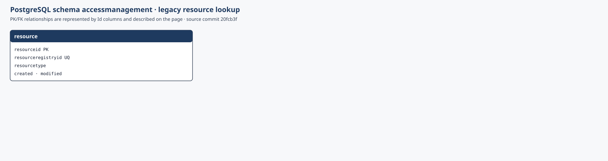

Persistensarkitekturen viser både den nyere EF-baserte modellen og de eldre skjemaene som fortsatt brukes. Modellen bygger på [EF-snapshoten og SQL-migreringene i kildecommit `20fcb3f`](https://github.com/Altinn/altinn-authorization-tmp/tree/20fcb3f06a20b93ba7bba04a2fa8f55b57d033cb/src/apps/Altinn.AccessManagement/src).

Klikk på et diagram for å åpne det i full størrelse i en ny fane.

## Lagringsoversikt

## Skjemaet `dbo`

`dbo` er delt i to diagrammer fordi skjemaet har 34 tabeller.

### Katalog og metadata

Tabellene beskriver parter, tilbydere, ressurser, roller, områder og tilgangspakker. Koblingstabellene uttrykker hvilke roller som gir pakker og ressurser.

### Tilgangsforhold og drift

Denne delen inneholder tildelinger, delegeringer, forespørsler, instans- og ressurskoblinger, utboks, feilkø og importfremdrift. Visningen `connections` projiserer forbindelser på tvers av tildelinger og delegeringer, men er ikke en tabell.

## Skjemaet `dbo_history`

De 27 revisjonstabellene lagrer gyldighetsperiode, endringsoperasjon og parten eller systemet som utførte endringen, sammen med en kopi av domenefeltene.

## Skjemaet `consent`

Skjemaet har seks tabeller for samtykkeforespørsler, rettigheter, hendelser, språkontekst, metadata og ressursattributter. Flere koblinger håndheves logisk og mangler fremmednøkler i baseline-skriptet.

## Eldre skjemaer

### `delegation`

De tre endringstabellene peker til policyblobens sti og versjon og lagrer identitetene som inngår i delegeringen.

### `accessmanagement`

Skjemaet inneholder ressursoppslaget som `resourceregistrydelegationchanges` refererer til.

## Blobcontainer

`MetadataContainer` angir containeren for XACML-policyblobber. Standardkonfigurasjonen bruker `metadata`. PostgreSQL lagrer policyens sti og versjons-ID, mens blob leases samordner oppdateringer. Kontonavn og containernavn kan variere mellom miljøene.

## Avgrensning og vedlikehold

EF-diagrammene er generert fra `AppDbContextModelSnapshot` og viser sentrale kolonner. Revisjonsfelter er samlet som `Audit_*`. Indekser, kontrollregler, triggere, funksjoner og alle fremmednøklinavn er utelatt for lesbarhet. Oppdater diagrammene og kildecommitten når EF-snapshoten, SQL-migreringene eller blobkonfigurasjonen endres.