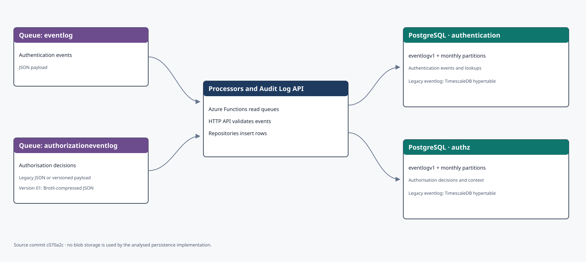
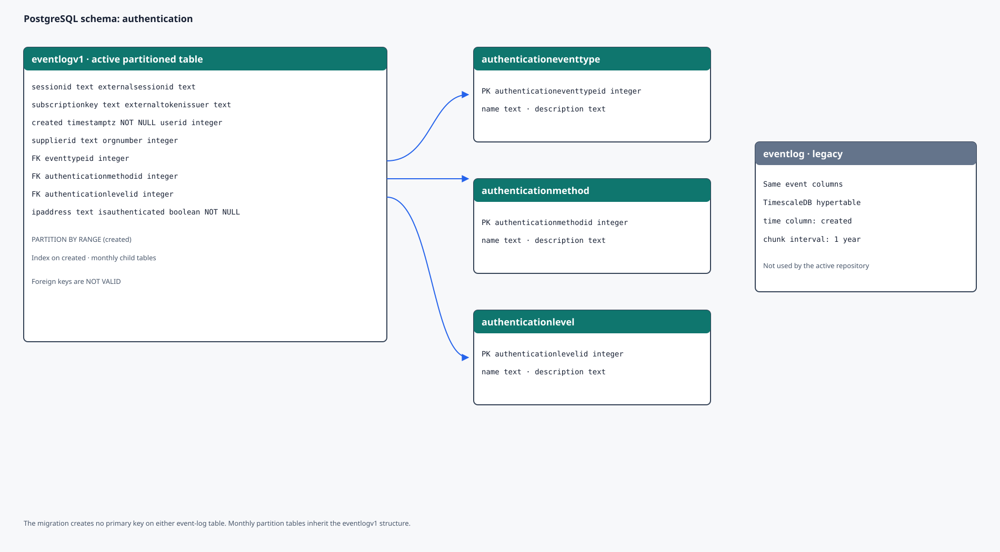
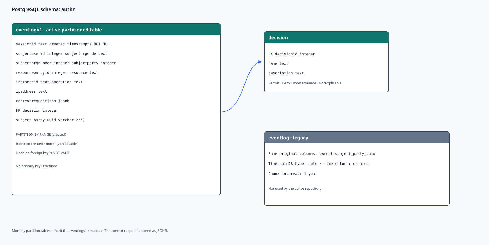
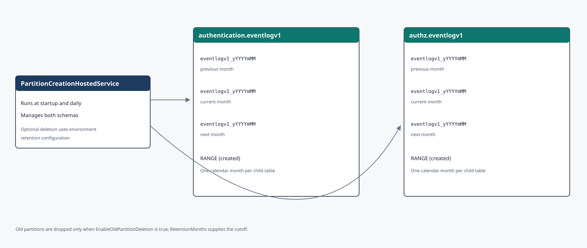

Audit Log stores authentication and authorisation events in PostgreSQL. Azure Storage queues receive events before functions forward them to the Audit Log API. The model is based on [source commit `c070a2c`](https://github.com/Altinn/altinn-auth-audit-log/tree/c070a2c4e18ee648ed9fb8a82dc53e2889ee235e).

Select a diagram to open it at full size in a new tab.

## Storage overview

The `eventlog` queue receives authentication events. The `authorizationeventlog` queue receives authorisation events in both legacy JSON and a versioned, Brotli-compressed format. Azure Functions read the queues and send events to the API, which writes them to PostgreSQL.

## The `authentication` schema

The active `eventlogv1` table stores authentication events and is partitioned by `created`. Three lookup tables describe event type, authentication method and assurance level. The foreign keys are created as `NOT VALID`: PostgreSQL enforces them for new and changed rows, but the migration did not check existing rows.

The legacy `eventlog` table has the same fields and is a TimescaleDB hypertable with a one-year interval. It remains in the migrations, but the active repository writes to `eventlogv1`.

## The `authz` schema

The active `eventlogv1` table stores decision context, resource, operation and the PDP decision. `decision` is a lookup table containing Permit, Deny, Indeterminate and NotApplicable. `subject_party_uuid` was added after the original table migration.

The legacy `eventlog` table is a TimescaleDB hypertable and does not contain `subject_party_uuid`. The active repository writes to `eventlogv1`.

## Monthly partitions and retention

A background service creates partitions for the previous, current and next months in both schemas. Names follow `eventlogv1_yYYYYmMM`. The service runs at startup and then daily.

Old-partition deletion is controlled per environment by `EnableOldPartitionDeletion` and `RetentionMonths`. The default configuration disables deletion. The production configuration specifies 24 months but also disables deletion at the analysed commit. This documents technical configuration, not a legal or business retention policy.

## Scope and maintenance

The diagrams show tables, key relations, queues and partitions. Grants, complete lookup values and TimescaleDB internal tables are omitted. The analysed persistence implementation contains no blob containers.
