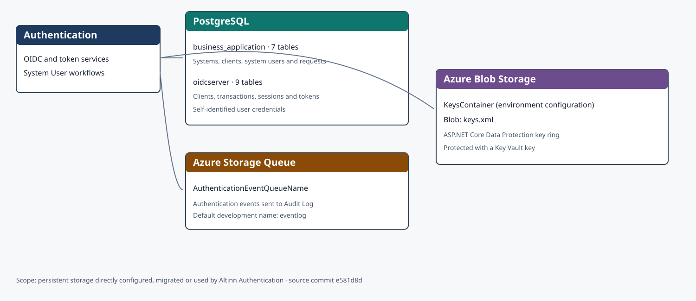
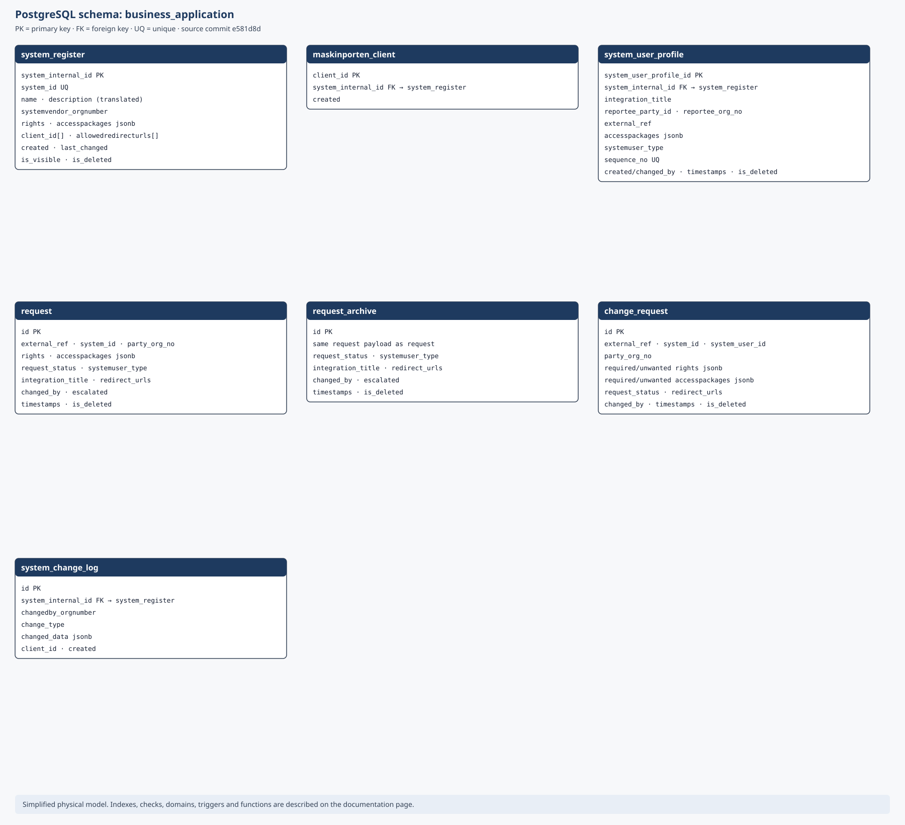
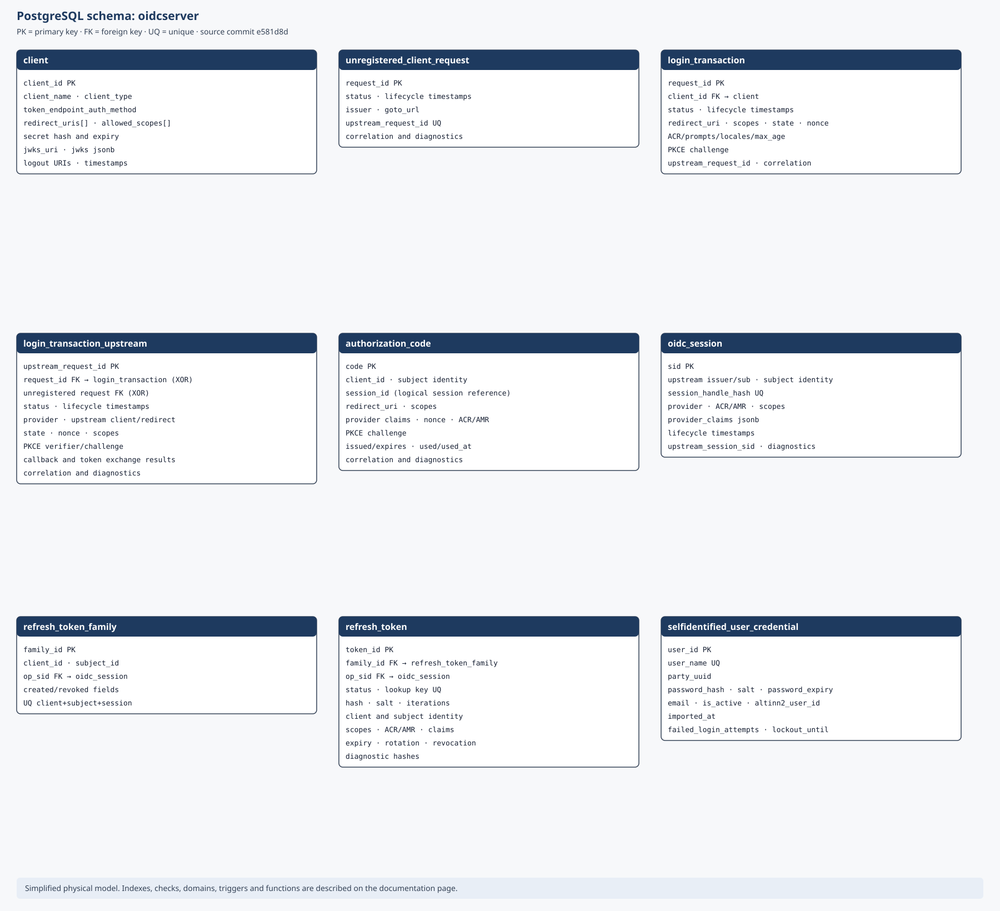

Persistensarkitekturen viser hvordan Authentication lagrer varige data. Modellen bygger på migreringene til og med versjon 0.29 i [kildecommit `e581d8d`](https://github.com/Altinn/altinn-authentication/tree/e581d8d61542e87709f5b7292af4532693072832/src/Persistance/Migration).

## Lagringsoversikt

Klikk på diagrammene for å åpne dem i full størrelse i en ny fane.

Authentication bruker to PostgreSQL-skjemaer, én konfigurerbar blobcontainer for Data Protection-nøkler og én Azure Storage-kø for autentiseringshendelser.

## Skjemaet `business_application`

De sju tabellene lagrer registrerte systemer, Maskinporten-klienter, systembrukere, forespørsler, arkiv og endringslogg. `system_register` er roten for klienter, systembrukerprofiler og endringslogg. Forespørselstabellene bruker logiske identifikatorer uten fremmednøkler til roten.

## Skjemaet `oidcserver`

De ni tabellene lagrer OIDC-klienter, innloggingstransaksjoner, autorisasjonskoder, sesjoner, oppfriskingstoken og innloggingsopplysninger for selvregistrerte brukere. Oppstrømstransaksjonen peker til enten en registrert eller uregistrert klientflyt; en kontrollregel krever nøyaktig én av dem.

`authorization_code.session_id` er en logisk referanse til `oidc_session.sid`, men migreringen oppretter ingen fremmednøkkel.

## Blobcontainer og kø

`KeysContainer` angir blobcontaineren. Blobobjektet `keys.xml` inneholder nøkkelringen til ASP.NET Core Data Protection og beskyttes med en nøkkel fra Key Vault. Containernavnet varierer mellom miljøene.

`AuthenticationEventQueueName` angir køen som mottar autentiseringshendelser før Audit Log behandler dem. Utviklingskonfigurasjonen bruker navnet `eventlog`.

## Avgrensning og vedlikehold

SVG-ene viser tabellene, sentrale kolonner og eksplisitte relasjoner. De utelater indekser, kontrollregler, PostgreSQL-domener, triggere og funksjoner for å være lesbare. Oppdater diagrammene og kildecommitten når migreringer eller lagringskonfigurasjon endres.