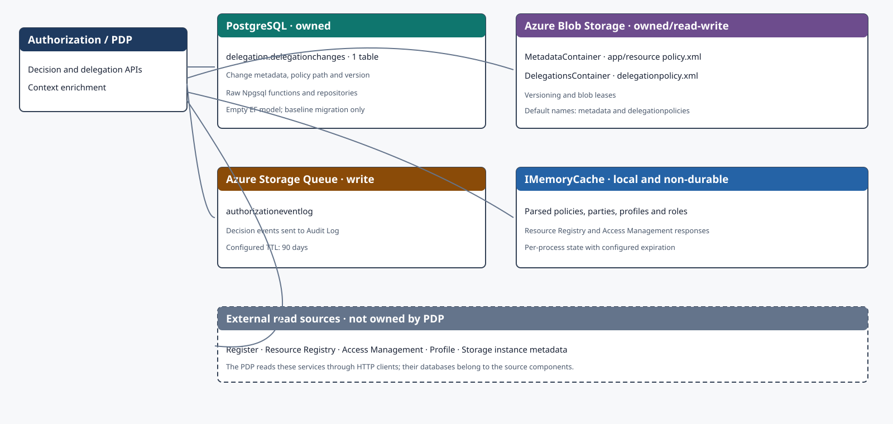
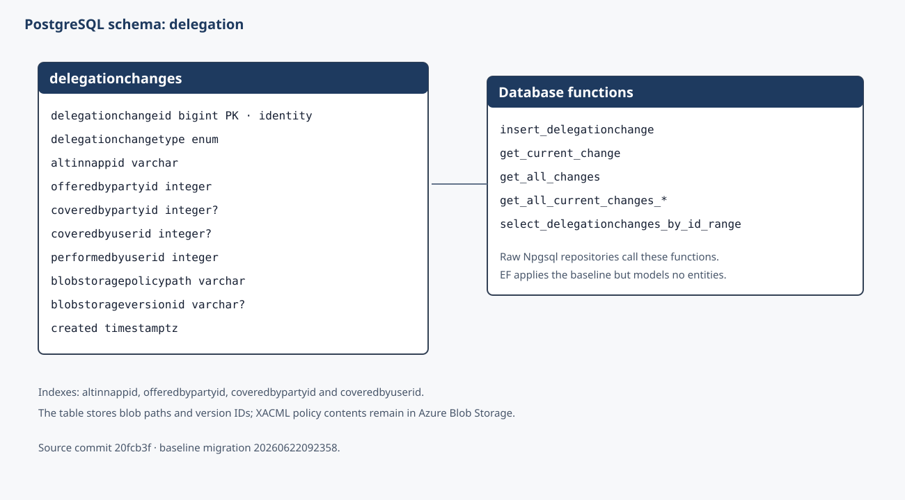
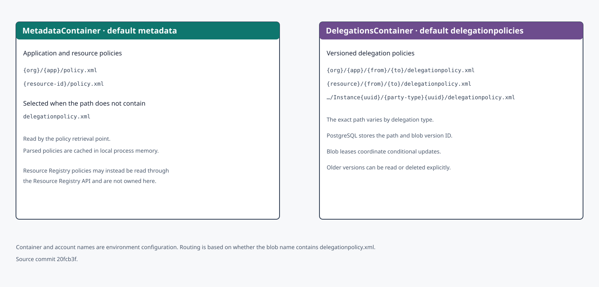

Persistensarkitekturen skiller mellom data som PDP eier, data den skriver til, lokal ikke-varig hurtigbuffer og data den leser fra andre komponenter. Modellen bygger på [kildecommit `20fcb3f`](https://github.com/Altinn/altinn-authorization-tmp/tree/20fcb3f06a20b93ba7bba04a2fa8f55b57d033cb/src/apps/Altinn.Authorization/src/Altinn.Authorization).

Klikk på et diagram for å åpne det i full størrelse i en ny fane.

## Lagringsoversikt

PDP eier én PostgreSQL-tabell og bruker to blobcontainere. Autorisasjonshendelser skrives til en Azure Storage-kø. Opplysninger fra Register, Resource Registry, Access Management, Profile og Storage leses gjennom API-er og er ikke eid av PDP.

## Databaseskjemaet `delegation`

`delegationchanges` er en append-orientert endringslogg. Hver rad inneholder stien til en delegeringspolicy i Blob Storage og, når den finnes, blobversjonens ID. Databasefunksjoner finner gjeldende endring eller historikk for en kombinasjon av app og parter.

`AuthorizationDbContext` har ingen `DbSet` og EF-snapshoten er tom. EF bruker en håndskrevet baseline til å opprette eller adoptere skjemaet, mens rå Npgsql-repositories fortsetter å bruke tabellen og funksjonene. Tilbakemigreringen er med vilje tom for å unngå tap av delegeringsdata.

## Blobstruktur

`MetadataContainer` bruker standardnavnet `metadata` og inneholder app- og ressurspolicyer. `DelegationsContainer` bruker standardnavnet `delegationpolicies` og inneholder versjonerte `delegationpolicy.xml`-filer. Repositoryet velger container ut fra filnavnet.

Blob leases beskytter samtidige policyoppdateringer. PostgreSQL lagrer blobstien og en eventuell versjons-ID, slik at PDP kan evaluere policyversjonen som hører til endringen når den er angitt.

## Hendelseskø og hurtigbuffer

`AuthorizationEventQueueName` angir køen for beslutningshendelser. Standardkonfigurasjonen bruker `authorizationeventlog`. Hendelsene sendes til Audit Log, og kømeldingene har en TTL på 90 dager.

`IMemoryCache` lagrer blant annet tolkede policyer, parter, profiler, roller og svar fra Resource Registry og Access Management. Hurtigbufferen er lokal for prosessen og er ikke en autoritativ eller varig datakilde.

## Avgrensning og vedlikehold

Diagrammene viser PDP-ens egne lagringsgrenser. De dokumenterer ikke tabellene bak eksterne API-er. Oppdater diagrammene og kildecommitten når baseline-migreringen, policybanene, containerkonfigurasjonen, køen eller hurtigbufferstrategien endres.