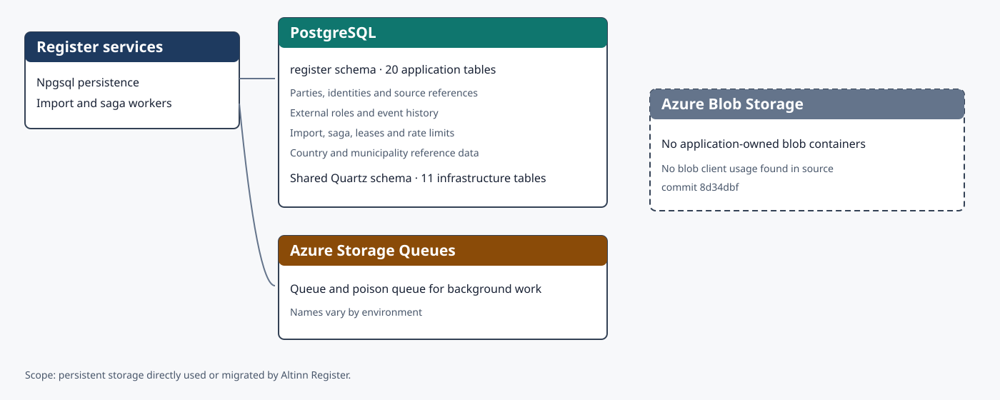
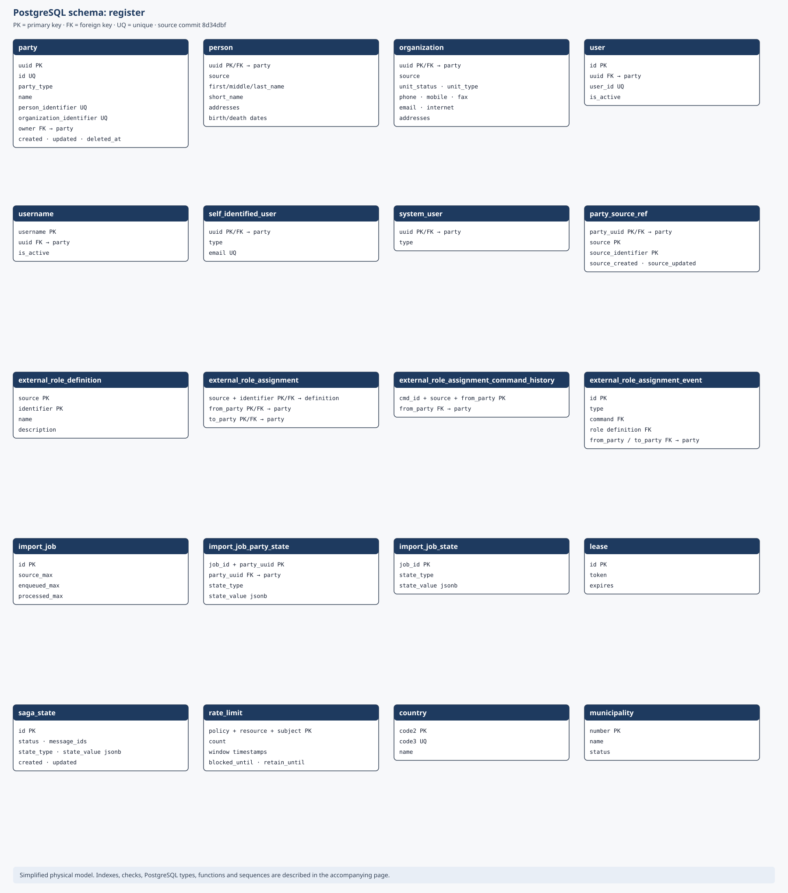

Persistensarkitekturen viser hvordan Register lagrer varige data. Modellen bygger på SQL-migreringene til og med versjon 0.63 i [kildecommit `8d34dbf`](https://github.com/Altinn/altinn-register/tree/8d34dbf828e40b8d529f0ee2040aa1eeed55bd87/src/apps/Altinn.Register/src/Altinn.Register.Persistence/Migration).

## Lagringsoversikt

Klikk på diagrammet for å åpne det i full størrelse i en ny fane.

Register eier PostgreSQL-skjemaet `register`. MassTransit-oppsettet etablerer i tillegg elleve Quartz-tabeller i et konfigurerbart, delt infrastrukturskjema. Register bruker Azure Storage Queues til bakgrunnsarbeid, men kildekoden bruker ikke Azure Blob Storage og definerer derfor ingen applikasjonseide blobcontainere.

## Databasemodell

Klikk på diagrammet for å åpne det i full størrelse i en ny fane.

### Hovedområder

- `party` er roten for personer, organisasjoner, brukere, selvregistrerte brukere og systembrukere.
- `external_role_definition` beskriver rolletypen, mens `external_role_assignment` knytter to parter sammen. Kommandohistorikken og hendelsestabellen gir idempotens og et endringsspor.
- import-, saga- og leietabellene lagrer fremdrift og koordinering for bakgrunnsjobber.
- `country` og `municipality` inneholder oppslagsdata.
- `rate_limit` lagrer tellere og tidsvinduer for hastighetsbegrensning.

### Avgrensning

SVG-en viser alle 20 applikasjonstabellene og de viktigste kolonnene, primærnøklene, fremmednøklene og unike nøklene. Den utelater indekser, PostgreSQL-domener og -typer, sekvenser, kontrollregler og lagrede funksjoner for å holde modellen lesbar. Disse detaljene finnes i de versjonslåste migreringene.

`import_job_state.job_id` og `import_job_party_state.job_id` har med vilje ingen fremmednøkkel til `import_job`, fordi tabellene oppdateres i forskjellige transaksjoner.

## Vedlikeholde modellen

Når en migrering oppretter, endrer, gir nytt navn til eller sletter en tabell, må teamet oppdatere SVG-en og kildecommitten på denne siden. Endringer i Azure Storage-klienter må også kontrolleres, slik at nye køer eller blobcontainere blir dokumentert.