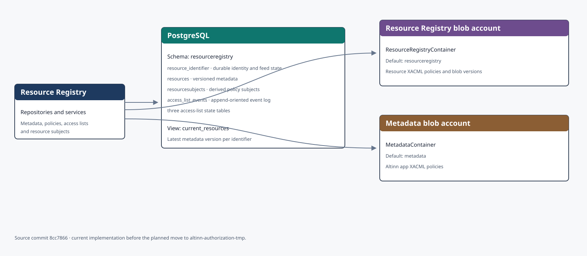
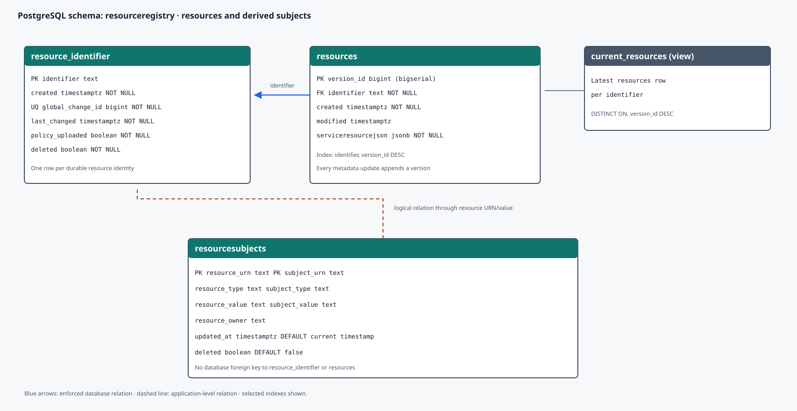
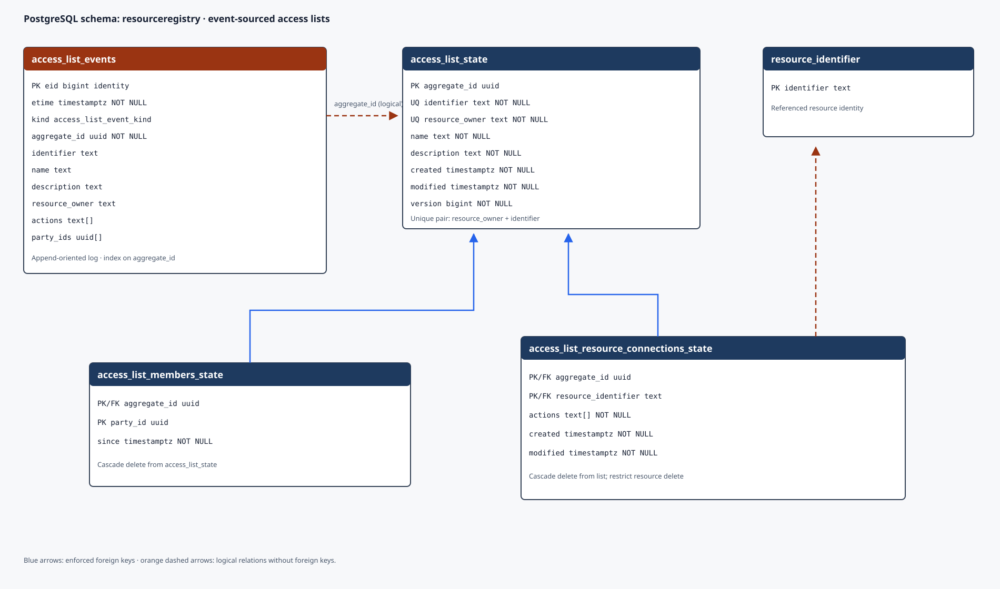
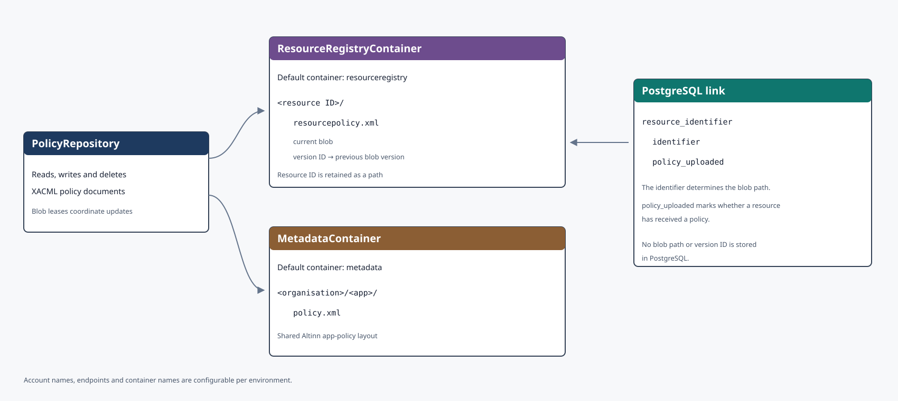

Resource Registry lagrer ressursmetadata, tilgangslister og utledede ressurssubjekter i PostgreSQL. XACML-policyer ligger i Azure Blob Storage. Modellen bygger på [kildecommit `8cc7866`](https://github.com/Altinn/altinn-resource-registry/tree/8cc78660c3650e71b48fd18587928ef8065d9ea4).

Klikk på et diagram for å åpne det i full størrelse i en ny fane.

## Lagringsoversikt

PostgreSQL bruker ett skjema, `resourceregistry`. Diagrammene deler skjemaet etter ansvarsområde for å gjøre detaljene lesbare. Inndelingen betyr ikke at det finnes flere databaseskjemaer.

## Ressurser og ressurssubjekter

`resource_identifier` representerer den varige identiteten til en ressurs og holder tilstanden for endringsstrømmen. `resources` er en versjonstabell der hver endring får en ny `version_id`. Databasevisningen `current_resources` velger den nyeste versjonen per ressurs.

`resourcesubjects` inneholder subjekter som er utledet fra policyen. Den sammensatte primærnøkkelen består av ressurs- og subjekt-URN. Tabellen har myk sletting og tidsstempel for trinnvis uthenting, men migreringene oppretter ingen fremmednøkkel til ressurstabellene.

## Tilgangslister

Tilgangslister bruker hendelseslagring med en separat, oppdatert tilstandsmodell. `access_list_events` er den append-orienterte hendelsesloggen. `access_list_state`, `access_list_members_state` og `access_list_resource_connections_state` gjør lesing effektiv uten å spille av alle hendelsene. `version` brukes til optimistisk samtidighetskontroll.

Hendelsesloggen har ingen fremmednøkkel til tilstandstabellen. Koblingen fra en tilgangsliste til en ressurs mangler også fremmednøkkel etter at ressurstabellen ble versjonert. Diagrammet skiller derfor mellom håndhevede fremmednøkler og logiske koblinger via `aggregate_id` og `resource_identifier`.

## Blobstruktur

Resource Registry bruker to konfigurerbare containere:

- `ResourceRegistryContainer`, med standardnavnet `resourceregistry`, lagrer ressurspolicyer som `<ressurs-ID>/resourcepolicy.xml`
- `MetadataContainer`, med standardnavnet `metadata`, lagrer apppolicyer som `<organisasjon>/<app>/policy.xml`

Blobversjoner gjør det mulig å hente en bestemt versjon av en ressurspolicy. Blob leases beskytter betingede oppdateringer mot samtidige skriv. Databasen lagrer ikke blobstien eller versjons-ID-en, men `policy_uploaded` viser om ressursen har fått lastet opp en policy.

## Avgrensning og planlagt flytting

Diagrammene viser tabeller, sentrale indekser, visningen og lagringskoblinger. Databasefunksjoner, sekvensdetaljer, rettigheter og alle indeksnavn er utelatt for å gjøre modellen lesbar.

Resource Registry skal etter planen flyttes inn i `altinn-authorization-tmp`. Kildelenken dokumenterer dagens implementasjon. Oppdater siden når flyttingen endrer migreringene, navnerommene, containerne eller eierskapet til dataene.
