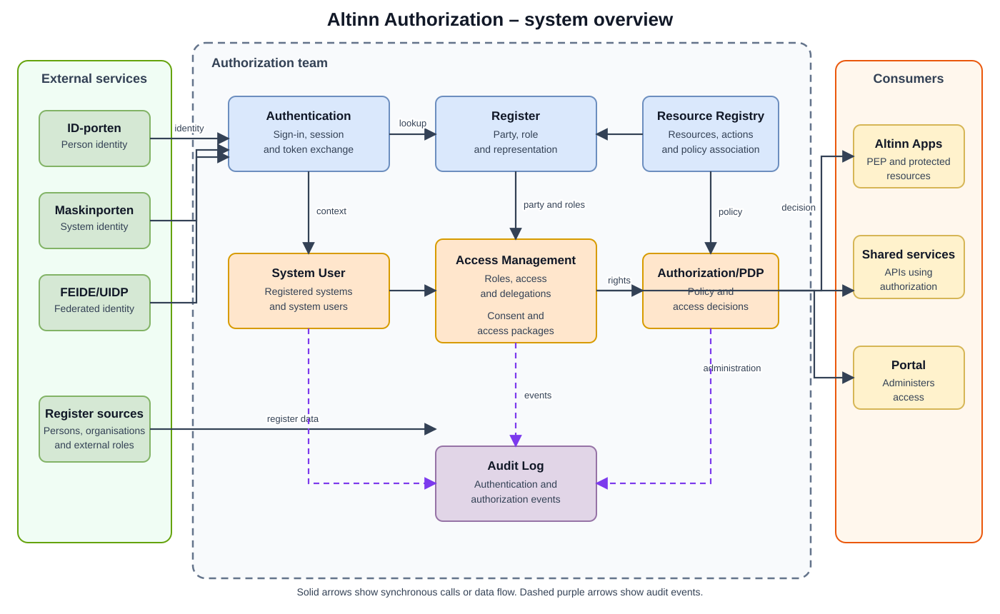

Altinn Authorization is not a single application. It is a set of services that establish identity and representation, describe protected resources, administer rights, evaluate policy and record security-relevant events.

## The trust chain

1. **Identity:** Who, or which system, is acting?
2. **Party and representation:** On behalf of which person or organisation?
3. **Resource:** What is the actor trying to use?
4. **Right:** Which rules, roles, delegations or consents apply?
5. **Decision:** Is this action permitted in the current context?
6. **Traceability:** Can the event and decision basis be examined later?

## System context

| Area | Main responsibility | Core components |
|---|---|---|
| Identity | Establish authenticated identity context | Authentication |
| Party and representation | Describe persons, organisations, roles and representation | Register |
| Resource | Identify and describe services and protected objects | Resource Registry |
| Rights administration | Create, read and change delegations and access relationships | Access Management |
| Machine representation | Allow a system to act on behalf of an organisation | System User |
| Purpose-specific authority | Create and validate consents | Consent |
| Access control | Evaluate policy, rights and context | Authorization/PDP |
| Traceability | Process and store authentication and authorization events | Audit Log |

## Important system boundaries

The team owns the authentication service and the authorization components described here. It does not own ID-porten or Maskinporten. Altinn Access Token is owned by Team Platform and is a dependency. Maskinporten client administration is an integration, not part of the team's system responsibility.

A PEP enforces a decision close to the protected service and may therefore be outside the team's components. The decision basis and PDP capability belong to the authorization system.

## Architecture principles

- Resources are explicitly identified; rights are not granted to undefined objects.
- Identity and representation are separate concepts.
- Administration of rights is separated from evaluation of rights.
- PDP returns a decision; the calling PEP enforces it.
- External tokens are evidence that is validated and translated into internal identity context.
- Events should be correlatable across component boundaries.

[The XACML decision model](../development-architecture/xacml-decision-model/) describes the responsibilities of the PDP, PAP, PRP, PIP, context handler and PEP. The older detailed pages are available through this entry point but no longer appear as a separate architecture tree in the menu.
