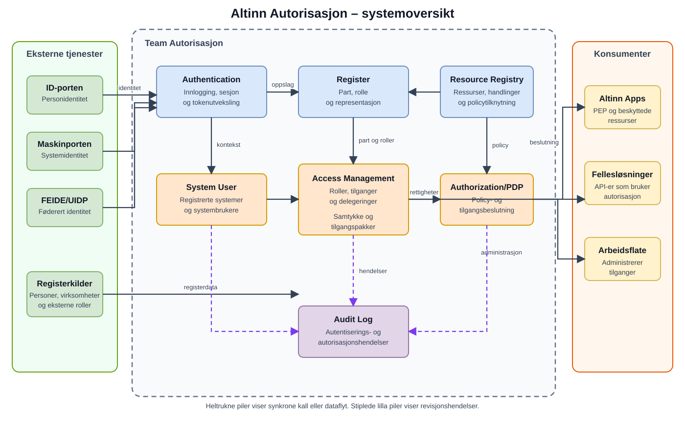

Altinn Autorisasjon er ikke én applikasjon. Det er et sett med tjenester som sammen etablerer identitet og representasjon, beskriver beskyttede ressurser, administrerer rettigheter, evaluerer policy og registrerer sikkerhetsrelevante hendelser.

## Tillitskjeden

En autorisasjonsbeslutning kan forstås som en kjede:

1. **Identitet:** Hvem eller hvilket system handler?
2. **Part og representasjon:** På vegne av hvilken person eller virksomhet skjer handlingen?
3. **Ressurs:** Hva forsøker personen, virksomheten eller systemet å bruke?
4. **Rettighet:** Hvilke regler, roller, delegeringer eller samtykker gjelder?
5. **Beslutning:** Er den konkrete handlingen tillatt i denne konteksten?
6. **Sporbarhet:** Kan hendelsen og beslutningsgrunnlaget undersøkes i ettertid?

## Systemkontekst

| Område | Hovedansvar | Sentrale komponenter |
|---|---|---|
| Identitet | Etablere autentisert identitetskontekst | Authentication |
| Part og representasjon | Beskrive personer, virksomheter, roller og representasjonsforhold | Register |
| Ressurs | Identifisere og beskrive tjenester og andre beskyttede objekter | Resource Registry |
| Rettighetsadministrasjon | Opprette, lese og endre delegeringer og tilgangsrelasjoner | Access Management |
| Maskinrepresentasjon | La et system opptre kontrollert på vegne av en virksomhet | Systembruker |
| Formålsbestemt fullmakt | Opprette og validere samtykker | Samtykke |
| Tilgangskontroll | Evaluere policy, rettigheter og kontekst | Authorization/PDP |
| Sporbarhet | Behandle og lagre autentiserings- og autorisasjonshendelser | Audit Log |

## Viktige systemgrenser

Teamet eier autentiseringstjenesten og autorisasjonskomponentene som er beskrevet her. Teamet eier ikke identitetsleverandørene ID-porten og Maskinporten. Altinn Access Token eies av Team Platform og brukes som en avhengighet. Maskinporten-klientadministrasjon er en integrasjon, ikke en del av teamets systemansvar.

En PEP håndhever en beslutning nær den beskyttede tjenesten. PEP kan derfor ligge utenfor teamets komponenter, mens beslutningsgrunnlaget og PDP-funksjonen ligger i autorisasjonssystemet.

## Arkitekturprinsipper

- Ressurser identifiseres eksplisitt; rettigheter gis ikke til udefinerte objekter.
- Identitet og representasjon behandles som forskjellige begreper.
- Administrasjon av rettigheter er skilt fra evaluering av rettigheter.
- PDP returnerer en beslutning; den kallende PEP håndhever den.
- Eksterne tokens er bevis som valideres og oversettes til en intern identitetskontekst.
- Hendelser skal kunne korreleres på tvers av komponentgrenser.

[Beslutningsmodellen i XACML](../development-architecture/xacml-decision-model/) beskriver ansvaret til PDP, PAP, PRP, PIP, konteksthåndtereren og PEP. De eldre detaljsidene er tilgjengelige fra denne inngangen, men vises ikke lenger som et eget arkitekturtre i menyen.
