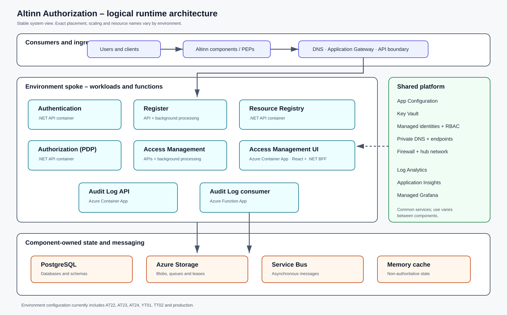

This page presents the logical runtime architecture. It explains the deployable units, their platform services and the authoritative configuration sources. The diagram is not a complete resource inventory. Read names, sizes, replica counts and network addresses from infrastructure as code and the running environment.

*Select the diagram to open it at full size.*

## Overview

Most core services are built as Linux containers behind the public ingress and API boundary. Access Management UI and the Audit Log API run as Azure Container Apps. Audit Log Consumer runs as a separately delivered Azure Function App. Each component owns its PostgreSQL databases, schemas, blob containers and queues; these stores are not integration interfaces.

The infrastructure in `altinn-authorization-tmp` follows a hub-and-spoke model. The hub provides shared network and platform services, whilst an environment-specific spoke hosts workloads and data services. Configuration refers to AT22, AT23, AT24, YT01, TT02 and production, but not every component necessarily runs in every environment.

## Deployable units

| Component | Deployable units | Persistent data and messaging | Authoritative source |
|---|---|---|---|
| Authentication | Containerised .NET API | Multiple PostgreSQL schemas | [altinn-authentication](https://github.com/Altinn/altinn-authentication/tree/e581d8d61542e87709f5b7292af4532693072832) |
| Register | Containerised .NET API and background processing | PostgreSQL and import-related stores | [altinn-register](https://github.com/Altinn/altinn-register/tree/8d34dbf828e40b8d529f0ee2040aa1eeed55bd87) and [infrastructure transition](https://github.com/Altinn/altinn-authorization-tmp/tree/20fcb3f06a20b93ba7bba04a2fa8f55b57d033cb/src/apps/Altinn.Register/infra) |
| Resource Registry | Containerised .NET API | PostgreSQL and resource-related blob data | [altinn-resource-registry](https://github.com/Altinn/altinn-resource-registry/tree/8cc78660c3650e71b48fd18587928ef8065d9ea4) |
| Authorization (PDP) | Containerised .NET API | PostgreSQL, blobs, queue and memory cache | [application and infrastructure](https://github.com/Altinn/altinn-authorization-tmp/tree/20fcb3f06a20b93ba7bba04a2fa8f55b57d033cb/src/apps/Altinn.Authorization) |
| Access Management | Containerised .NET APIs and background processing | PostgreSQL, Service Bus and lease storage | [application and infrastructure](https://github.com/Altinn/altinn-authorization-tmp/tree/20fcb3f06a20b93ba7bba04a2fa8f55b57d033cb/src/apps/Altinn.AccessManagement) |
| Access Management UI | React client and .NET BFF in an Azure Container App | No authoritative business database | [altinn-access-management-frontend](https://github.com/Altinn/altinn-access-management-frontend/tree/8539d5bd44c1fbace079a65dfa42831a599f8806) |
| Audit Log | API in an Azure Container App and Consumer in a separate Azure Function App | PostgreSQL and Azure Storage Queue | [altinn-auth-audit-log](https://github.com/Altinn/altinn-auth-audit-log/tree/c070a2c4e18ee648ed9fb8a82dc53e2889ee235e) |

See the [application architecture](../../application-architecture/) for detailed database and storage models.

## Delivery

The new monorepo workflow builds a versioned container image, publishes it to GitHub Container Registry and applies component Terraform in sequence across test, TT02 and production. The inspected workflow does not show the mechanism that selects the new image in the running environment. Document that link when it is established or located; do not treat a published image as proof of deployment.

Older component repositories have separate workflows. Access Management UI includes an explicit rollback workflow. Audit Log delivers the Consumer Function App and API Container App separately.

## Configuration, security and observability

Use the same image across environments. Supply ordinary configuration and feature flags through App Configuration, keep secrets in Key Vault or the approved secret store, and use managed identities with least privilege. The shared infrastructure includes Log Analytics, Application Insights and managed Grafana.

Each component repository or operational tool should identify health endpoints, logs, traces, metrics, dashboards, alerts, dependency failures, rollback instructions and the owner. A decision should be traceable by trace or correlation ID from PEP through PDP and dependencies to Audit Log without logging unnecessary personal data.

## Ownership

System documentation owns the stable logical model and cross-component links. Component repositories own build and delivery details, health checks and operational procedures. Terraform and the running platform own resource names, network values, sizes and environment-specific settings.