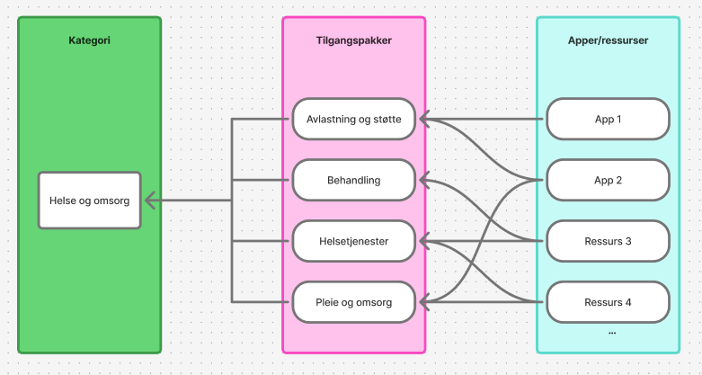

I Altinn 3 tilbyr vi et eget sett med tilgangspakker for innbyggere, slik at tjenesteeiere kan ta et aktivt valg om privatpersoner skal kunne bruke tjenestene. 
Fullmaktsområdene og tilgangspakkene for innbygger er basert på kategorisering i LOS, Altinn skjemakatalog og vergemålsinndelingen. Som for virksomheter, er tilgangspakkene samlet i kategorier.

|**Fullmaktsområder for innbyggere**|
|---|
|[Skatt, avgift, bank og forsikring](./skattavgiftbankforsikring)|
|[Arbeidsliv, skole og utdanning](./arbeidslivskoleutdanning/)|
|[Familie og fritid](./familiefritid/)|
|[Helse og omsorg](./helseomsorg/)|
|[Kultur, idrett og frivillighet](./kulturidrettfrivillighet/)|
|[Patenter, sertifikater og attester](./patentersertifikaterattester/)|
|[Privatperson](./privatperson/)|
|[Verger](./verger/)|
