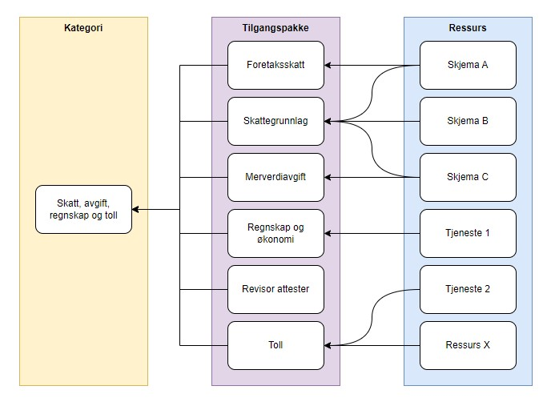

For å kunne styre tilgang til apper og ressurser, må det opprettes policyfiler på app/ressurs. 

Fullmaktsområdene for tilgangsstyring er bygget på Statistisk sentralbyrå sin kategorisering av virksomheter, og de inneholder et sett med tilgangspakker innenfor området. Apper og ressurser knyttes til tilgangspakker i Altinn studio og Ressursregisteret.

|**Fullmaktsområder for virksomheter**|
|---|
|[Administrere tilganger](./adminstreretilganger/)|
|[Andre tjenesteytende næringer](./andretjenesteytende/)|
|[Bygg, anlegg og eiendom](./bygganleggeiendom/)|
|[Energi, vann, avløp og avfall](./energivannavlopavfall/)|
|[Forhold ved virksomheten](./forholdvedvirksomheten/)|
|[Handel, overnatting og servering](./handelovernatting/)|
|[Helse, pleie, omsorg og vern](./helsepleieomsorgvern/)|
|[Industrier](./industrier/)|
|[Integrasjoner](./integrasjoner/)|
|[Jordbruk, skogbruk, jakt, fiske og akvakultur](./jordbrukskogbrukjaktfiskeakvakultur/)|
|[Konkursbo](./konkursbo/)|
|[Kultur og frivillighet](./kulturfrivillighet/)|
|[Miljø, ulykke og sikkerhet](./miljoulykkesikkerhet/)|
|[Oppvekst og utdanning](./oppvekstutdanning/)|
|[Personale](./personale/)|
|[Post og arkiv](./postogarkiv/)|
|[Regnskapsfører](./regnskapsforer/)|
|[Revisor](./revisor/)|
|[Skatt, avgift, regnskap og toll](./skattavgiftregnskaptoll/)|
|[Transport og lagring](./transportoglagring/)|