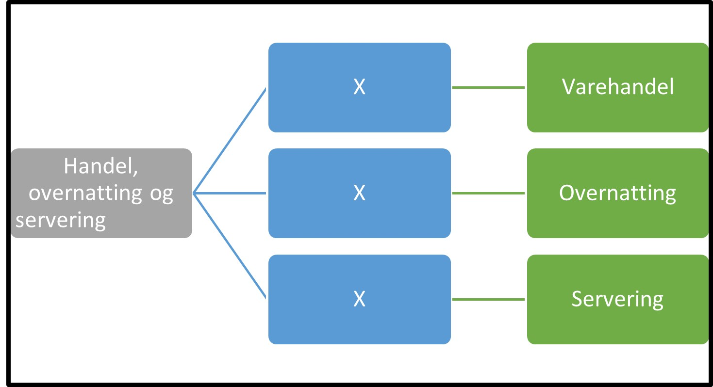

Tilbake til [hovedoversikt](/authorization/what-do-you-get/accessgroups/type-accessgroups/versjon-2/#oversikt-over-tilgangspakker)

 

- **Handel, overnatting og servering:** Denne fullmakten gir tilgang til alle tjenester som omhandler varehandel, overnatting og servering
	- **Varehandel:** Denne fullmakten gir tilgang til alle tjenester knyttet til varehandel og salg og reperasjon av motorvogner
	- **Overnatting:** Denne fullmakten gir tilgang til alle tjenester knyttet til overnattingsvirksomhet
	- **Servering:** Denne fullmakten gir tilgang til alle tjenester knyttet til serveringsvirksomhet

## Egenskaper ved tilgangspakkene
|Navn tillgangspakke|Kan delegeres til ansatte?|Kan knytte tjenester til?|[ER rolle](/authorization/what-do-you-get/accessgroups/register_er/#rolletyper-fra-enhetsregisteret) som får fullmakten|
|---|---|---|---|
|Handel, overnatting og servering| ja|nei||
|Varehandel|ja|ja|DAGL, STYR,INNH, DTPR, DTSO, KOMP, BEST, REPR, BOBE|
|Overnatting|ja|ja|DAGL, STYR,INNH, DTPR, DTSO, KOMP, BEST, REPR, BOBE|
|Servering|ja|ja|DAGL, STYR,INNH, DTPR, DTSO, KOMP, BEST, REPR, BOBE|

{} Det er fortsatt uavklart hvilke fullmakter det vil være natulig å gi personer med rollen Forretningsførerer innenfor fullmaktsområdet "Handel, overnatting og servering" {}

Tilbake til [hovedoversikt](/authorization/what-do-you-get/accessgroups/type-accessgroups/versjon-2/#oversikt-over-tilgangspakker)