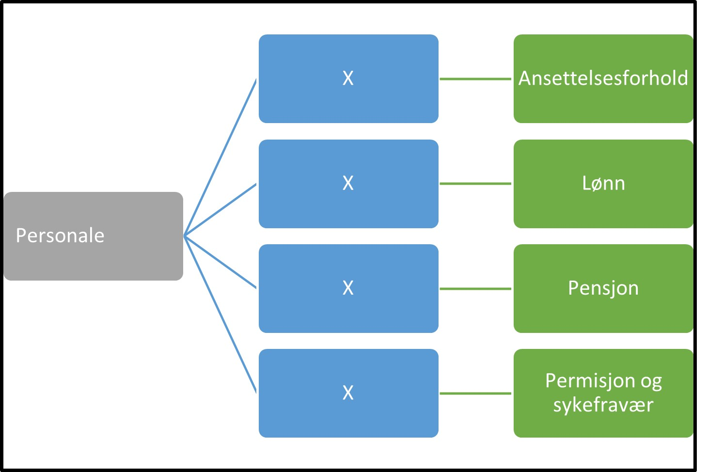

Tilbake til [hovedoversikt](/authorization/what-do-you-get/accessgroups/type-accessgroups/versjon-3/#oversikt-over-tilgangspakker)

- **Personale:** Denne fullmakten gir tilgang til alle tjenester som angår ansatte og personalforhold. Ved regelverksendringer eller innføring av nye digitale tjenester kan det bli endringer i tilganger som fullmakten gir. 
	- **Ansettelsesforhold:** Denne tilgangspakken gir fullmakter til tjenester knyttet til ansettelsesforhold. Ved regelverksendringer eller innføring av nye digitale tjenester kan det bli endringer i tilganger som fullmakten gir.    **urn:altinn:accesspackage:ansettelsesforhold**
	- **Lønn:** Denne tilgangspakken gir fullmakter til tjenester knyttet til lønn og honorar. Ved regelverksendringer eller innføring av nye digitale tjenester kan det bli endringer i tilganger som fullmakten gir.    **urn:altinn:accesspackage:lonn**
	- **Pensjon:** Denne tilgangspakken gir fullmakter til tjenester knyttet til pensjon. Ved regelverksendringer eller innføring av nye digitale tjenester kan det bli endringer i tilganger som fullmakten gir.    **urn:altinn:accesspackage:pensjon**
	- **Permisjon og sykefravær:** Denne tilgangspakken gir fullmakter til tjenester knyttet til permisjon og sykefravær. Ved regelverksendringer eller innføring av nye digitale tjenester kan det bli endringer i tilganger som fullmakten gir.   **urn:altinn:accesspackage:permisjonogsykefravaer**
	- 
## Egenskaper ved tilgangspakkene
|Navn tillgangspakke|Kan delegeres til ansatte?|Kan knytte tjenester til?|[ER rolle](/authorization/what-do-you-get/accessgroups/register_er/#rolletyper-fra-enhetsregisteret) som får fullmakten|
|---|---|---|---|
|Personale| ja|nei||
|Ansettelsesforhold|ja|nei||
|Lønn|ja|ja|DAGL, LEDE, INNH, DTPR, DTSO, KOMP, BEST, REPR, BOBE|
|Pensjon|ja|ja|DAGL, LEDE, INNH, DTPR, DTSO, KOMP, BEST, REPR, BOBE|
|Pensjon|ja|ja|DAGL, LEDE, INNH, DTPR, DTSO, KOMP, BEST, REPR, BOBE|
|Permisjon og sykefravær|ja|ja|DAGL, LEDE, INNH, DTPR, DTSO, KOMP, BEST, REPR, BOBE|

{} Det er fortsatt uavklart hvilke fullmakter det vil være natulig å gi personer med rollen Forretningsførerer innenfor fullmaktsområdet "Personale" {}

Tilbake til [hovedoversikt](/authorization/what-do-you-get/accessgroups/type-accessgroups/versjon-3/#oversikt-over-tilgangspakker)
