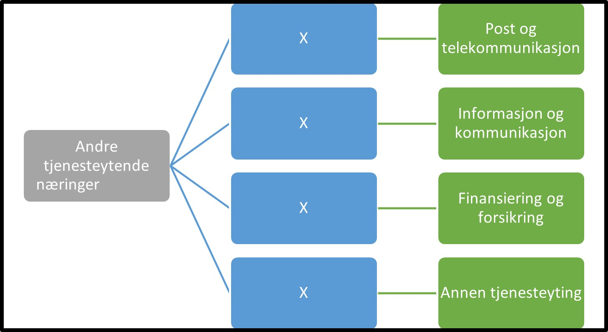

Tilbake til [hovedoversikt](/authorization/what-do-you-get/accessgroups/type-accessgroups/versjon-3/#oversikt-over-tilgangspakker)

 

- **Andre tjenesteytende næringer:** Denne fullmakten gir tilgang til alle tjenester som omhandler annen tjenesteyting som f eks post, telekommunikasjon, informasjon, kommunikasjon, forsikring, finansiering. 
	- **Post og telekommunikasjon:** Denne fullmakten gir tilgang til alle tjenester knyttet til post og telekommunikasjon. Ved regelverksendringer eller innføring av nye digitale tjenester kan det bli endringer i tilganger som fullmakten gir. **urn:altinn:accesspackage:postogtelekommunikasjon**
	- **Informasjon og kommunikasjon:** Denne fullmakten gir tilgang til alle tjenester knyttet til informasjon og kommunikasjon. Ved regelverksendringer eller innføring av nye digitale tjenester kan det bli endringer i tilganger som fullmakten gir. **urn:altinn:accesspackage:informasjonogkommunikasjon**
	- **Finansiering og forsikring:** Denne fullmakten gir tilgang til alle tjenester knyttet til finansiering og forsikring. Ved regelverksendringer eller innføring av nye digitale tjenester kan det bli endringer i tilganger som fullmakten gir.  **urn:altinn:accesspackage:finansieringogforsikring**
	- **Annen tjenesteyting:** Denne fullmakten gir tilgang til alle tjenester knyttet til annen tjenesteyting som f eks  organisasjoner og foreninger, reparasjon av datamaskiner og varer til personlig bruk og husholdningsbruk og en rekke personlige tjenester som ikke er nevnt annet sted. Ved regelverksendringer eller innføring av nye digitale tjenester kan det bli endringer i tilganger som fullmakten gir. **urn:altinn:accesspackage:annentjenesteyting**

## Egenskaper ved tilgangspakkene
|Navn tillgangspakke|Kan delegeres til ansatte?|Kan knytte tjenester til?|[ER rolle](/authorization/what-do-you-get/accessgroups/register_er/#rolletyper-fra-enhetsregisteret) som får fullmakten|
|---|---|---|---|
|Andre tjenesteytende næringer| ja|nei||
|Post og telekommunikasjon|ja|ja|DAGL, LEDE, INNH, DTPR, DTSO, KOMP, BEST, REPR, BOBE|
|Informasjon og kommunikasjon|ja|ja|DAGL, LEDE, INNH, DTPR, DTSO, KOMP, BEST, REPR, BOBE|
|Finansiering og forsikring|ja|ja|DAGL, LEDE, INNH, DTPR, DTSO, KOMP, BEST, REPR, BOBE|
|Annen tjenesteyting|ja|ja|DAGL, LEDE, INNH, DTPR, DTSO, KOMP, BEST, REPR, BOBE|

{} Det er fortsatt uavklart hvilke fullmakter det vil være natulig å gi personer med rollen Forretningsførerer innenfor fullmaktsområdet "Andre tjenesteytende næringer" {}

Tilbake til [hovedoversikt](/authorization/what-do-you-get/accessgroups/type-accessgroups/versjon-3/#oversikt-over-tilgangspakker)
