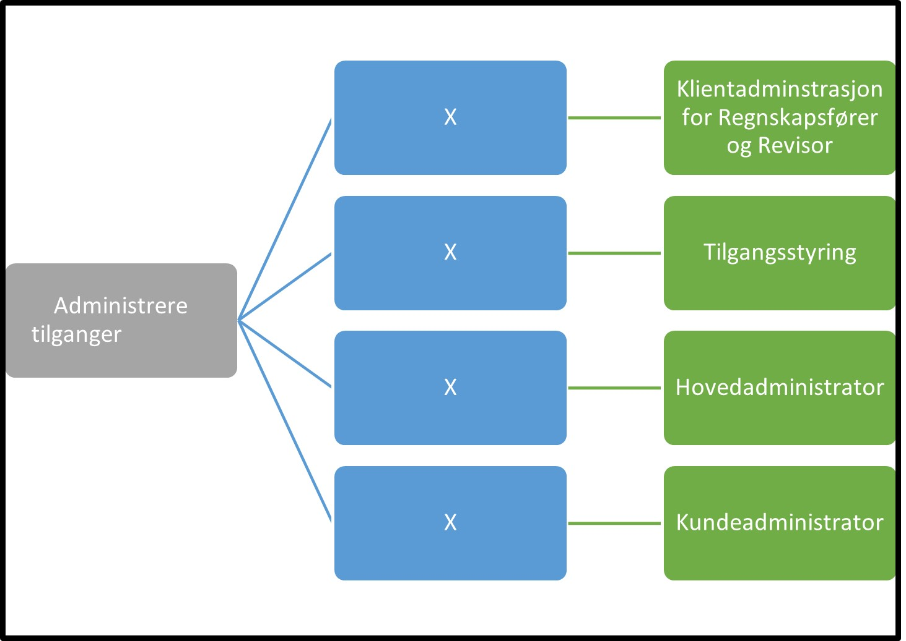

Tilbake til [hovedoversikt](/authorization/what-do-you-get/accessgroups/type-accessgroups/versjon-2/#oversikt-over-tilgangspakker)

- **Administrere tilganger** (ingen beskrivelse, tilgangspakken kan ikke gis videre til andre)		
	- **Klientadminstrasjon for Regnskapsfører og Revisor:** Denne fullmakten gir bruker mulighet til å administrere tilgang til tjenester det er naturlig at regnskapsfører eller revisor utfører. Bruker kan administrere tilgang til tjenestene  til ansatte hos regnskapsfører eller revisor på vegne av deres kunder. 
	- **Tilgangsstyring:** Denne fullmakten gir bruker mulighet til å gi videre tilganger for virksomheten som man selv har mottatt
	- **Hovedadministrator:** Denne fullmakten gir bruker mulighet til å administrere alle tilganger for virksomheten
	- **Kundeadministrator:** Denne fullmakten gir bruker mulighet til å administrere tilganger man har mottatt for sine kunder til ansatte i egen virksomheten

## Egenskaper ved tilgangspakkene
|Navn tillgangspakke|Kan delegeres til ansatte?|Kan knytte tjenester til?|[ER rolle](/authorization/what-do-you-get/accessgroups/register_er/#rolletyper-fra-enhetsregisteret) som får fullmakten|
|---|---|---|---|
|Administrere tilganger| nei|nei||
|Klientadminstrasjon for Regnskapsfører og Revisor|ja|ja|DAGL, STYR, INNH, DTPR, DTSO, KOMP, BEST, REPR, BOBE|
|Tilgangsstyring|ja|ja|DAGL, LEDE, INNH, DTPR, DTSO, KOMP, BEST, REPR, BOBE|
|Hovedadministrator|ja|ja|DAGL, LEDE, INNH, DTPR, DTSO, KOMP, BEST, REPR, BOBE|
|Kundeadministrator|ja|ja|DAGL, LEDE, INNH, DTPR, DTSO, KOMP, BEST, REPR, BOBE|

{} Det er fortsatt uavklart hvilke fullmakter det vil være natulig å gi personer med rollen Forretningsførerer innenfor fullmaktsområdet "Administrere tilganger" {}

Tilbake til [hovedoversikt](/authorization/what-do-you-get/accessgroups/type-accessgroups/versjon-2/#oversikt-over-tilgangspakker)
