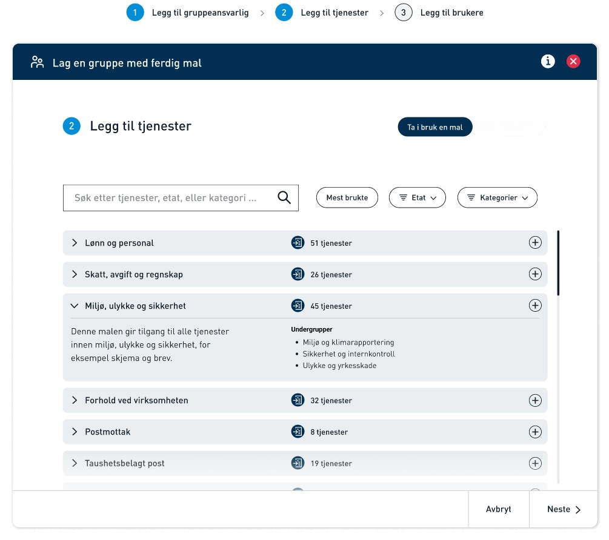
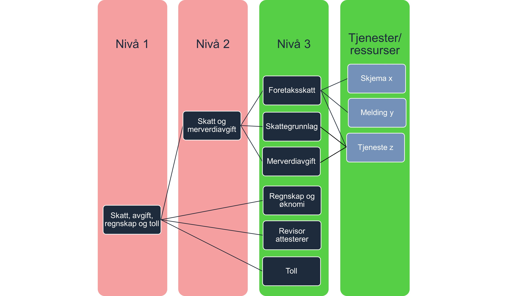

Altinn skal erstatte rollene som gir tilgang til tjenester i Altinn 2 når vi flytter Altinn Autorisasjon til Altinn 3. 
I stedet for roller vil det i Altinn 3 være ulike tilgangspakker som består av tjenester som hører til et ansvarsområde.

I forbindelse med innføring av nye tilgangspakker så endres brukergrensesnitt for tilgangsstyrer slik at disse blir enklere å forstå og ta i bruk enn dagens roller.  

**Her finner du som er tjenesteeier forslag til kategorier og navn på de nye tilgangspakkene. Vi ønsker innspill om de nye tilgangspakkene passer til deres tjeneste.**

## Administrator gir tilgang til grupper med tjenester
Den som skal gi tilgang til tjenester i en virksomhet kalles administrator. 
Administrator kan gi tilgang til ansatte ved å legge de til tilgangspakker. 

Eksterne roller fra Enhetsregisteret (f eks Daglig leder, styreleder eller Regnskapsfører, heretter kalt ER-roller), får automatisk tilgang til tilgangspakkene for sin virksomhet. 
Forslag til hvilke ER-roller som automatisk skal få hvilke tilgangspakker er beskrevet på hver tillgangspakke. 
## De nye tilgangspakkene gjør det lettere å administrere tilganger

Den største forskjellen på rollene i 2.0 og tilgangspakkene i 3.0 blir:

- Flere tilgangspakker som kan være delt inn i opptil tre nivåer, slik at administrator kan gi tilgang til færre tjenester og det blir lettere å finne riktig tillgangspakke. 
- Mer findelt tilgangspakker gjør det lettere for tjenesteeiere å velge riktig målgruppe for sine tjenester.

Grunnlaget for inndelingen i maler er [Altinns skjemakatalog](https://www.altinn.no/skjemaoversikt/?category=category) og [SSBs standard for å kategorisere virksomheter](https://www.ssb.no/klass/klassifikasjoner/6). 
## Tjenester må knyttes til det laveste nivået i hierarkiet 

Tilgangspakkene har maksimalt tre nivåer. Tjenesteeier må knytte tjenester til tilgangspakker som er på det laveste nivå. En tjeneste kan knyttes til flere tilgangspakker hvis tjenesteeier mener det er riktig. 

Målet med mer findelte nivåer et at virksomhetene skal kunne gi ansatte tilgang til akkurat det de trenger, men ikke få for omfattende tilganger. 

Administrator vil i brukergrensesnitt oppleve av vedkommende kan gi sine ansatte tilgang til tilgangspakker på alle nivå, men i virkeligheten registreres delegeringen alltid på nivå 3, f eks: 

- Administrator gir sin ansatt tilgangspakken «Skatt og merverdiavgift». I Altinn registeres da at den ansatte får følgende fullmakter: 
   - Foretaksskatt
   - Skattegrunnlag
   - Merverdiavgift

Her finner du [fremgangsmåte og rekkefølge](/authorization/migration/new-accessgroups/) av oppgaver som må gjennomføres hos Altinn, tjenesteeiere og sluttbrukervirksomhetene for å innføre nye tilgangspakker. 
 

### Avvikling av Altinn 2 generelle roller
Altinn 2 roller vil bli avviklet senest ved avslutning av Altinn 2-løsningen. Tjenester som ligger på Altinn 2 vil fortsatt bruke Altinn 2-roller for tilgangsstyring, men ved flytting av tjenestene til Altinn Studio eller ressursregisteret, må nye tilgangspakker tas i bruk. I en overgangsfase vil roller og tilgangspakker vil eksistere i parallell i en periode, før Altinn 2-rollene fjernes.

Noen få av de nye tilgangspakkene vil være identiske med gamle Altinn2 roller. Dette gjelder rollene: 
- ECKEYROLE - lik funksjonalitet, men nytt navn som tilgangsgruppe er Opptre for virksomhetens kunder
- Klientadministrator
- Tilgangsstyrer
- Hovedadministrator
- Roller benyttet av regnskapsfører og revisor
- Roller benyttet for tilgang til konkursbo 
  
For disse tilfellene vil Altinn sørge for at de ansatte som har en utgående Altinn2 rolle automatisk får de nye tilgangspakkene.

## Videre arbeid med tilgangspakker
Vi har nå gjennomført høring nummer 2 av nye tilgangspakker, og behandlet innspillene vi har fått. Versjon 3 er den versjonen som vil bli tilgjengeliggjort i Altinn Studio og ressursregisteret for å opprette policy'er basert på tilgangspakkene.
Det dere som tjenesteeiere må gjøre fremover, er å kartlegge hvilke tilgangspakker dere ønsker å benytte på tjenestene deres. Etterhvert som dere migrerer tjenestene, enten til ressursregisteret eller som app i Altinn studio, må dere bruke tilgangspakkene i tjenestenes/ressursenes policy-filer.

Merk at vi har revidert vår plan for innføring av tilgangspakker angående muligheten for å fortsatt kunne delegere Altinn 2-roller. Opprinnelig plan var at delegering av Altinn 2-roller ikke skulle være mulig etter at ny brukerflate for tilgangsstyring var lansert, men vi ser at det vil være behov for denne muligheten fremover også.

## Oversikt over tilgangspakker: 

### Generelt om beskrivelse av tilgangspakkene

- Fullmaktsbeskrivelse presenteres administrator. Denne skal sikre at administrator forstår hvilke fullmakter man gir videre til sin ansatt.
- Fullmaktsbeskrivelsen vil forklare hvilke type tjenester som er knyttet til fullmakten og som fullmakten dermed gir tilgang til
- Det er tjenesteeier som avgjør hvilken tillgangspakke deres tjeneste/ressus hører inn under. 
- Tjenester/ressurser knyttes alltid til laveste nivå (grønn boks)
- Det er mulig å knytte en tjeneste/ressurs til flere tilgangspakker. 

(klikk på lenken for å se nedover i hierarkiet)
### Tilgangspakker relevant for mange/alle virksomheter

1. [Skatt, avgift, regnskap og toll](/authorization/what-do-you-get/accessgroups/type-accessgroups/versjon-3/skatt/)
2. [Personale](/authorization/what-do-you-get/accessgroups/type-accessgroups/versjon-3/personale/)
3. [Miljø, ulykke og sikkerhet](/authorization/what-do-you-get/accessgroups/type-accessgroups/versjon-3/miljo/)
4. [Post/arkiv](/authorization/what-do-you-get/accessgroups/type-accessgroups/versjon-3/post/)
5. [Forhold ved virksomheten](/authorization/what-do-you-get/accessgroups/type-accessgroups/versjon-3/forhold/)
6. [Integrasjoner og API-er](/authorization/what-do-you-get/accessgroups/type-accessgroups/versjon-3/integrasjon/)
7. [Administrere tilganger](/authorization/what-do-you-get/accessgroups/type-accessgroups/versjon-3/tilgang/)

### Bransjespesifikke tilgangspakker
7. [Jordbruk, skogbruk, jakt, fiske og akvakultur](/authorization/what-do-you-get/accessgroups/type-accessgroups/versjon-3/jordbruk/)
8. [Bygg, anlegg og eiendom](/authorization/what-do-you-get/accessgroups/type-accessgroups/versjon-3/bygg/)
9. [Transport og lagring](/authorization/what-do-you-get/accessgroups/type-accessgroups/versjon-3/transport/)
10. [Helse, pleie, omsorg og vern](/authorization/what-do-you-get/accessgroups/type-accessgroups/versjon-3/helse/)
11. [Oppvekst og utdanning](/authorization/what-do-you-get/accessgroups/type-accessgroups/versjon-3/oppvekst/)
12. [Energi, vann, avløp og avfall](/authorization/what-do-you-get/accessgroups/type-accessgroups/versjon-3/energi/)
13. [Industrier](/authorization/what-do-you-get/accessgroups/type-accessgroups/versjon-3/industrier/)
14. [Kultur og frivillighet](/authorization/what-do-you-get/accessgroups/type-accessgroups/versjon-3/kultur/)
15. [Handel, overnatting og servering](/authorization/what-do-you-get/accessgroups/type-accessgroups/versjon-3/handel/)
16. [Andre tjenesteytende næringer](/authorization/what-do-you-get/accessgroups/type-accessgroups/versjon-3/tjenesteytende/)

### Andre spesialiserte tilgangspakker
17. [Tilgangspakker for regnskapsførere](/authorization/what-do-you-get/accessgroups/type-accessgroups/versjon-3/regnskapsførere/)
18. [Tilgangspakker for revisor](/authorization/what-do-you-get/accessgroups/type-accessgroups/versjon-3/revisor/)
19. [Tilgangspakker for konkursbo](/authorization/what-do-you-get/accessgroups/type-accessgroups/versjon-3/konkursbo/)

*Siden er under arbeid*
