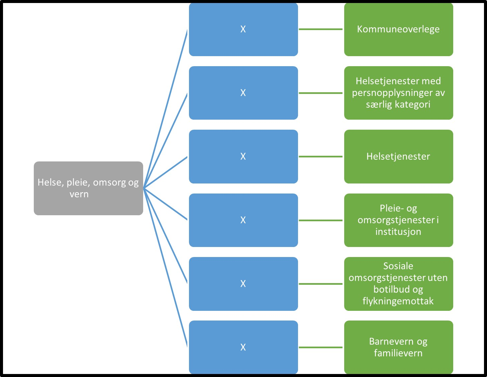

Tilbake til [hovedoversikt](/authorization/what-do-you-get/accessgroups/type-accessgroups/versjon-3/#oversikt-over-tilgangspakker)

- **Helse, pleie, omsorg og vern:** Denne fullmakten gir tilgang til alle tjenester som omfatter helse- og sosialtjenester med og uten botilbud. Denne fullmakten kan gi bruker tilgang til helseopplysninger om personer det rapporteres om. Ved regelverksendringer eller innføring av nye digitale tjenester kan det bli endringer i tilganger som fullmakten gir.
	- **Kommuneoverlege:** (mangler)		**urn:altinn:accesspackage:kommuneoverlege**
	- **Helsetjenester med personopplysninger av særlig kategori:** (mangler)	 **urn:altinn:accesspackage:helsetjenesterpersonopplysingersaerligkategori**
	- **Helsetjenester:** Denne tilgangspakken gir fullmakter til tjenester knyttet til sykehus, lege, tannlege og hjemmesykepleie,fysioterapi, ambulanse og lignende. Denne fullmakten kan gi bruker tilgang til personopplysninger om personer det rapporteres om. Ved regelverksendringer eller innføring av nye digitale tjenester kan det bli endringer i tilganger som fullmakten gir. **urn:altinn:accesspackage:helsetjenester**
	- **Pleie- og omsorgstjenester i institusjon:** Denne tilgangspakken gir fullmakter til tjenester knyttet til pleie og omsorgstilbud i institursjon. Dette er tjenester som tilbyr institusjonsopphold kombinert med sykepleie, tilsyn eller annen form for pleie alt etter hva som kreves av beboerne. Denne fullmakten kan gi bruker tilgang til helseopplysninger om personer det rapporteres om. Ved regelverksendringer eller innføring av nye digitale tjenester kan det bli endringer i tilganger som fullmakten gir. **urn:altinn:accesspackage:pleieomsorgstjenesteriinstitusjon:**
	- **Sosiale omsorgstjenester uten botilbud og flykningemottak:** Denne tilgangspakken gir fullmakter til tjenester knyttet til sosiale omsorgstjeneser uten botilbud for eldre, funksjonshemmede og rusmisbrukere samt flykningemottak, og tjenester relatert til arbeidstrening og andre sosiale tjenester, f eks i regi av velferdsorganisasjoner. Denne fullmakten kan gi bruker tilgang til helseopplysninger om personer det rapporteres om. Ved regelverksendringer eller innføring av nye digitale tjenester kan det bli endringer i tilganger som fullmakten gir.  **urn:altinn:accesspackage:pleieomsorgstjenesteriinstitusjon:**
	- **Barnevern og familievern:** Denne tilgangspakken gir fullmakter til tjenester knyttet til barnevern og familievern. Denne fullmakten kan gi bruker tilgang til helseopplysninger om personer det rapporteres om. Ved regelverksendringer eller innføring av nye digitale tjenester kan det bli endringer i tilganger som fullmakten gir.  **urn:altinn:accesspackage:barnevernogfamilievern**

## Egenskaper ved tilgangspakkene
|Navn tillgangspakke|Kan delegeres til ansatte?|Kan knytte tjenester til?|[ER rolle](/authorization/what-do-you-get/accessgroups/register_er/#rolletyper-fra-enhetsregisteret) som får fullmakten|
|---|---|---|---|
|Helse, pleie, omsorg og vern| ja|nei||
|Kommuneoverlege|ja|ja|DAGL, LEDE, INNH, DTPR, DTSO, KOMP, BEST, REPR, BOBE|
|Helsetjenester|ja|ja|DAGL, LEDE, INNH, DTPR, DTSO, KOMP, BEST, REPR, BOBE|
|Pleie- og omsorgstjenester i institusjon|ja|ja|DAGL, LEDE, INNH, DTPR, DTSO, KOMP, BEST, REPR, BOBE|
|Sosiale omsorgstjenester uten botilbud og flykningemottak|ja|ja|DAGL, LEDE, INNH, DTPR, DTSO, KOMP, BEST, REPR, BOBE|
|Barnevern og familievern|ja|ja|DAGL, LEDE, INNH, DTPR, DTSO, KOMP, BEST, REPR, BOBE|

{} Det er fortsatt uavklart hvilke fullmakter det vil være natulig å gi personer med rollen Forretningsførerer innenfor fullmaktsområdet "Helse, pleie, omsorg og vern" {}

Tilbake til [hovedoversikt](/authorization/what-do-you-get/accessgroups/type-accessgroups/versjon-3/#oversikt-over-tilgangspakker)