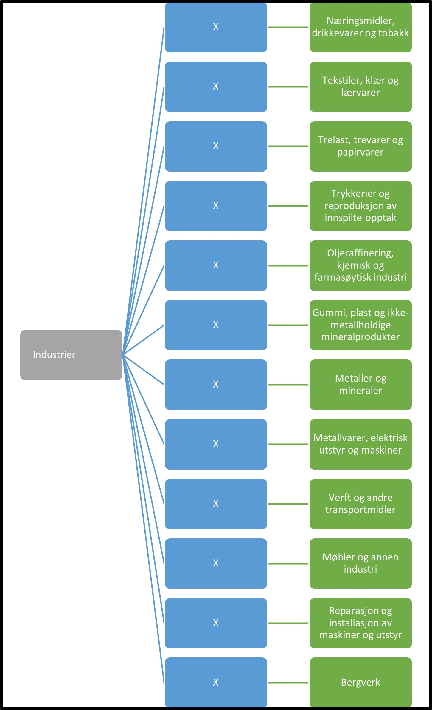

Tilbake til [hovedoversikt](/authorization/what-do-you-get/accessgroups/type-accessgroups/versjon-3/#oversikt-over-tilgangspakker)

- **Industrier:** Denne fullmakten gir tilgang til alle tjenester som omhandler industrier som fysisk eller kjemisk omdanner materialer, stoffer eller deler til nye produkter. 
	- **Næringsmidler, drikkevarer og tobakk:** Denne tilgangspakken gir fullmakter til tjenester knyttet til industri i forbindelse med næringsmidler, drikkevarer og tobakk. Ved regelverksendringer eller innføring av nye digitale tjenester kan det bli endringer i tilganger som fullmakten gir.   **urn:altinn:accesspackage:naeringsmidlerdrikkevarerogtobakk**
	- **Tekstiler, klær og lærvarer:** Denne tilgangspakken gir fullmakter til tjenester knyttet til industri i forbindelse med tekstiler, klær og lærvarer. Ved regelverksendringer eller innføring av nye digitale tjenester kan det bli endringer i tilganger som fullmakten gir.  **urn:altinn:accesspackage:tekstilerklaerlaervarer**
	- **Trelast, trevarer og papirvarer:** Denne tilgangspakken gir fullmakter til tjenester knyttet til industri i forbindelse med trelast, trevarer og papirvarer. Ved regelverksendringer eller innføring av nye digitale tjenester kan det bli endringer i tilganger som fullmakten gir. **urn:altinn:accesspackage:trelasttrevarerpapirvarer**
	- **Trykkerier og reproduksjon av innspilte opptak:** Denne tilgangspakken gir fullmakter til tjenester knyttet til industri i forbindelse med trykkerier og reproduksjon av innspilte opptak. Ved regelverksendringer eller innføring av nye digitale tjenester kan det bli endringer i tilganger som fullmakten gir. **urn:altinn:accesspackage:trykkerierreproduksjonopptak**
	- **Oljeraffinering, kjemisk og farmasøytisk industri:** Denne tilgangspakken gir fullmakter til tjenester knyttet til industri i forbindelse med oljeraffinering, kjemisk og farmasøytisk industri. Ved regelverksendringer eller innføring av nye digitale tjenester kan det bli endringer i tilganger som fullmakten gir. **urn:altinn:accesspackage:oljeraffineringkjemiskfarmasoytiskindustri**
	- **Gummi, plast og ikke-metallholdige mineralprodukter:** Denne tilgangspakken gir fullmakter til tjenester knyttet til industri i forbindelse med gummi, plast og ikke-metallholdige mineralprodukter. Ved regelverksendringer eller innføring av nye digitale tjenester kan det bli endringer i tilganger som fullmakten gir. **urn:altinn:accesspackage:gummiplastogikkemetallholdigemineralprodukter**
	- **Metaller og  mineraler:** Denne tilgangspakken gir fullmakter til tjenester knyttet til industri i forbindelse med metaller og  mineraler. Ved regelverksendringer eller innføring av nye digitale tjenester kan det bli endringer i tilganger som fullmakten gir. **urn:altinn:accesspackage:gummiplastogikkemetallholdigemineralprodukter**
	- **Metallvarer, elektrisk utstyr og maskiner:** Denne tilgangspakken gir fullmakter til tjenester knyttet til industri i forbindelse med metallvarer, elektrisk utstyr og maskiner. Ved regelverksendringer eller innføring av nye digitale tjenester kan det bli endringer i tilganger som fullmakten gir. **urn:altinn:accesspackage:metallvarerelektriskutstyrogmaskiner**
	- **Verft og andre transportmidler:** Denne tilgangspakken gir fullmakter til tjenester knyttet til industri i forbindelse med verft og andre transportmidler. Ved regelverksendringer eller innføring av nye digitale tjenester kan det bli endringer i tilganger som fullmakten gir. **urn:altinn:accesspackage:verftogandretransportmidler**
	- **Møbler og annen industri:** Denne tilgangspakken gir fullmakter til tjenester knyttet til industri i forbindelse med møbler og annen industri. Ved regelverksendringer eller innføring av nye digitale tjenester kan det bli endringer i tilganger som fullmakten gir.  **urn:altinn:accesspackage:moblerogannenindustri**
	- **Reparasjon og installasjon av maskiner og utstyr:** Denne tilgangspakken gir fullmakter til tjenester knyttet til industri i forbindelse med reparasjon og installasjon av maskiner og utstyr. Ved regelverksendringer eller innføring av nye digitale tjenester kan det bli endringer i tilganger som fullmakten gir. **urn:altinn:accesspackage:reparasjonoginstallasjonavmaskinerogutstyr**
	- **Bergverk:** Denne tilgangspakken gir fullmakter til tjenester knyttet til industri i forbindelse med bergverk og tilhørende tjenester til bergverksdrift og utvinning. Ved regelverksendringer eller innføring av nye digitale tjenester kan det bli endringer i tilganger som fullmakten gir. **urn:altinn:accesspackage:bergverk**

## Egenskaper ved tilgangspakkene
|Navn tillgangspakke|Kan delegeres til ansatte?|Kan knytte tjenester til?|[ER rolle](/authorization/what-do-you-get/accessgroups/register_er/#rolletyper-fra-enhetsregisteret) som får fullmakten|
|---|---|---|---|
|Industrier| ja|nei||
|Næringsmidler, drikkevarer og tobakk|ja|ja|DAGL, LEDE, INNH, DTPR, DTSO, KOMP, BEST, REPR, BOBE|
|Tekstiler, klær og lærvarer|ja|ja|DAGL, LEDE, INNH, DTPR, DTSO, KOMP, BEST, REPR, BOBE|
|Trelast, trevarer og papirvarer|ja|ja|DAGL, LEDE, INNH, DTPR, DTSO, KOMP, BEST, REPR, BOBE|
|Trykkerier og reproduksjon av innspilte opptak|ja|ja|DAGL, LEDE, INNH, DTPR, DTSO, KOMP, BEST, REPR, BOBE|
|Oljeraffinering, kjemisk og farmasøytisk industri|ja|ja|DAGL, LEDE, INNH, DTPR, DTSO, KOMP, BEST, REPR, BOBE|
|Gummi, plast og ikke-metallholdige mineralprodukter|ja|ja|DAGL, LEDE, INNH, DTPR, DTSO, KOMP, BEST, REPR, BOBE|
|Metaller og  mineraler|ja|ja|DAGL, LEDE, INNH, DTPR, DTSO, KOMP, BEST, REPR, BOBE|
|Metallvarer, elektrisk utstyr og maskiner|ja|ja|DAGL, LEDE, INNH, DTPR, DTSO, KOMP, BEST, REPR, BOBE|
|Verft og andre transportmidler|ja|ja|DAGL, LEDE, INNH, DTPR, DTSO, KOMP, BEST, REPR, BOBE|
|Møbler og annen industri|ja|ja|DAGL, LEDE, INNH, DTPR, DTSO, KOMP, BEST, REPR, BOBE|
|Reparasjon og installasjon av maskiner og utstyr|ja|ja|DAGL, LEDE, INNH, DTPR, DTSO, KOMP, BEST, REPR, BOBE|
|Bergverk|ja|ja|DAGL, LEDE, INNH, DTPR, DTSO, KOMP, BEST, REPR, BOBE|

{} Det er fortsatt uavklart hvilke fullmakter det vil være natulig å gi personer med rollen Forretningsførerer innenfor fullmaktsområdet "Industrier" {}

Tilbake til [hovedoversikt](/authorization/what-do-you-get/accessgroups/type-accessgroups/versjon-3/#oversikt-over-tilgangspakker)