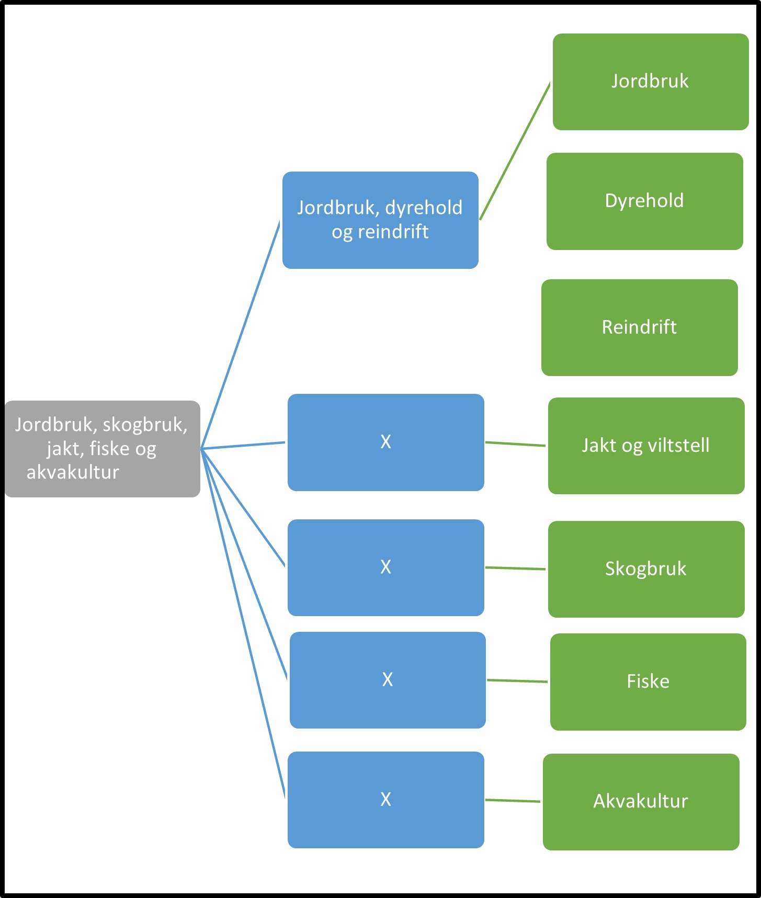

Tilbake til [hovedoversikt](/authorization/what-do-you-get/accessgroups/type-accessgroups/versjon-3/#oversikt-over-tilgangspakker)

 

- **Jordbruk, skogbruk, jakt, fiske og akvakultur:** Denne underkategorien inneholder tilgangspakker alle tjenester som angår jordbruk, skogbruk, jakt, fiske og akvakultur.
	- **Jordbruk, dyrehold og reindrift:** Denne underkategorien inneholder tilgangspakker til tjenester knyttet til jordbruk, dyrehold og reindrift.
		- **Jordbruk:** Denne tilgangspakken gir tilgang til tjenester knyttet til jordbruk. Ved regelverksendringer eller innføring av nye digitale tjenester kan det bli endringer i tilganger som fullmakten gir. **urn:altinn:accesspackage:jordbruk**
   		- **Dyrehold:** Denne tilgangspakken gir tilgang til tjenester knyttet til dyrehold. Ved regelverksendringer eller innføring av nye digitale tjenester kan det bli endringer i tilganger som fullmakten gir.  **urn:altinn:accesspackage:dyrehold**
   		- **Reindrift:** Denne tilgangspakken gir tilgang til tjenester knyttet til reindrift. Ved regelverksendringer eller innføring av nye digitale tjenester kan det bli endringer i tilganger som fullmakten gir.  **urn:altinn:accesspackage:reindrift**
   		
     - **Jakt og viltstell:** Denne tilgangspakken gir fullmakter til tjenester knyttet til jakt og viltstell. Ved regelverksendringer eller innføring av nye digitale tjenester kan det bli endringer i tilganger som fullmakten gir. **urn:altinn:accesspackage:jaktogviltstell**
     - **Skogbruk:** Denne tilgangspakken gir fullmakter til tjenester knyttet til skogbruk. Ved regelverksendringer eller innføring av nye digitale tjenester kan det bli endringer i tilganger som fullmakten gir. **urn:altinn:accesspackage:skogbruk**
     - **Fiske:** Denne tilgangspakken gir fullmakter til tjenester knyttet til fiske. Ved regelverksendringer eller innføring av nye digitale tjenester kan det bli endringer i tilganger som fullmakten gir.  **urn:altinn:accesspackage:fiske**
     - **Akvakultur:** Denne tilgangspakken gir fullmakter til tjenester knyttet til akvakultur og fiskeoppdrett. Ved regelverksendringer eller innføring av nye digitale tjenester kan det bli endringer i tilganger som fullmakten gir. **urn:altinn:accesspackage:akvakultur**

## Egenskaper ved tilgangspakkene
|Navn tillgangspakke|Kan delegeres til ansatte?|Kan knytte tjenester til?|[ER rolle](/authorization/what-do-you-get/accessgroups/register_er/#rolletyper-fra-enhetsregisteret) som får fullmakten|
|---|---|---|---|
|Jordbruk, skogbruk, jakt, fiske og akvakultur| ja|nei||
|Jordbruk, dyrehold og reindrift| ja|nei||
|Jordbruk|ja|ja|DAGL, LEDE, INNH, DTPR, DTSO, KOMP, BEST, REPR, BOBE|
|Dyrehold|ja|ja|DAGL, LEDE, INNH, DTPR, DTSO, KOMP, BEST, REPR, BOBE|
|Reindrift|ja|ja|DAGL, LEDE, INNH, DTPR, DTSO, KOMP, BEST, REPR, BOBE|
|Jakt og viltstell|ja|ja|DAGL, LEDE, INNH, DTPR, DTSO, KOMP, BEST, REPR, BOBE|
|Skogbruk|ja|ja|DAGL, LEDE, INNH, DTPR, DTSO, KOMP, BEST, REPR, BOBE|
|Fiske|ja|ja|DAGL, LEDE, INNH, DTPR, DTSO, KOMP, BEST, REPR, BOBE|
|Akvakultur|ja|ja|DAGL, LEDE, INNH, DTPR, DTSO, KOMP, BEST, REPR, BOBE|

{} Det er fortsatt uavklart hvilke fullmakter det vil være natulig å gi personer med rollen Forretningsførerer innenfor fullmaktsområdet "Jordbruk, skogbruk, jakt, fiske og akvakultur" {}

Tilbake til [hovedoversikt](/authorization/what-do-you-get/accessgroups/type-accessgroups/versjon-3/#oversikt-over-tilgangspakker)
