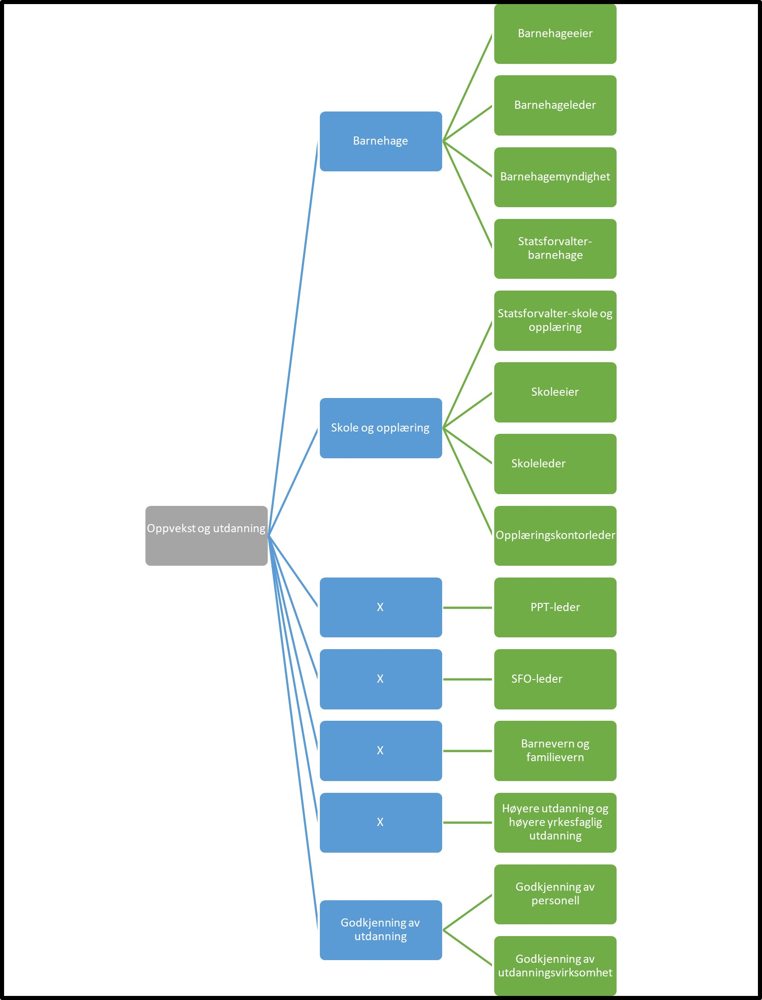

Tilbake til [hovedoversikt](/authorization/what-do-you-get/accessgroups/type-accessgroups/versjon-3/#oversikt-over-tilgangspakker)

- **Oppvekst og utdanning** Denne fullmakten gir tilgang til alle tjenester som omhandler barnehage, skole og høyere utdanning. Ved regelverksendringer eller innføring av nye digitale tjenester kan det bli endringer i tilganger som fullmakten gir.
    - **Barnehage** Denne fullmakten gir tilgang til alle tjenester innen drift av barnehage. Ved regelverksendringer eller innføring av nye digitale tjenester kan det bli endringer i tilganger som fullmakten gir.
      - **Barnehageeier** Denne fullmakten gir tilgang til alle tjenester innen drift av barnehage som barnehageeier er ansvarlig for. Ved regelverksendringer eller innføring av nye digitale tjenester kan det bli endringer i tilganger som fullmakten gir. **urn:altinn:accesspackage:barnehageeier**
      - **Barnehageleder** Denne fullmakten gir tilgang til alle tjenester innen drift av barnehage som barnehageleder er ansvarlig for. Ved regelverksendringer eller innføring av nye digitale tjenester kan det bli endringer i tilganger som fullmakten gir. **urn:altinn:accesspackage:barnehageleder**
      - **Barnehagemyndighet** Denne fullmakten gir tilgang til alle tjenester innen drift av barnehage som barnehagemyndighet er ansvarlig for. Ved regelverksendringer eller innføring av nye digitale tjenester kan det bli endringer i tilganger som fullmakten gir. **urn:altinn:accesspackage:barnehagemyndighet**
      - **Statsforvalter-barnehage** Beskrivelse mangler  **urn:altinn:accesspackage:barnehagemyndighet**
    - **Skole og opplæring** Denne fullmakten gir tilgang til alle tjenester innen drift av skole. Ved regelverksendringer eller innføring av nye digitale tjenester kan det bli endringer i tilganger som fullmakten gir. 
      - **Statsforvalter-skole og opplæring** Beskrivelse mangler **urn:altinn:accesspackage:statsforvalterskoleogopplearing**
      - **Skoleeier** Denne fullmakten gir tilgang til alle tjenester innen drift av skole som skoleeier er ansvarlig for. Ved regelverksendringer eller innføring av nye digitale tjenester kan det bli endringer i tilganger som fullmakten gir. **urn:altinn:accesspackage:skoleeier**
      - **Skoleleder** Denne fullmakten gir tilgang til alle tjenester innen drift av skole som skoleleder er ansvarlig for. Ved regelverksendringer eller innføring av nye digitale tjenester kan det bli endringer i tilganger som fullmakten gir. **urn:altinn:accesspackage:skoleleder**
    - **Opplæringskontorleder** Denne fullmakten gir tilgang til alle tjenester innen drift av opplæringskontor som opplæringskontorleder er ansvarlig for. Ved regelverksendringer eller innføring av nye digitale tjenester kan det bli endringer i tilganger som fullmakten gir.  **urn:altinn:accesspackage:opplaeringskontorleder**
    - **PPT-leder** Denne fullmakten gir tilgang til alle tjenester innen drift av Pedagogisk-psykologisk tjeneste (PPT) som PPT-leder er ansvarlig for. Ved regelverksendringer eller innføring av nye digitale tjenester kan det bli endringer i tilganger som fullmakten gir. **urn:altinn:accesspackage:pptleder**
    - **SFO-leder** Denne tilgangspakken gir fullmakter til tjenester knyttet til førskole og fritidsordning. Ved regelverksendringer eller innføring av nye digitale tjenester kan det bli endringer i tilganger som fullmakten gir.  **urn:altinn:accesspackage:sfoleder**
    - **Barnevern og familievern** Denne tilgangspakken gir fullmakter til tjenester knyttet til barnevern og familievern. Ved regelverksendringer eller innføring av nye digitale tjenester kan det bli endringer i tilganger som fullmakten gir. **urn:altinn:accesspackage:barnevernogfamilievern** (TODO Duplikat med helse)
	- **Høyere utdanning og høyere yrkesfaglig utdanning** Denne tilgangspakken gir fullmakter til tjenester knyttet til høyere utdanning og høyere yrkesfaglig utdanning. Ved regelverksendringer eller innføring av nye digitale tjenester kan det bli endringer i tilganger som fullmakten gir.  **urn:altinn:accesspackage:hoyereutdanningoghoyereyrkesfagligutdanning**
	- **Godkjenning av utdanning** Denne tilgangspakken gir fullmakter til tjenester knyttet til å søke om godkjenning til enkeltpersoner og godkjenning av utdanningsvirksomheter. Ved regelverksendringer eller innføring av nye digitale tjenester kan det bli endringer i tilganger som fullmakten gir.
    	- **Godkjenning av personell** Denne tilgangspakken gir fullmakter til tjenester knyttet til å søke om godkjenning til enkeltpersoner. Ved regelverksendringer eller innføring av nye digitale tjenester kan det bli endringer i tilganger som fullmakten gir.  **urn:altinn:accesspackage:godkjenningavpersonell**
    	- **Godkjenning av utdanningsvirksomhet** Denne tilgangspakken gir fullmakter til tjenester knyttet til å søke om godkjenning av utdanningsvirksomheter. Ved regelverksendringer eller innføring av nye digitale tjenester kan det bli endringer i tilganger som fullmakten gir.  **urn:altinn:accesspackage:godkjenningavutdanningsvirksomhet**

## Egenskaper ved tilgangspakkene
|Navn tillgangspakke|Kan delegeres til ansatte?|Kan knytte tjenester til?|[ER rolle](/authorization/what-do-you-get/accessgroups/register_er/#rolletyper-fra-enhetsregisteret) som får fullmakten|
|---|---|---|---|
|Oppvekst og utdanning| ja|nei||
|Barnehage|ja|nei||
|Barnehageeier|ja|ja|DAGL, LEDE, INNH, DTPR, DTSO, KOMP, BEST, REPR, BOBE|
|Barnehageleder|ja|ja|DAGL, LEDE, INNH, DTPR, DTSO, KOMP, BEST, REPR, BOBE|
|Barnehagemyndighet|ja|ja|DAGL, LEDE, INNH, DTPR, DTSO, KOMP, BEST, REPR, BOBE|
|Statsforvalter-barnehage|ja|ja|DAGL, LEDE, INNH, DTPR, DTSO, KOMP, BEST, REPR, BOBE|
|Skole og opplæring|ja|nei||
|Statsforvalter-skole og opplæring|ja|ja|DAGL, LEDE, INNH, DTPR, DTSO, KOMP, BEST, REPR, BOBE|
|Skoleeier|ja|ja|DAGL, LEDE, INNH, DTPR, DTSO, KOMP, BEST, REPR, BOBE|
|Skoleleder|ja|ja|DAGL, LEDE, INNH, DTPR, DTSO, KOMP, BEST, REPR, BOBE|
|Opplæringskontorleder|ja|ja|DAGL, LEDE, INNH, DTPR, DTSO, KOMP, BEST, REPR, BOBE|
|PPT-leder|ja|ja|DAGL, LEDE, INNH, DTPR, DTSO, KOMP, BEST, REPR, BOBE|
|SFO-leder|ja|ja|DAGL, LEDE, INNH, DTPR, DTSO, KOMP, BEST, REPR, BOBE|
|Barnevern og familievern|ja|ja|DAGL, LEDE, INNH, DTPR, DTSO, KOMP, BEST, REPR, BOBE|
|Høyere utdanning og høyere yrkesfaglig utdanning|ja|ja|DAGL, LEDE, INNH, DTPR, DTSO, KOMP, BEST, REPR, BOBE|
|Godkjenning av utdanning|ja|nei|DAGL, LEDE, INNH, DTPR, DTSO, KOMP, BEST, REPR, BOBE|
|Godkjenning av personell|ja|ja|DAGL, LEDE, INNH, DTPR, DTSO, KOMP, BEST, REPR, BOBE|
|Godkjenning av utdanningsvirksomhet| ja| ja|DAGL, LEDE, INNH, DTPR, DTSO, KOMP, BEST, REPR, BOBE|

{} Det er fortsatt uavklart hvilke fullmakter det vil være natulig å gi personer med rollen Forretningsførerer innenfor fullmaktsområdet "Oppvekst og utdanning" {}

Tilbake til [hovedoversikt](/authorization/what-do-you-get/accessgroups/type-accessgroups/versjon-3/#oversikt-over-tilgangspakker)
