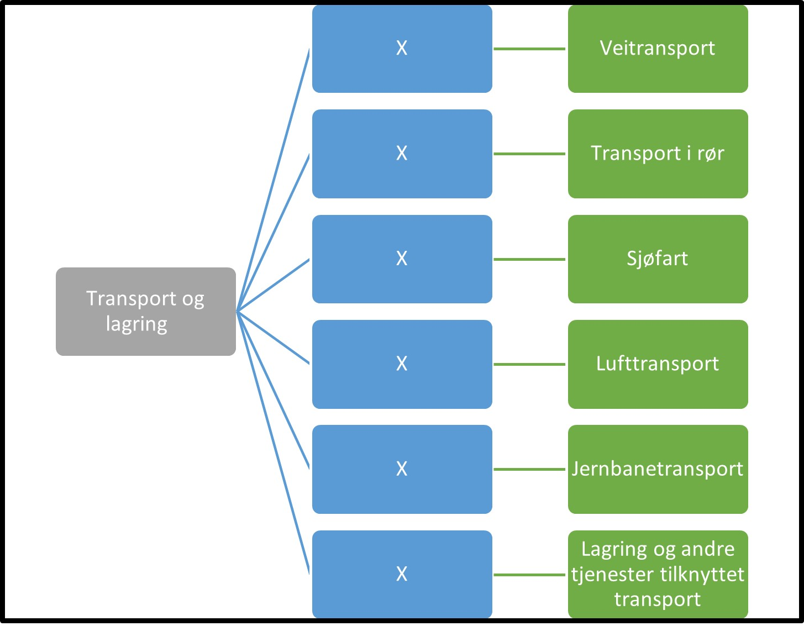

Tilbake til [hovedoversikt](/authorization/what-do-you-get/accessgroups/type-accessgroups/versjon-3/#oversikt-over-tilgangspakker)

- **Transport og lagring:** Denne fullmakten gir tilgang til alle tjenester som angår transport og lagring inkludert passasjer og godstransport, samt post- og kurervirksomhet. Ved regelverksendringer eller innføring av nye digitale tjenester kan det bli endringer i tilganger som fullmakten gir.
	- **Veitransport:** (mangler)	 **urn:altinn:accesspackage:veitransport**
	- **Transport i rør** (mangler)  **urn:altinn:accesspackage:transportiror**
	- **Sjøfart:** Denne fullmakten gir tilgang til alle tjenester knyttet til skipsarbeidstakere og fartøy til sjøs. Ved regelverksendringer eller innføring av nye digitale tjenester kan det bli endringer i tilganger som fullmakten gir. **urn:altinn:accesspackage:sjofart**
	- **Lufttransport:** Denne fullmakten gir tilgang til alle tjenester knyttet til luftfartøy og romfartøy. Ved regelverksendringer eller innføring av nye digitale tjenester kan det bli endringer i tilganger som fullmakten gir. **urn:altinn:accesspackage:lufttransport**
	- **Jernbanetransport:** Denne fullmakten gir tilgang til alle tjenester knyttet til jernbane, inkludert trikk, T-bane og sporvogn. Ved regelverksendringer eller innføring av nye digitale tjenester kan det bli endringer i tilganger som fullmakten gir. **urn:altinn:accesspackage:jernbanetransport**
	- **Lagring og andre tjenester tilknyttet transport:** Denne fullmakten gir tilgang til alle tjenester knyttet til  lagring og hjelpetjenester i forbindelse med transport, samt post- og kurervirksomhet. Ved regelverksendringer eller innføring av nye digitale tjenester kan det bli endringer i tilganger som fullmakten gir. **urn:altinn:accesspackage:lagringogandretjenestertilknyttettransport**

## Egenskaper ved tilgangspakkene
|Navn tillgangspakke|Kan delegeres til ansatte?|Kan knytte tjenester til?|[ER rolle](/authorization/what-do-you-get/accessgroups/register_er/#rolletyper-fra-enhetsregisteret) som får fullmakten|
|---|---|---|---|
|Transport og lagring| ja|nei||
|Veitransport|ja|ja|DAGL, LEDE, INNH, DTPR, DTSO, KOMP, BEST, REPR, BOBE|
|Transport i rør|ja|ja|DAGL, LEDE, INNH, DTPR, DTSO, KOMP, BEST, REPR, BOBE|
|Sjøfart|ja|ja|DAGL, LEDE, INNH, DTPR, DTSO, KOMP, BEST, REPR, BOBE|
|Lufttransport|ja|ja|DAGL, LEDE, INNH, DTPR, DTSO, KOMP, BEST, REPR, BOBE|
|Lagring og andre tjenester tilknyttet transport|ja|ja|DAGL, LEDE, INNH, DTPR, DTSO, KOMP, BEST, REPR, BOBE|

{} Det er fortsatt uavklart hvilke fullmakter det vil være natulig å gi personer med rollen Forretningsførerer innenfor fullmaktsområdet "Transport og lagring" {}

Tilbake til [hovedoversikt](/authorization/what-do-you-get/accessgroups/type-accessgroups/versjon-3/#oversikt-over-tilgangspakker)
