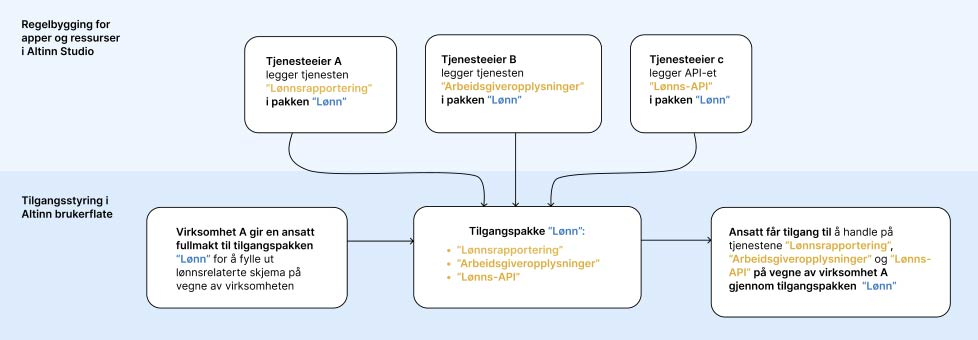

## Hvem definerer pakkene og tilgangene?

Autorisasjonsteamet i Digdir definerer og forvalter tilgangspakkene og fullmaktsområdene i Access Management. Teamet bestemmer navn, beskrivelser, URN-er og egenskaper. Det definerer også hvilke roller fra Enhetsregisteret som gir en pakke på forhånd.

Tjenesteeieren bestemmer hva en tilgangspakke gir tilgang til i tjenestene sine. I autorisasjonsreglene knytter tjenesteeieren en forhåndsdefinert pakke til en ressurs og angir hvilke handlinger pakken gir rett til, for eksempel å lese eller skrive. Ressursregisteret leser disse koblingene fra autorisasjonsreglene.

> Tilgangspakken inneholder ikke selv en fast liste over tjenester eller handlinger. Det faktiske innholdet er summen av autorisasjonsreglene der tjenesteeierne har brukt pakken.

## Tilgangspakker er et felles økosystem

Når flere tjenesteeiere legger tjenestene sine inn i samme tilgangspakke, bygger dere sammen et felles bransjeområde. Eksempel:

* Tjenesteeier A legger inn tjenesten “Lønnsrapportering” i pakken “Lønn”
* Tjenesteeier B legger inn tjenesten “Arbeidsgiveropplysninger” i pakken “Lønn”
* Tjenesteeier C legger inn API-et “Lønns-API” i pakken Lønn

Over tid blir tilgangspakken Lønn en samling av tjenester fra flere ulike etater, basert på tjenesteeiernes egne vurderinger av hvilke tjenester som hører hjemme i lønnsområdet.

## Når en bruker får tilgang til en tilgangspakke, får de alt i pakken

Hvis en virksomhet gir en ansatt tilgang til tilgangspakken “Lønn”, får vedkommende:

* tjenesten din som du har lagt inn i lønnspakken
* _og_ alle andre tjenester som andre tjenesteeiere har lagt inn i samme pakke

Det betyr at:
> Tilgangspakken er ikke en liste over dine tjenester – den er en samling tjenester som flere tjenesteeiere har vurdert som relevante for samme bransjeområde.

## Hvis ingen tilgangspakke passer

Tjenesteeieren kan ikke opprette en ny tilgangspakke selv. Send ønske om en ny pakke til [Altinn servicedesk](mailto:servicedesk@altinn.no). Autorisasjonsteamet vurderer om behovet kan dekkes av en eksisterende pakke, eller om katalogen skal utvides.

Beskriv hvilke tjenester eller ressurser pakken skal dekke, hvem som trenger tilgang, aktuelle handlinger og om tilgangen omfatter opplysninger som krever særskilt beskyttelse.

## Forhåndstildelte og ikke-forhåndstildelte tilgangspakker

Tilgangspakker skal brukes for å styre tilgang til tjenester og ressurser. De fleste har forhåndstildelte roller fra Enhetsregisteret som har fullmakt til å opptre på vegne av virksomheten og dermed kan dele tilgang videre. Noen pakker – særlig der innholdet er sensitivt – har ingen forhåndstildelte roller og må tildeles manuelt av virksomhetens hovedadministrator.

## Fullmaktsområder

Tilgangspakkene er inndelt i fullmaktsområder inspirert av SSBs kategorisering av virksomheter. Hvert område samler tilgangspakker som naturlig hører sammen, og gjør det enklere både for tjenesteeiere å plassere tjenester riktig og for virksomheter å delegere passende fullmakter.

- [Se fullmaktsområder og tilgangspakker for virksomheter](./business/).
- [Se fullmaktsområder og tilgangspakker for innbyggere](./citizens/).

Lenkene **Se innhold** på områdesidene åpner pakken i Tjenesteoversikten i en ny fane. Tjenesteoversikten er en uoffisiell visualisering som bruker Altinns åpne API-er.

## Kilder for vedlikehold

Access Management-koden er fasiten for katalogen:

- [`PackageConstants.cs`](https://github.com/Altinn/altinn-authorization-tmp/blob/main/src/apps/Altinn.AccessManagement/src/Altinn.AccessMgmt.PersistenceEF/Constants/PackageConstants.cs) definerer navn, beskrivelser, URN-er, fullmaktsområder og egenskaper for tilgangspakkene.
- [`AreaConstants.cs`](https://github.com/Altinn/altinn-authorization-tmp/blob/main/src/apps/Altinn.AccessManagement/src/Altinn.AccessMgmt.PersistenceEF/Constants/AreaConstants.cs) definerer fullmaktsområdene.
- [`IngestRolePackage.cs`](https://github.com/Altinn/altinn-authorization-tmp/blob/main/src/apps/Altinn.AccessManagement/src/Altinn.AccessMgmt.PersistenceEF/Data/IngestRolePackage.cs) definerer hvilke roller som får tilgang til hvilke pakker.
- [DelegationCheckHelper.cs](https://github.com/Altinn/altinn-resource-registry/blob/main/src/Altinn.ResourceRegistry.Core/Utils/DelegationCheckHelper.cs) viser hvordan Ressursregisteret leser ressurser, handlinger og tilgangspakker fra autorisasjonsreglene.

[Se SSBs standard for næringsgruppering, som har inspirert inndelingen av fullmaktsområdene](https://www.ssb.no/klass/klassifikasjoner/6).
