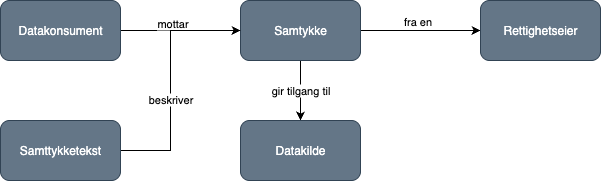
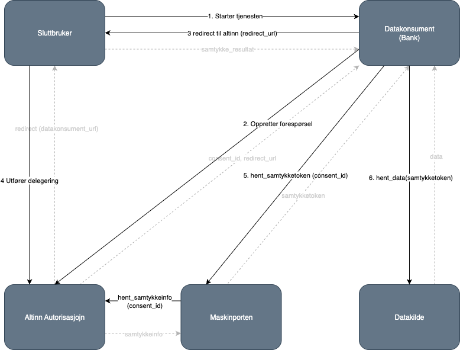

Depending on the purpose and content of the consent, it can give the service owner both the necessary legal basis for sharing data in line with the Personal Data Act/GDPR and consent for, for example, lifting statutory confidentiality.

## What do you get with consent in Altinn 3?

- An end-to-end consent process where Altinn manages the dialogue between end user, data consumer, and service owner.
- A single Maskinporten consent token that contains everything you need to validate and log the delegation.
- An improved end-user experience with an upgraded consent screen and clearer information flow.
- Flexible support for third-party vendors that can administer consent on behalf of the data consumer.
- Built-in controls for access lists, duration, and revocation so users and service owners stay in control of shared data.

## What's new in Altinn 3?

The consent process in Altinn 2 works well, so we have aimed to change it as little as possible to keep the transition to Altinn 3 simple. To make the experience even smoother for everyone involved, we have still introduced some improvements.

- **Simplified token handling:** Only one Maskinporten token is used, containing all the information about the consent.
- **New token format:** API providers must update their validation code to interpret the new format. The format is described in the guides for both [service owners](/en/authorization/guides/resource-owner/consent/) and [data consumers](/en/authorization/guides/system-vendor/consent/).
- **Improved user experience:** End users meet an upgraded and more user-friendly interface.
- **Support for vendors:** Option to use third-party vendors to manage the consent process.

## How the consent process works

### Actors

**End user** Individual or organisation that grants consent.  
**Data consumer** Organisation (e.g. a bank) that requests access to data.
**Service owner** (Data source) Public entity that owns the data. [

### Process flow

1. The end user starts a service where the data consumer needs to fetch data from a public service → initiates the consent flow.
2. The data consumer sends a consent request to Altinn.
3. Altinn returns a `redirect_url` → the user is sent there to approve.
4. The user authenticates and grants consent (delegation).
5. The data consumer retrieves the consent token (`consent_id`).
6. The data consumer uses the token to fetch data from the service owner (data source).



| Step                   | Description                                                                      | Technical action                                                                    | Comment                                            |
| ---------------------- | -------------------------------------------------------------------------------- | ----------------------------------------------------------------------------------- | -------------------------------------------------- |
| 1. Start the service   | End user starts the consent process via the data consumer (e.g. the bank’s site) | User clicks “Request consent”                                                       | Data consumer initiates the flow                   |
| 2. Create request      | Data consumer creates a consent request in Altinn                                | POST /api/consentRequests with parameters (CoveredBy, OfferedBy, RedirectUrl, etc.) | Requires enterprise authentication (Maskinporten)  |
| 3. Redirect to Altinn  | Data consumer sends the end user to Altinn’s consent form                        | Redirect to a GUI link that contains `consentRequestId`                             | User reviews and approves the request              |
| 4. Perform delegation  | User approves the consent in Altinn                                              | Altinn registers the delegation and updates the consent status                      | User signs in via ID-porten                        |
| 5. Fetch consent token | Data consumer fetches a consent token after approval                             | GET /api/consentTokens/{consent_id}                                                 | Token confirms that consent has been granted       |
| 6. Fetch data          | Data consumer uses the consent token to access data from the service owner       | API call to the service owner with the token in the header                          | Service owner validates the token and returns data |



## Technical requirements

### Enterprise authentication

Data consumers must authenticate via Maskinporten with the correct scopes.

To use consent, the data consumer needs the following tokens:

- altinn:consentrequests.read
- altinn:consentrequests.write

In addition to this, each individual service owner must grant the necessary tokens for their service.
The service owner is responsible for documenting the necessary tokens for their service, as well as how the data consumer can be granted these.

### Access lists

Service owners can control which organisations are allowed to use the service with access lists.

### Validity

Consents must have a defined duration.

### Revocation

The user can withdraw consent at any time in the Altinn portal.

## Use of Suppliers

For data consumers, it is possible to use suppliers (third-party actors) to create consent requests and retrieve data on behalf of the data consumer.

**Requirements for using a supplier:**

1. Scope `altinn:consentrequests.write` must be delegated to the supplier.
2. The scope for the relevant API must also be delegated to the supplier (e.g., [skatteetaten:inntekt](https://skatteetaten.github.io/api-dokumentasjon/api/inntekt)).
3. The supplier creates the request on behalf of the data consumer.
4. The user retrieves the consent token and calls the API to fetch data.

> **Note:** End users receive information in the GUI that the consent is handled by a supplier.

## The EBevis Solution

For Digdir's EBevis solution, Digdir can request consent on behalf of the data consumer without the scope being delegated to Digdir. This makes it possible for actors such as municipalities to use the solution without having a complete setup in Maskinporten.

The EBevis solution has its own scope that allows the creation of consent requests for all organizations for their resources.

## Getting started

Read the specific steps you need to complete under [Getting Started](/nb/authorization/getting-started/consent/)
