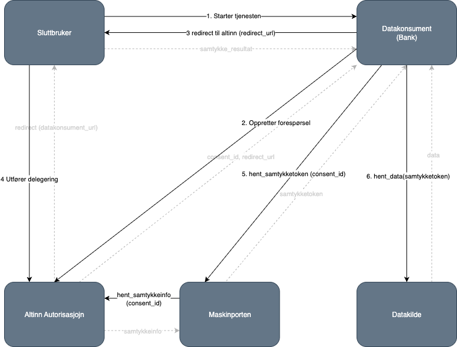

Avhengig av samtykkets formål og innhold, kan dette gi tjenesteeier både nødvendig rettslig grunnlag/behandlingsgrunnlag for deling av data i henhold til personopplysningsloven/GDPR, og samtykke til eksempelvis oppheving av taushetsplikt.

## Hva får du med Samtykke?

- Helhetlig samtykkeprosess hvor Altinn håndterer dialogen mellom sluttbruker, datakonsument og tjenesteeier.
- Ett samtykketoken fra Maskinporten som samler all informasjon du trenger for å validere og loggføre delegeringen.
- Bedre sluttbrukeropplevelse med oppgradert samtykkeskjerm og tydeligere informasjonsflyt.
- Fleksibel støtte for tredjepartsleverandører som kan administrere samtykke på vegne av datakonsument.
- Innebygd styring av tilgangslister, varighet og tilbakekall slik at brukere og tjenesteeiere beholder kontrollen over delte data.

## Hva er nytt i Samtykke?

Dagens samtykkeprosess i Altinn 2 fungerer i utgangspunktet veldig bra, og vi har derfor tilstrebet å endre den minst mulig for å gjøre overgangen til Altinn 3 så enkel som mulig. For å gjøre prosessen enda mer smidig for alle parter har vi likevel gjort noen forbedringer.

- **Forenklet token-håndtering:** Kun ett Maskinporten-token benyttes, som inneholder all nødvendig informasjon om samtykket. Dette gjøre det enklere for Datakonsument som kun trenger etterspørre ett token, samt for tjenesteier som mottar både autentisering- og autorisasjonsinsinformasjon i samme token.
- **Nytt token-format:** API-tilbydere må oppdatere valideringskoden for å tolke det nye formatet. Nytt format er beskrevet under Guider for både [Tjenesteeier](/nb/authorization/guides/resource-owner/consent/) og [Datakonsument](/nb/authorization/guides/system-vendor/consent/)
- **Bedre brukeropplevelse:** Sluttbrukere møter et oppgradert og mer brukervennlig grensesnitt.
- **Støtte for leverandører:** Mulighet for å bruke tredjepartsleverandører til å håndtere samtykkeprosessen.

## Slik fungerer samtykkeprosessen

### Aktører

**Sluttbruker** Privatperson eller virksomhet som skal gi samtykke.  
**Datakonsument** Organisasjon (f.eks. bank) som ønsker tilgang til data.  
**Tjenesteeier** (Datakilde) Offentlig virksomhet som eier dataene.  
**Altinn Autorisasjon** Altinns system for samtykke, delegering og autorisasjon.  
**Maskinporten** Felles infrastruktur for autentisering og tokens (OAuth2).

### Prosessflyt

1. Sluttbruker starter en tjeneste der datakonsument må hente data fra offentlig tjeneste → initierer samtykkeflyten.
2. Datakonsument sender samtykkeforespørsel til Altinn.
3. Altinn returnerer en redirect_url → brukeren sendes dit for å godkjenne.
4. Brukeren autentiserer seg og gir samtykke (delegering).
5. Datakonsument henter samtykketoken (consent_id).
6. Datakonsument bruker tokenet til å hente data fra tjenesteeier (datakilde).



| Steg                     | Beskrivelse                                                                       | Teknisk handling                                                                  | Kommentar                                       |
| ------------------------ | --------------------------------------------------------------------------------- | --------------------------------------------------------------------------------- | ----------------------------------------------- |
| 1. Starter tjenesten     | Sluttbruker starter samtykkeprosessen via datakonsument (f.eks. bankens nettside) | Bruker klikker "Innhent samtykke"                                                 | Datakonsument initierer flyten                  |
| 2. Oppretter forespørsel | Datakonsument oppretter en samtykkeforespørsel i Altinn                           | POST /api/consentRequests med parametre (CoveredBy, OfferedBy, RedirectUrl, osv.) | Krever virksomhetsautentisering (Maskinporten)  |
| 3. Redirect til Altinn   | Datakonsument sender sluttbrukeren til Altinns samtykkeskjema                     | Redirect til GUI-lenke som inneholder consentRequestId                            | Brukeren ser og godkjenner forespørselen        |
| 4. Utfører delegering    | Brukeren godkjenner samtykke i Altinn                                             | Altinn registrerer delegering og oppdaterer samtykkestatus                        | Brukeren logger inn via ID-porten               |
| 5. Hent samtykketoken    | Datakonsument henter et samtykketoken etter godkjenning                           | GET /api/consentTokens/{consent_id}                                               | Token bekrefter at samtykke er gitt             |
| 6. Hent data             | Datakonsument bruker samtykketoken til å hente data fra tjenesteeier              | API-kall mot tjenesteeier med token i header                                      | Tjenesteeier validerer token og returnerer data |



## Tekniske krav

### Virksomhetsautentisering:

Datakonsumenter må autentisere seg via Maskinporten med gyldige scopes.
For å benytte samtykke trenger datakonsument følgende token:

- altinn:consentrequests.read
- altinn:consentrequests.write

I tillegg til dette må den enkelte tjesteeier tildele nødvndige token for sin tjeneste.
Tjenesteeier er ansvarlig for å dokumentere nødvendige token for sin tjenste, samt hvordan datakonsument kan få tildelt disse.

### Tilgangslister

Tjenesteeier kan styre hvilke virksomheter som kan bruke tjenesten ved hjelp av tilgangslister.

### Gyldighet:

Samtykker skal ha en definert varighet.

### Tilbakekall/Revokering:

Brukeren kan når som helst trekke tilbake samtykket i Altinn-portalen.

## Bruk av leverandører

For datakonsument er mulig å benytte leverandører (tredjepartsaktører) til å opprette samtykkeforespørsler og hente ut data på vegne av datakonsumenten.

**Krav for bruk av leverandør:**

1. Scope `altinn:consentrequests.write` må delegeres til leverandøren.
2. Scope for det aktuelle API-et må også delegeres til leverandøren (f.eks. [skatteetaten:inntekt](https://skatteetaten.github.io/api-dokumentasjon/api/inntekt)).
3. Leverandøren oppretter forespørselen på vegne av datakonsumenten.
4. Brukeren henter ut samtykketoken og kaller API-et for å hente data.

> **Merk:** Sluttbruker får informasjon i GUI om at samtykket håndteres av leverandør.

## EBevis-løsningen

For Digdirs EBevis-løsning kan Digdir be om samtykke på vegne av datakonsument uten at scope er delegert til Digdir. Dette gjør det mulig for aktører som kommuner å bruke løsningen uten å ha fullt oppsett i Maskinporten.

EBevis-løsningen har et eget scope som tillater opprettelse av samtykkeforespørsler for alle virksomheter for sine ressurser.

## Kom i gang

Les konkrete steg du må gjennomføres under [Kom i gang](/nb/authorization/getting-started/consent/)
