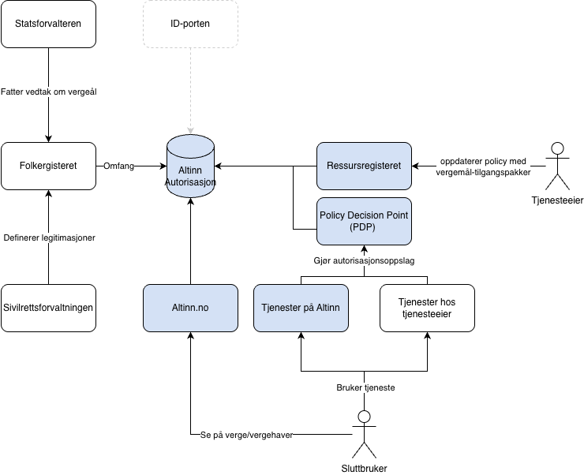

Personer som ikke kan ta hånd om interessene sine selv på grunn av skade, sykdom eller funksjonsnedsettelse, kan få hjelp av en verge.
En slik ordning er frivillig og tilpasset ønskene og behovene til den som har verge.
Statsforvalteren oppnevner og følger opp vergene, og Sivilrettsforvaltningen er sentral vergemålsmyndighet.

{}
Dette er funksjonalitet som enda ikke er i TEST eller PROD, men som er planlagt lansert tidlig i mars.
For å være klar kan du starte med å finne ut hva som er relevante vergemål, samt integrere mot aktørvalg og autorisasjonsoppslag.
{}

## Slik fungerer vergemål i Altinn

Altinn Autorisasjon tilrettelegger slik at tjenesteeiere enkelt kan innføre støtte for vergemål i tjenester som bruker Altinn Autorisasjon:

- Legitimasjoner definert av Sivilrettsforvaltningen hentes fra Folkeregisteret og kobles direkte mot tilgangspakker i Altinn Autorisasjon.
- Tjenesteeier oppretter tilgangsregler knyttet til tilgangspakkene for sin tjeneste.
- Tjenesteeier legger til aktørvalg i tjenesten sin.
- Tjenesteeier gjør autorisasjonsoppslag (PDP) fra tjenesten.
- Folkeregisteret er autoritativ kilde — det er ikke mulig å gi eller trekke tilbake vergefullmakter i Altinn.
- Ved behov for å gi private fullmakter finnes det egne tilgangspakker for privatpersoner.

## Slik ser det ut for brukerne

I brukerflaten for tilgangsstyring vil vergehaver se sine verger, og verger vil se personene de er verge for.
Dersom en vergehaver har flere verger, vises alle, men det vises ikke innenfor hvilke områder den enkelte vergen har ansvar.

## Slik innfører du støtte for vergemål

1. Opprett en autorisasjonsressurs.
2. Sett tilgangsregler for vergemål.
3. Legg til støtte for aktørvalg og autorisasjonsoppslag.

Når dette er på plass, kan vergen logge inn, velge å representere vergehaver og utføre handlinger i tjenesten.

Se [steg-for-steg-guide for å innføre vergemål](/nb/authorization/getting-started/guardianship/).

## Les mer

- Les mer om vergemål hos [Sivilrettsforvaltningen](https://www.vergemal.no).
- Statsforvalteren er lokal vergemålsmyndighet og fatter vedtak om opprettelse, endring og opphør av vergemål.
  Vedtak og opplysninger meldes til Folkeregisteret for registrering, mens Sivilrettsforvaltningen er overordnet fag- og klageinstans.
