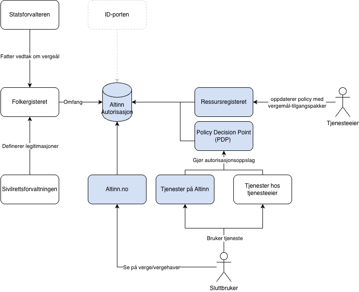

Personer som ikke kan ta hånd om interessene sine selv på grunn av skade, sykdom eller funksjonsnedsettelse, kan få hjelp av en verge.
En slik ordning er frivillig og tilpasset ønskene og behovene til den som har verge.
Statsforvalteren oppnevner og følger opp vergene, og Sivilrettsforvaltningen er sentral vergemålsmyndighet.

## Slik innfører du støtte for vergemål

Sivilrettsforvaltningen definerer vergefullmaktene som angir hva en verge kan gjøre på vegne av vergehaver. Vergefullmaktene hentes fra Folkeregisteret og kobles mot tilgangspakker i Altinn Autorisasjon — du som tjenesteeier trenger ikke å håndtere dette.

Som tjenesteeier gjør du tre ting:

1. Oppretter tilgangsregler som knytter aktuelle vergefullmakter til tjenesten din.
2. Legger til aktørvalg slik at vergen kan velge hvem hen representerer.
3. Gjør et autorisasjonsoppslag for å bekrefte at vergen har riktig vergefullmakt.

Når dette er på plass, kan vergen logge inn, velge å representere vergehaver og utføre handlinger i tjenesten.

Folkeregisteret er autoritativ kilde for vergefullmakter. Det er ikke mulig å gi eller trekke tilbake vergefullmakter i Altinn — det gjøres hos Statsforvalteren.

Se [steg-for-steg-guide for å innføre vergemål](/nb/authorization/getting-started/guardianship/).

## Slik ser det ut for brukerne

Når en verge logger inn på en tjeneste som støtter vergemål, vises alle vergehaverne hen er verge for — avgrenset til vergefullmaktene tjenesten har støtte for. Vergen velger en vergehaver fra aktørvalget og kan deretter utføre handlinger på vegne av den valgte vergehaveren.

I brukerflaten for tilgangsstyring i Altinn vil vergehaver se sine verger, og verger vil se personene de er verge for. Har en vergehaver flere verger, vises alle, men det vises ikke innenfor hvilke områder den enkelte vergen har ansvar.

## Les mer

- [Vergefullmakter fra Sivilrettsforvaltningen — oversikt over hva de ulike vergefullmaktene dekker](/nb/authorization/what-do-you-get/accessgroups/accessgroups-citizens/verger/)
- [Les mer om vergemål hos Sivilrettsforvaltningen](https://www.vergemal.no)
