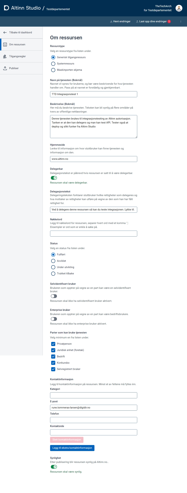
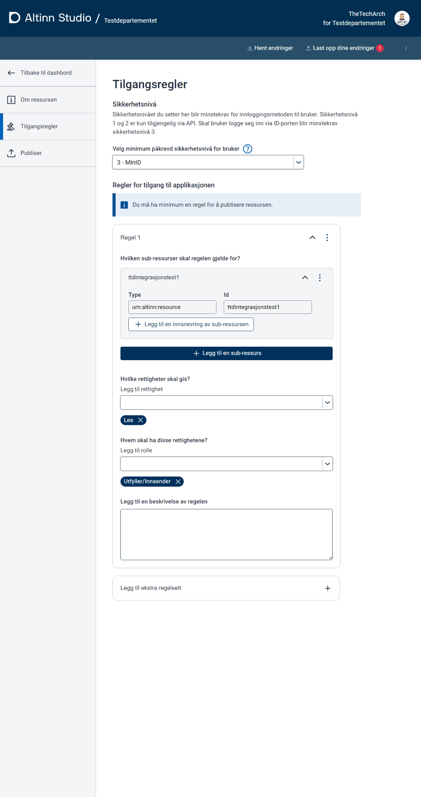
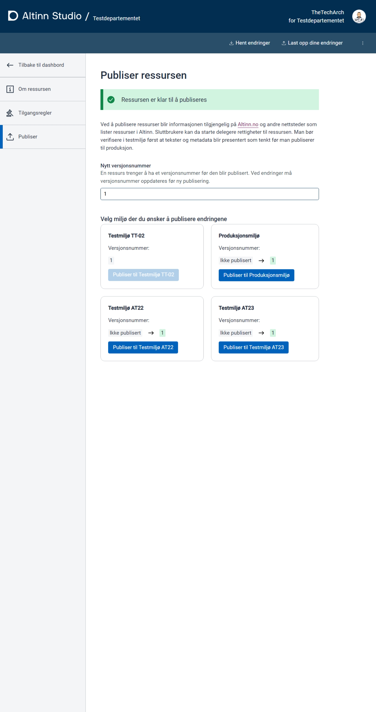


This is work in progress


## Type of resources

There are different types of resources that can be registrated

- GenericAccessResource
- MaskinportenSchema
- Systemresource
  
Later it will be possible to registrate

- Altinn 3 Apps
- Legacy Altinn 2 services for legacy archive authorization (not finalized)

### Generic Access Resources

GenericAccessResources will be used as linkServices are used in Altinn 2.

The resource would be any type of service provided by public organiazations.

We used [cpsv:PublicService](https://informasjonsforvaltning.github.io/cpsv-ap-no/#OffentligTjeneste) as inspiration to the data model.

This also allows Felles datakatalog to consume the definition for their [service catalogue](https://data.norge.no/public-services-and-events)

See full list [in production](https://platform.altinn.no/resourceregistry/api/v1/resource/search).

Some examples

- API's exposing data [Example3](exampleresource3.json) [XACML](policysample3.xml)
- Portal functionality in Altinn [Example 1](exampleresource1.json) [XACML](policysample3.xml)
- Portal functionality in external portal [Example 2](exampleresource2.json)
- Samordna registermelding [Example 4](exampleresource4.json) [XACML](policysample4.xml)
- Avtale om Arbeidstrening [Example 6](exampleresource6.json) [XACML](policysample6.xml)
- Lakselus MaskinPortenSchema [Example 7](https://platform.altinn.no/resourceregistry/api/v1/resource/mat-maskinportenschema-lakselusrapportering/) [XACML](https://platform.altinn.no/resourceregistry/api/v1/resource/mat-maskinportenschema-lakselusrapportering/policy)

## Resource attributes

The below table list the attributes a resource has in the resource registry. For attributes defined i cpsv:PublicService there is a link to the description.

|Attribute|Beskrivelse|Used for i Altinn|Format|Mand.|
|---|-----|---|---|---|
| [identifier](https://informasjonsforvaltning.github.io/cpsv-ap-no/#OffentligTjeneste-identifikator) |Identifes the resource.| Altinn tjenestekatalog + Tilgangsstyring + Tilgangskontroll.| Unik og persistent. Fritekst, max ? tegn. Bør være lesbar.|Yes|
| [title](https://informasjonsforvaltning.github.io/cpsv-ap-no/#OffentligTjeneste-navn) |The resource title | Altinn tjenestekatalog + Tilgangsstyring. (search)|Fritekst, max ? tegn, på alle språk (nb, nn, en)|Yes|
| [description](https://informasjonsforvaltning.github.io/cpsv-ap-no/#OffentligTjenest-beskrivelse)|Describes the resource. | Altinn tjenestekatalog + Tilgangsstyring (search)|Fritekst, max ? tegn på alle språk (nb, nn, en)| Yes|
| [hasCompetent Authority](https://informasjonsforvaltning.github.io/cpsv-ap-no/#OffentligTjeneste-harKompetentOrgan)|Resource owner (when public) | Altinn tjenestekatalog + Tilgangsstyring (search/filter) | Orgnr, tjenesteeierkode (fra A2), navn (nb, nn. en)|Yes|
| [ownedBy](https://informasjonsforvaltning.github.io/cpsv-ap-no/#Tjeneste-eiesAv )|Resource owner (when private) | Ingen private tjenester i Altinn i dag, attributt brukes ikke. |Orgnr|No|
| [contactpoint](https://informasjonsforvaltning.github.io/cpsv-ap-no/#OffentligTjeneste-kontaktpunkt)|Who to contact aboute the service| Altinn tjenestekatalog |epost, telefonnummer eller url til kontaktside|Yes|
| [homepage](https://informasjonsforvaltning.github.io/cpsv-ap-no/#OffentligTjeneste-hjemmeside)|Homepage for service | Altinn tjenestekatalog |url |No|
| [keyword](https://informasjonsforvaltning.github.io/cpsv-ap-no/#OffentligTjeneste-n%C3%B8kkelord)| A keyword, term or phrase to describe the Public Service. | Altinn tjenestekatalog? |fritekst, max ? tegn.| No|
| [status](https://informasjonsforvaltning.github.io/cpsv-ap-no/#OffentligTjeneste-status)|Indicates the status of a service | Altinn tjenestekatalog? |Mulige verdier i henhold til [standard](https://raw.githubusercontent.com/SEMICeu/ADMS-AP/master/purl.org/ADMS_SKOS_v1.00.rdf): "Completed", "Deprecated", "UnderDevelopment", "Withdrawn"|No|
| [isPartOf](https://informasjonsforvaltning.github.io/cpsv-ap-no/#OffentligTjeneste-erDelAv)|Linkes to related services |Altinn tjenestekatalog + Tilgangsstyring|[cpsv:PublicService](https://informasjonsforvaltning.github.io/cpsv-ap-no/#OffentligTjeneste) eller [cpsvno:Service](https://informasjonsforvaltning.github.io/cpsv-ap-no/#Tjeneste). Skal det opprettes tjenestegruppe? |No|
| [spatial](https://informasjonsforvaltning.github.io/cpsv-ap-no/#OffentligTjeneste-dekningsomr%C3%A5de)|Area the public service is available to |Altinn tjenestekatalog?|En av følgende EUvoc verdier: [Continent](https://op.europa.eu/en/web/eu-vocabularies/concept-scheme/-/resource?uri=http://publications.europa.eu/resource/authority/continent), [Contry](https://op.europa.eu/en/web/eu-vocabularies/concept-scheme/-/resource?uri=http://publications.europa.eu/resource/authority/country), eller [Place](https://op.europa.eu/en/web/eu-vocabularies/concept-scheme/-/resource?uri=http://publications.europa.eu/resource/authority/place).  Angivelse i Norge benyttes [Administrative enheter](https://data.geonorge.no/administrativeEnheter/nasjon/doc/173163)|No|
| [produces](https://informasjonsforvaltning.github.io/cpsv-ap-no/#OffentligTjeneste-produserer)|Linkes to the outcome of a public service | Altinn tjenestekatalog? + Tilgangsstyring? |[cv:output](https://informasjonsforvaltning.github.io/cpsv-ap-no/#OffentligTjeneste-produserer): id + Fritekst|No|
| rights Description|Describes the power of attorney given in access management | Tilgangsstyring |Fritekst, max ? tegn.|Yes, if delgatble|
| limitedByRRR |Defines if RRR will be used to controll access| Tilgangsstyring + Tilgangskontroll | Boolean|Yes|
| availableForType |Defines what type of party that can use service| Altinn tjenestekatalog + Tilgangsstyring |Mulige verdier: Privatperson, Juridisk enhet (foretak), Bedrift, Konkursbo, Selvregistert bruker|Yes|
| SelfIdentified UserEnabled |The user acting on behalf of party can be a selfidentifed users| Tilgangsstyring + Tilgangskontroll |Boolean?|Yes|
| Enterprise UserEnabled |The user acting on behalf of party can be an  enterprise users| Tilgangsstyring + Tilgangskontroll |Boolean?|Yes|
| Reference | Referance to other IDs or values| Tilgangsstyring + Tilgangskontroll |Mulige verdier: SerivdeEditionCode, ServiceCode, MaskinportenScope, DelegationschemeID, AppID, Uri|No|
| Resourcetype | Type of resource.|Tilgangsstyring| Mulige verdier: Systemresource, MaksinportenSchema, GenericAccessResource|Yes|
|delegable|Indicates if a rights to perfome a service can be given to others|Tilgangsstyring|Boolean?|Yes|
|visible|Indicates if a service should be visable to users i GUI|Tilgangsstyring|Boolean?|Yes|
## Policies

Polices defined for apps and resources will be stored by resource registry.

### App Policies

The App Policies are policies for Apps [created in Altinn Studio](../../../../../../../../altinn-studio/reference/configuration/authorization/). 
The policy is created in Altinn Studio and migrated to the Access Policy component when the app is deployed to a test or production environment.

An app policy contains information about the different resources in an App and who and what kind of operations they are allowed to perform. 
The who is identified using Altinn Roles, Access Groups, or roles/groups from other sources.

**Example**

- [BRG RRH-Innrapportering](apppolicy_brg_rrh-innrapportering.xml)

### Resource Registry Policies

The resource registry policies are policies for resources that is not comming from Altinn 3 apps. It could be any functionality hosted on any platform. 

Both digital and analog services can be registrated in the resource registry.

### Administration from Altinn Studio

## Construction

See [construction components](/authorization/reference/architecture/resourceregistry/) if you want to see how the component is built. 
