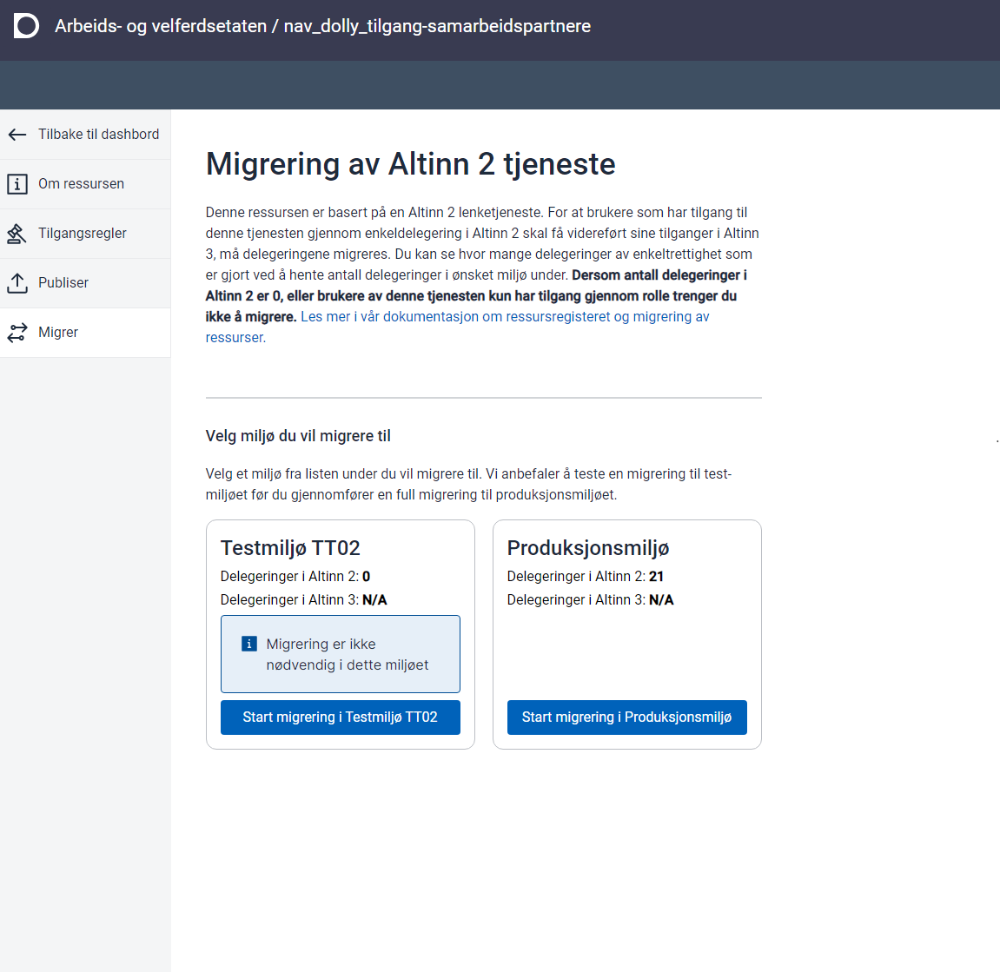
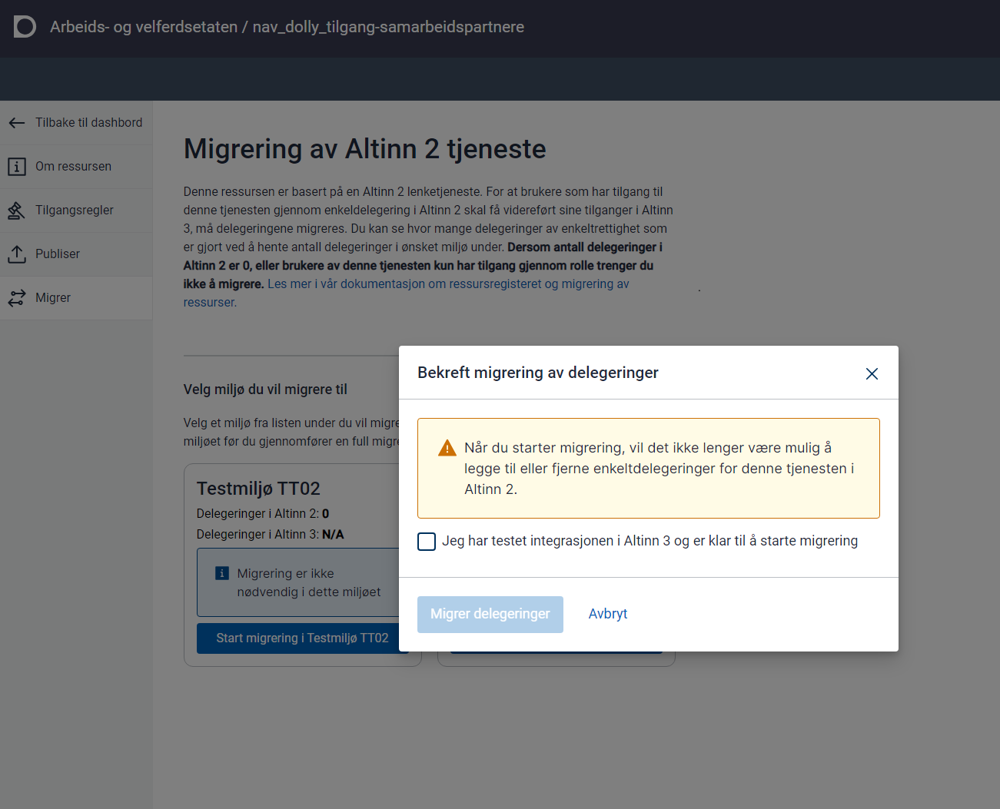

In the Resource Registry you can create brand-new resources or base them on Altinn 2 linked services.

{}
Altinn 2 linked services where Altinn provides startup control will not be continued.

Organisations that rely on startup control must implement it themselves and redirect users straight to their solution, for example from the Altinn service catalogue.
{}

### Import from Altinn 2 Linked Services

Linked services in Altinn 2 that are used for external authorisation must be moved to the Resource Registry on the Altinn 3 platform.

Altinn Studio lets you create new resources based on those linked services.

**Use this option if you need to migrate existing delegations from an Altinn 2 service so they also apply to the new resource in Altinn 3.**

Select "Import Resource".


Provide the ID to be used in the Resource Registry. This ID becomes the primary reference to the resource.


When you click "Import", Altinn Studio creates a new resource in your organisation’s repository.

The Resource Registry requires more complete data than Altinn 2. You must add:

- Title in Bokmål, Nynorsk, and English
- Delegation text in Bokmål, Nynorsk, and English
- Description in Bokmål, Nynorsk, and English
- Contact information for the service (can be displayed in the service catalogue)


#### Access Rules

Import creates access rules that mirror those in Altinn 2.

Add any relevant access packages so the service is ready for a transition to access packages based on Altinn roles.


{}
For delegation migration to succeed, the policy must still contain the rules that exist in Altinn 2. For example, you cannot remove the signing rule if it was part of the service there.
{}

#### Publishing

When the resource information is complete, you can publish it to the test or production environment.

#### Changing API Integration

To enforce access control in external services, the service owner must call Altinn access control (PDP). The API is based on the XACML standard.

The request contains:

- Who wants to perform the request
- Which resource the request concerns, and the party associated with it
- Which operation the end user wants to perform

You can check multiple operations in the same request if needed.

#### Migration of Delegations

Most linked services have [active delegations in Altinn 2](https://github.com/Altinn/altinn-access-management/issues/579). These rights are granted from an actor to a person or organisation. To preserve user access after moving to the Resource Registry, the delegations must be migrated.

In Altinn Studio you can start a batch job for services **created from an imported Altinn 2 resource**. The job:

- deactivates the Altinn 2 service so delegations cannot change during the migration
- copies the delegations to the new resource in Altinn 3

The functionality is currently hidden behind a feature flag in Altinn Studio.

```javascript
localStorage.setItem("featureFlags", '["resourceMigration"]');
```

Run the command in the browser console (developer tools).

After you start the batch job it takes roughly ten minutes before it kicks off. The first step is to deactivate the service in Altinn 2 before migrating to Altinn 3.

The service must already be deployed to the environment in which you plan to migrate delegations. We strongly recommend testing in TT02 before running the job in production.





When the job finishes, the delegations are transferred. Verify the result manually for now—counts are not yet available. We welcome feedback from service owners so we can fine-tune the process.

##### Creating Reference to Altinn 2 Service

If you have created a resource in the Altinn 3 Resource Registry without using the import functionality, you can add the reference manually.

Add the reference by editing the resource file in Gitea with content similar to:

```json
"resourceReferences": [
    {
        "referenceSource": "Altinn2",
        "reference": "5600",
        "referenceType": "ServiceCode"
    },
    {
        "referenceSource": "Altinn2",
        "reference": "100",
        "referenceType": "ServiceEditionCode"
    },
    {
        "referenceSource": "Altinn2",
        "reference": "https://test.landbruksdirektoratet.no/disko/soker",
        "referenceType": "Uri"
    }
]
```

Remember to use the correct service codes and URL.
