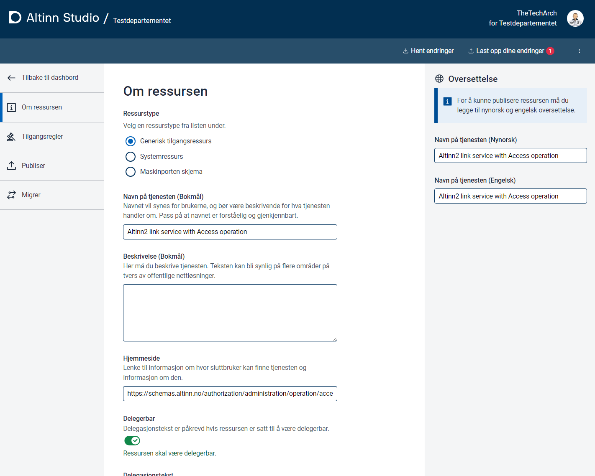
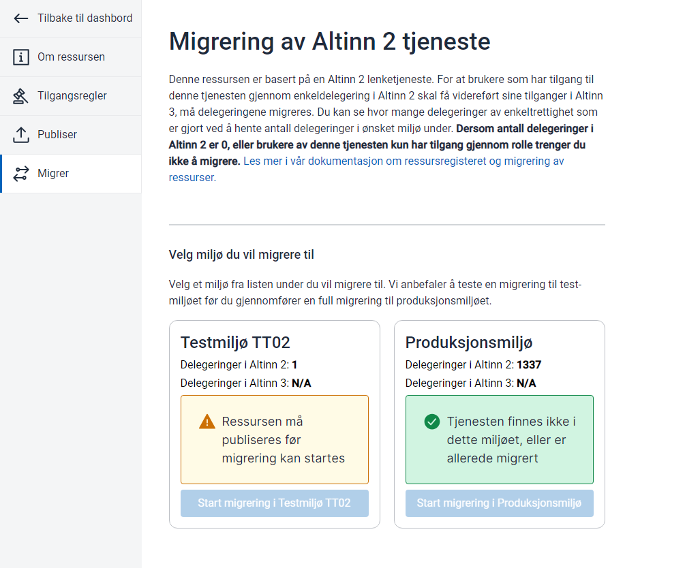

In the resource registry, you can create entirely new resources or base resources on Altinn 2 linked services.

{}
Altinn 2 linked services where Altinn offers startup control will not be continued.

This means that those who currently use startup control must implement this in their own solutions and link the user directly to their solution. For example, from the Altinn service catalog.
{}

### Import from Altinn 2 Linked Services

If you have existing linked services in Altinn 2 that you use for external authorization, these must be moved to the resource registry in the Altinn 3 platform.

In Altinn Studio, you can choose to create new resources based on existing linked services.

Select import resource


Provide the ID to be used in the Altinn resource registry. This ID will be central in


When you click import, a new resource is created in Altinn Studio in the organization's repository.

Since the resource registry requires more complete data than was possible to set in Altinn 2, you will need to fill in additional values

- Title in Bokmål, Nynorsk, and English
- Delegation text in Bokmål, Nynorsk, and English
- Description in Bokmål, Nynorsk, and English
- Contact information for the service (can be displayed in the service catalog)



#### Access Rules

Upon import, access rules similar to those in Altinn 2 are created.

Relevant access packages should also be added to make the service ready for transition to access packages from Altinn roles.


#### Publishing

When the properties of the resource are complete, it can be published to the test environment or production.

#### Change of API Integration

To perform access control on users in external services, the service owner must make calls to Altinn access control (PDP) to check access.
This is done via an API based on the XACML standard.

Functionally, the request contains

- Information about who wants to perform the request
- What type of resource is being discussed and who is the party for that resource.
- What operation the end user wants to perform.

In a request, you can ask about several things simultaneously if needed.

#### Migration of Delegations

For most linked services, there are [active delegations in Altinn 2](https://github.com/Altinn/altinn-access-management/issues/579). These are rights that have been granted from an actor to a person or organization. For these users to continue to have access after a transition to the resource registry, the rights must be migrated over.

In Altinn Studio, you can start a batch on services created **based on an imported resource from Altinn 2** that:

- Deactivates the Altinn 2 service so that no changes to delegation can be made.
- Copies the delegations to the new resource in Altinn 3.

Currently, this function is hidden behind a feature flag in Altinn Studio.

```javascript
localStorage.setItem('featureFlags', "[\"resourceMigration\"]")
```

Run the command above in the browser console (available via developer tools).

Starting the batch job will take about 10 minutes before the job starts. The first thing the job does is deactivate the service before it runs the migration to Altinn 3.

The service must be migrated to the environment where you want to migrate delegations. We strongly recommend testing this in TT02 before running the job in Altinn 3.




After running, the delegations will be transferred. This must currently be checked manually as counting is not yet available.

We hope for feedback from service owners to adapt the process.

##### Create Reference to Altinn 2 Service

If you have created a resource in the Altinn 3 resource registry without using the import functionality, you can add a reference manually.

This can be done by the following methods:

**Edit Resource File in Gitea**

The format of what needs to be added is as follows:

```json
"resourceReferences": [
    {
        "referenceSource": "Altinn2",
        "reference": "5600",
        "referenceType": "ServiceCode"
    },
    {
        "referenceSource": "Altinn2",
        "reference": "100",
        "referenceType": "ServiceEditionCode"
    },
    {
        "referenceSource": "Altinn2",
        "reference": "https://test.landbruksdirektoratet.no/disko/soker",
        "referenceType": "Uri"
    }
]
```

This can be added by editing the resource in Gitea. Remember to use the correct service codes and URL.
