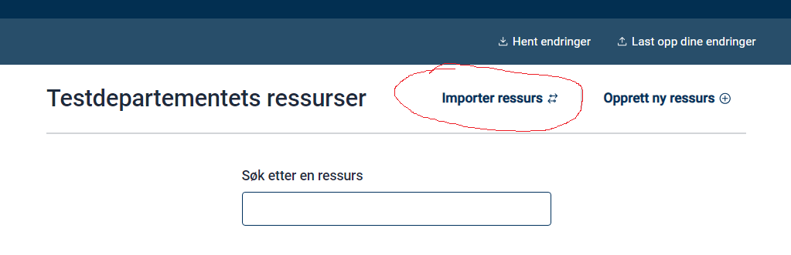
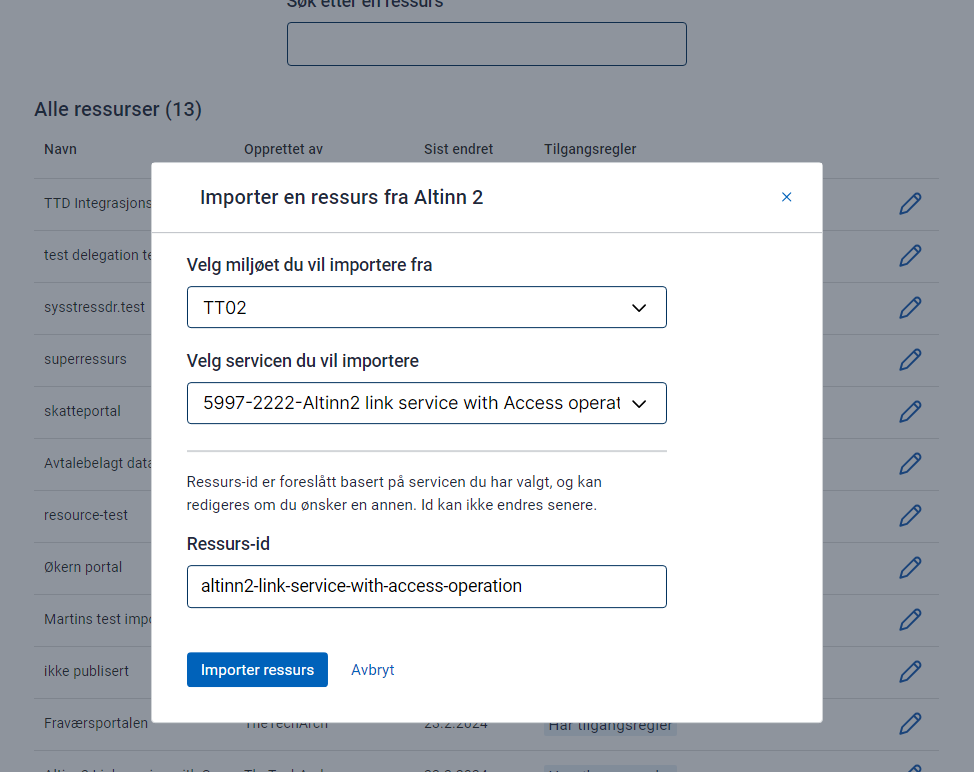
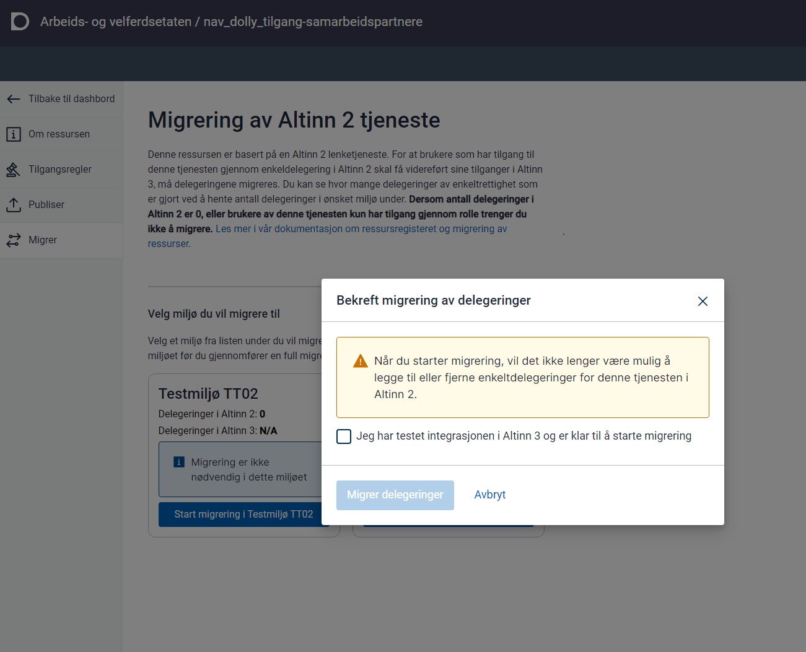

I Ressursregisteret kan du opprette helt nye ressurser eller basere dem på Altinn 2 lenketjenester.

{}
Altinn 2 lenketjenester der Altinn tilbyr oppstartskontroll, blir ikke videreført.

Det betyr at de som i dag bruker oppstartskontroll, må implementere dette selv og sende brukeren direkte til sin løsning, for eksempel via Altinns tjenestekatalog.
{}

### Import fra Altinn 2 lenketjenester

Eksisterende lenketjenester i Altinn 2 som brukes til ekstern autorisasjon, må flyttes til Ressursregisteret på Altinn 3.

I Altinn Studio kan du opprette nye ressurser basert på disse lenketjenestene.

**Denne funksjonen er nødvendig dersom du vil migrere eksisterende delegeringer fra en Altinn 2-tjeneste slik at de også gjelder for den nye ressursen i Altinn 3.**

Velg "Importer ressurs".



Oppgi ID-en som skal brukes i Ressursregisteret. Denne ID-en blir den primære referansen til ressursen.



Når du klikker "Import", opprettes det en ny ressurs i Altinn Studio i organisasjonens repo.

Ressursregisteret krever mer utfyllende informasjon enn Altinn 2. Du må derfor legge inn:

- Tittel på bokmål, nynorsk og engelsk
- Delegeringstekst på bokmål, nynorsk og engelsk
- Beskrivelse på bokmål, nynorsk og engelsk
- Kontaktinformasjon for tjenesten (kan vises i tjenestekatalogen)


#### Tilgangsregler

Ved import opprettes tilgangsregler som speiler reglene i Altinn 2.

Legg til aktuelle tilgangspakker slik at tjenesten er klar for overgang til tilgangspakker basert på Altinn-roller.


{}
For at migreringen skal fungere, må policyen fortsatt inneholde reglene som finnes i Altinn 2. Du kan for eksempel ikke fjerne signeringsregelen hvis den var del av tjenesten der.
{}

#### Publisering

Når ressursen er komplett, kan den publiseres til testmiljø eller produksjon.

#### Endring av API-integrasjon

For å kontrollere tilgang i eksterne tjenester må tjenesteeier kalle Altinn tilgangskontroll (PDP). API-et følger XACML-standarden.

Forespørselen inneholder:

- Hvem som ønsker å utføre forespørselen
- Hvilken ressurs forespørselen gjelder, og tilhørende part
- Hvilken operasjon sluttbruker ønsker å utføre

Du kan kontrollere flere operasjoner i samme forespørsel ved behov.

#### Migrering av delegeringer

For de fleste lenketjenester finnes det [aktive delegeringer i Altinn 2](https://github.com/Altinn/altinn-access-management/issues/579). Dette er rettigheter gitt fra én aktør til en person eller virksomhet. For at brukerne skal beholde tilgangen etter overføring til Ressursregisteret, må rettighetene migreres.

I Altinn Studio kan du for tjenester som er **opprettet basert på en importert Altinn 2-ressurs** starte en batchjobb som:

- deaktiverer Altinn 2-tjenesten slik at delegeringer ikke endres underveis
- kopierer delegeringene til den nye ressursen i Altinn 3

Funksjonen er foreløpig skjult bak et feature flag i Altinn Studio.

```javascript
localStorage.setItem("featureFlags", '["resourceMigration"]');
```

Kjør kommandoen i nettleserens konsoll (utviklerverktøy).

Når batchjobben startes, tar det omtrent ti minutter før den settes i gang. Den første handlingen er å deaktivere tjenesten i Altinn 2 før migreringen til Altinn 3 gjennomføres.

Tjenesten må allerede være migrert til miljøet der du skal overføre delegeringer. Test gjerne prosessen i TT02 før den kjøres i produksjon.




Etter kjøringen er delegeringene overført. Dette må foreløpig verifiseres manuelt siden tellefunksjon ikke er tilgjengelig ennå.

##### Opprette referanse til Altinn 2-tjeneste

Hvis du har opprettet en ressurs i Ressursregisteret uten å bruke importfunksjonen, kan du legge til referansen manuelt ved å redigere ressursfilen i Gitea:

```json
"resourceReferences": [
    {
        "referenceSource": "Altinn2",
        "reference": "5600",
        "referenceType": "ServiceCode"
    },
    {
        "referenceSource": "Altinn2",
        "reference": "100",
        "referenceType": "ServiceEditionCode"
    },
    {
        "referenceSource": "Altinn2",
        "reference": "https://test.landbruksdirektoratet.no/disko/soker",
        "referenceType": "Uri"
    }
]
```

Dette legger du inn ved å redigere ressursen i Gitea. Husk å bruke riktige tjenestekoder og URL-er.
