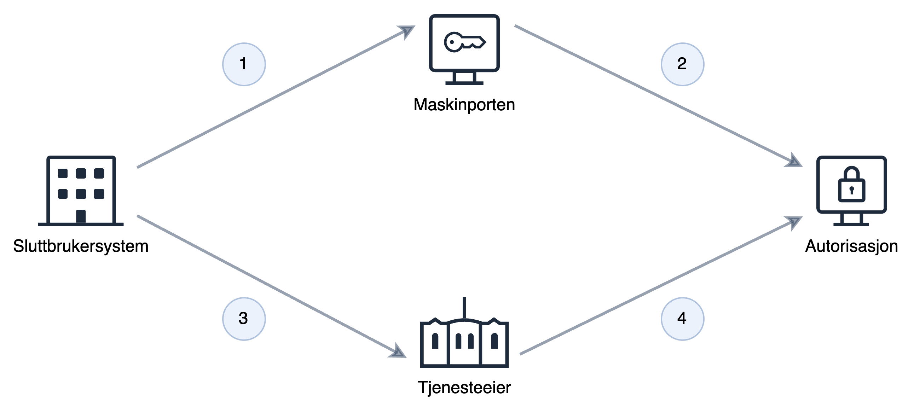

A large portion of communication between the public sector and businesses occurs via APIs in Altinn and at other platform providers in the public sector. Much of this communication happens on behalf of the organization and does not need to be performed by a specific person.
System User makes it easy to create a user that is granted the necessary authorizations in relation to the tasks it is to perform.

System User builds upon Maskinporten, which provides secure authentication and coarse-grained access control, and extends this with fine-grained access control.

System User makes it easy to set up a virtual user that can operate on behalf of the organization, either as a self-created system or in a customer-supplier relationship.
System User can be used both for services running in Altinn and for external services that use Altinn Authorization as their authorization solution.

> System User is not intended to replace ID-porten or Maskinporten, but to supplement and extend what is already provided through these components.
> ID-porten and System User can be used separately or in combination on the same service, depending on the service owner's need to know whether it is a person or a system calling the service.
>
> When you need to link the operations performed with which person is performing them, use **ID-Porten**.
>
> When you need to link the operations performed with the system behind them, use **System User**.
>
> If you only need to know which organization and any scopes, use **Maskinporten**.

For a high-level functional walkthrough and user journey, see [Samarbeidsportalen](https://samarbeid.digdir.no/altinn/systembruker/2542).

## Features with System User

System User provides a number of advantages compared to today's enterprise user and end user system concept in Altinn 2.

**For service owners**
To support System User on your service, you must choose Maskinporten as the authentication method and make queries against our authorization API (PDP) with the system user information found in the Maskinporten token.

A detailed guide to get started can be found [here](./../../guides/resource-owner/system-user/)

**For end user system vendors**

System User gives you a simple and secure way to create a user that can be used to automate actions on behalf of your customers, without the need to exchange certificates or other secrets.
System User supports both customers who work on behalf of themselves in your system and on behalf of clients (accountants, etc.).
You can choose whether you want your customers to be able to create System Users from the Altinn portal, or if you want to control and guide them through the process in your end user system.
To use System User, you must ensure that the service owner supports this on their service.

<!--Describe support in apps-->

For more information to get started, see [here](./../../guides/system-vendor/system-user/)

**For end users**

System User enables your end user system vendor to perform actions on behalf of your organization in a simple and secure way.
At any time, you can see which authorizations you have granted the System User via the Altinn user interface and delete the System User if the vendor no longer needs the authorizations.

For more information to get started, see [here](./../../guides/end-user/system-user/)

## Ecosystem

### Resource Owner

The resource owner creates a service in the Resource Registry so that Altinn Authorization can be used for authorization.
Furthermore, the resource owner creates or determines which scopes should be used for their service.
If the scopes are not public, the resource owner assigns scopes to those who should have access to use the service.
When the service is in operation, the resource owner queries Altinn Authorization to determine whether the System User can perform the requested action on behalf of the organization it represents.

### Altinn Authorization

Altinn Authorization is the solution that contains information about who can do what, on behalf of whom in the public sector.

**System Registry** is a registry of end user systems that can request to have a System User created.
End user system vendors register metadata about the system here, authorizations the system can request, as well as which Maskinporten client ID the system uses.
End user system vendors also choose whether the system can be created via the Altinn user interface or if it happens upon request from the end user system.
Systems in the System Registry can be seen as templates for a System User.

**System User** is a non-personal user that is granted authorizations on behalf of the organization that owns it.
The System User can be created upon request from a system vendor or via the Altinn user interface if the end user system vendor has made this available.

**PDP** is the service that resource owners call to authorize that the System User can perform the requested action.

### Maskinporten

Maskinporten is used for fine- and coarse-grained access control in the solution. The Maskinporten token contains information about:

The authentication mechanism for everything related to System Users:

- Registration of systems in the System Registry (API at Altinn Authorization)
- Registering System User (API at Altinn Authorization)
- Submission from the system (the vendor's system/end user system)
- Coarse-grained access control that gives service owners the ability to control access to their API
- Authorization bearer in the form of a System User token (Maskinporten token with extended information about the System User)

### End User System

The definition for the end user system. This definition contains, among other things, which rights the system needs from the System User, and which Maskinporten client (client ID) the system intends to use for authentication in Maskinporten.
The system is registered and owned by the end user system vendor in the System Registry.

## In Use

1. The end user system requests a System User token from Maskinporten. The request specifies the necessary scopes, client ID, and the organization number of the end user organization it acts on behalf of.
2. Maskinporten verifies against Altinn Authorization that the customer has granted access to the end user system linked to the client. Given that a valid System User exists, a Maskinporten token with System User information is returned.
3. The end user system (SBS) queries the service with the Maskinporten token.
4. The service authenticates the SBS and verifies that the token contains the necessary scopes to use the service. Then a query is made against Altinn Authorization to verify that the System User has the necessary authorizations.

## Delivery Plan

System User will be delivered as part of several releases.

More detailed information about the delivery plan and status can be found in [Digdir's Roadmap](https://github.com/digdir/roadmap/issues/284)
