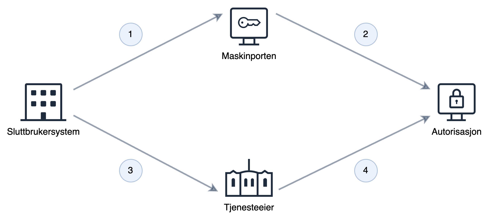

En stor del av kommunikasjonen mellom det offentlige og næringslivet skjer via API i Altinn og hos andre plattformleverandører i det offentlige. Mye av denne kommunikasjonen skjer på vegne av virksomheten og trenger ikke utføres av en spesifikk person.
Systembruker gjør det enkelt å opprette en bruker, som gis nødvendige fullmakter i forhold til oppgavene den skal utføre.

Systembruker bygger videre på Maskinporten, som gir sikker autentisering og grovkornet tilgangsstyring, og utvider dette med finkornet tilgangsstyring.

Systembruker gjør det enkelt å sette opp en virtuell bruker som kan operere på vegne av virksomheten, enten som et egenopprettet system eller i et kunde–leverandørforhold.
Systembruker kan både brukes mot tjenester som kjører i Altinn og mot eksterne tjenester som bruker Altinn Autorisasjon som autorisasjonsløsning.

> Systembruker er ikke ment å erstatte ID-porten eller Maskinporten, men supplere og utvide det man allerede får gjennom disse komponentene.
> ID-porten og systembruker kan brukes hver for seg eller i kombinasjon på samme tjeneste ut fra tjenesteeiers behov for å vite om det er en person eller system som kaller tjenesten.
>
> Ved behov for å knytte operasjonene til hvilken person som utfører dem, bruk **ID-porten**.
>
> Ved behov for å knytte operasjonene til hvilket system som ligger bak, bruk **Systembruker**.
>
> Dersom man kun trenger å vite hvilken virksomhet og eventuelt scope, bruk **Maskinporten**.

For en overordnet funksjonell gjennomgang og brukerreise, se [Samarbeidsportalen](https://samarbeid.digdir.no/altinn/systembruker/2542).

## Egenskaper med systembruker

Systembruker gir en rekke fordeler sammenlignet med dagens virksomhetsbruker og sluttbrukersystemkonsept i Altinn 2.

**For tjenesteeier**
For å støtte systembruker på tjenesten din må du velge Maskinporten som autentiseringsmetode og gjøre oppslag mot vårt autorisasjons-API (PDP) med systembrukerinformasjonen som finnes i Maskinporten-tokenet.

Detaljert veiledning for å komme i gang finnes [her](./../../guides/resource-owner/system-user/).
**For sluttbrukersystemleverandør**

Systembruker gir deg en enkel og sikker måte å opprette en bruker som kan brukes til å automatisere handlinger på vegne av dine kunder, uten at det er behov for å utveksle sertifikat eller andre hemmeligheter.
Systembruker støtter både kunder som jobber på vegne av seg selv i ditt system og på vegne av klienter (regnskapsførere etc.).
Du velger selv om du ønsker dine kunder skal kunne opprette systembruker fra Altinn portal, eller om du ønsker kontrollere og lede de gjennom prosessen i ditt sluttbrukersystem.
For å kunne bruke systembruker må du sikre at tjenesteeier støtter dette på sin tjeneste.

<!--Beskriv støtte i apps-->

For mer informasjon for å komme i gang finnes [her](./../../guides/system-vendor/system-user/)

**For sluttbruker**

Systembruker gjør det mulig for sluttbrukersystemleverandøren din å utføre handlinger på vegne av virksomheten din på en enkel og sikker måte.
Du vil til enhver tid kunne se hvilke fullmakter du har gitt systembrukeren via Altinns brukerflate, og eventuelt slette systembrukeren dersom leverandøren ikke lenger trenger fullmaktene.

For mer informasjon for å komme i gang finnes [her](./../../guides/end-user/system-user/).

## Økosystem

### Ressurseier

Ressurseier oppretter tjeneste i Ressursregisteret slik at Altinn autorisasjon kan benyttes til autorisasjon.
Videre oppretter eller bestemmer ressurseier hvilke scopes som skal brukes på sin tjeneste.
Dersom scopene ikke er public tildeler ressurseier scope til de som skal ha tilgang til å benytte tjenesten
Når tjenesten er i drift, gjør ressurseier oppslag mot Altinn Autorisasjon for å avgjøre om systembruker kan utføre de forespurte handlingene på vegne av virksomheten den representerer.

### Altinn Autorisasjon

Altinn Autorisasjon er løsningen som inneholder informasjon om hvem som kan gjøre hva, på vegne av hvem i offentlig sektor.

**Systemregister** er et register over sluttbrukersystemer som kan be om å få opprettet systembruker.
Sluttbrukersystemleverandører registrerer her metadata om systemet, fullmakter systemet kan be om, samt hvilken Maskinporten-klient-ID systemet benytter.
Sluttbrukersystemleverandør velger også om systemet kan opprettes via Altinn-portalen, eller om det skjer etter forespørsel fra sluttbrukersystemet.
Systemer i systemregisteret kan sees på som en mal for en systembruker.
**Systembruker** er en ikke-personlig bruker som får tildelt fullmakter på vegne av virksomheten som eier den.
Systembrukeren kan opprettes på forespørsel fra en systemleverandør eller via Altinns brukerflate dersom sluttbrukersystemleverandøren har tilgjengeliggjort dette.

**PDP** er tjenesten ressurseiere kaller for å autorisere at systembrukeren kan utføre de forespurte handlingene.

### Maskinporten

Maskinporten brukes for fin- og grovkornet tilgangsstyring i løsningen. Maskinporten-tokenet inneholder informasjon om

Autentiseringsmekanismen for alt som har med systembrukere å gjøre:

- Registrering av system i systemregisteret (API hos Altinn Autorisasjon)
- Registrere systembruker (API hos Altinn Autorisasjon)
- Innsending fra systemet (leverandørens system/sluttbrukersystemet)
- Grovkornet tilgangsstyring som gir tjenesteeiere mulighet til å styre tilgang til sitt API
- Autorisasjonsbærer i form av systembrukertoken (Maskinportentoken med utvidet informasjon om systembruker)

### Sluttbrukersystem

Definisjon av sluttbrukersystemet: Denne inneholder bl.a. hvilke rettigheter systemet trenger fra systembrukeren, og hvilken Maskinporten-klient (klient-ID) systemet skal bruke ved autentisering i Maskinporten.
Systemet registreres og eies av sluttbrukersystemleverandøren i systemregisteret.

## I bruk

1. Sluttbrukersystem ber om systembrukertoken fra Maskinporten. Forespørselen angir nødvendige scopes, klient-ID og organisasjonsnummeret til sluttbrukervirksomheten det opptrer på vegne av.
2. Maskinporten verifiserer mot Altinn Autorisasjon at kunden har gitt sluttbrukersystemet som er knyttet mot klienten, tilgang. Gitt at det finnes gyldig systembruker, returneres Maskinportentoken med systembrukerinformasjon.
3. SBS gjør oppslag mot tjeneste med Maskinportentokenet.
4. Tjenesten autentiserer SBS og sjekker at tokenet inneholder nødvendige scopes for å benytte tjenesten. Deretter gjøres det oppslag mot Altinn Autorisasjon for å sjekke at systembruker har nødvendige fullmakter.

## Leveranseplan

Systembruker vil leveres som del av flere leveranser.

Mer detaljert informasjon om leveranseplan og status finnes i [Digdirs Roadmap](https://github.com/digdir/roadmap/issues/284)
