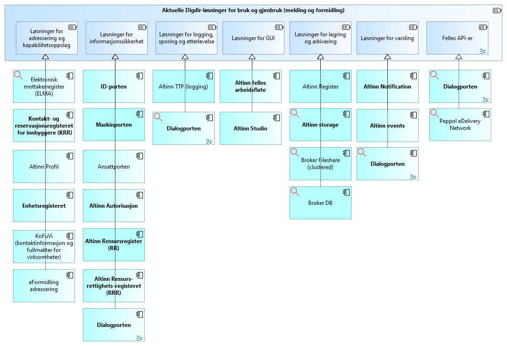
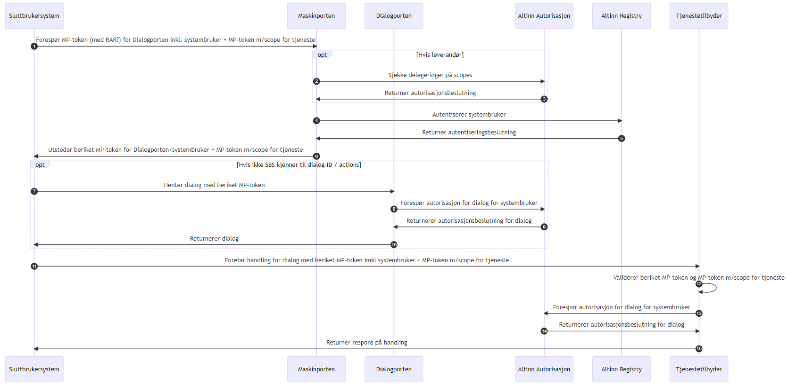
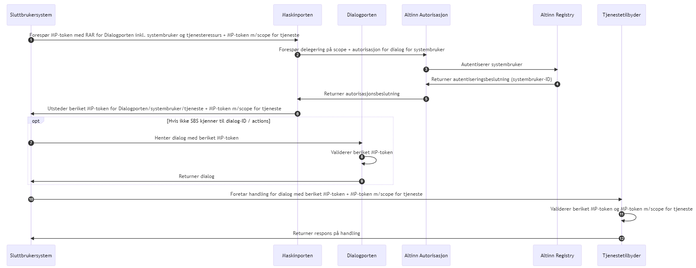

 <!-- info -->
This is work in progress


## Realization of capabilities and featuress

### General

TBD… describe the conceptual architecture Building Blocks (ABBs) vs.
specific Solutions Building Blocks (SBBs)…

### Use and reuse of other Digdir Solution Building Blocks

An overview of relevant Digdir components … TBD… update and translate…

[](https://www.vg.no)

### Authentication and Authorization

Ref. [Authentication –
Altinn](https://docs.altinn.studio/authentication/) and [Authorization –
Altinn](https://docs.altinn.studio/authorization/).

Erik: Ekspilsitt ref. til sekvensdiagram som Rune T.
viste meg i dag – bare finner det ikke…

Erik: I så fall ikke lengre nødvendig å «låne» fra Bjørn…

\###

Ref. <https://digdir.github.io/dialogporten/#autorisasjon>

#### Maskinporten-token med systembruker-ID

Maskinporten foretar autentisering av systembruker/passord og utsteder
et beriket token med identifikator for systembrukeren. Både
tjenestetilbyder og Dialogporten må foreta oppslag mot Altinn
Autorisasjon for å autorisere den oppgitte systembrukeren på
tjenestenivå.

#### Maskinporten-token med innbakt autorisasjon

I dette mønsteret oppgir SBS systembruker + passord, samt
tjenesteressurs i forespørselen til Maskinporten, som da foretar både
grov- og finkornet autorisasjon. Dette krever innføring av RAR (Rich
Authorization Requests) for Maskinporten, og en tettere kobling mellom
Maskinporten og Altinn Autorisasjon. Samme token-type kan benyttes mot
både Tjenestetilbyder og Dialogporten, men aud-claim må settes i token
og valideres for å unngå å åpne for replay-attacks.

### Broker File storage

Broker File Storage is based MS Azure Blob Storage.

Stored Files are always encrypted; ref. [Azure Storage encryption for
data at rest \| Microsoft
Learn](https://learn.microsoft.com/en-us/azure/storage/common/storage-service-encryption).

### Broker Metadata storage

Broker Metadata Storage uses the PostgreSQL Database.

Stored files are encrypted. Erik TBD: Add detail!

### Addressing and capability lookup

TBD

### Logging

TBD

### Monitoring

TBD

### Clearing and billing

TBD

### Notifications to persons

TBD

### Notifications to End User Systems

Ref.
<https://digdir.github.io/dialogporten/#integrasjon-med-event-komponent>

### API Management

TBD… MS Azure API Management

### Case Folder

Features:

- File versioning and change management

- Deletion of Erik

### File metadata

- correlationId

- uploadProtocol

- filename

- sendersFileReference

- checksum

- sender

- recipients

- Name-value pairs

- Erik TBD: Review this overview! Virksomheter, ikke personer nå.

### Linked data

TBD

### Specific Security controls

#### Authentication and Authorization

Maskinporten and Altinn Authorization

#### Checksum

#### Virus check

Erik TBD:

- Virus check on top of encrypted files.

- Configurable per transfer via intitalization

#### In-transit encryption

Encrypted file transfers with TLS/HTTPS.

#### At rest encryption

Encrypted Broker File Storage; ref. [Azure Storage encryption for data
at rest \| Microsoft
Learn](https://learn.microsoft.com/en-us/azure/storage/common/storage-service-encryption).

Encrypted Broker Metadata Storage, using the PostgreSQL Database. Erik
TBD: Specific encryption solution. Ikke tilgjengelig på åpent internett.
– brannmur, mullig: ikke V-net

#### Alternative file storage solutions

TBD

#### DDoS attack prevention

DDoS attack prevention via Azure API Management.

#### Hosting

Private cloud hosting

On-premises hosting

#### Coding practices

TBD Open source

#### Key Vault

Azure Key Vault

Private keys, interne ting, identities (med tokens skjult) og secrets
autentisering på Altinn