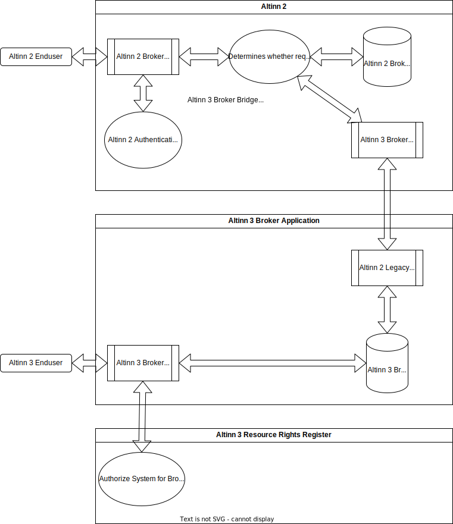

## About

The Altinn 3 Broker Transition service bridge is an internal component in Altinn 2 that transfers Broker requests from Altinn 2 to Altinn 3 for a given request, based on the ServiceCode/ServiceEditionCode combination of the request.
This is an implementation of the soft shift solution described [here](../../solution-architecture/#soft-shift-from-altinn-2-to-altinn-3).

## Technical overview

Altinn 2 allows end users in Altinn 2 to make BrokerService requests for specific Broker Services that will be transferred to Altinn 3 instead of being stored in Altinn 2.
Files transferred in this way will be available for Altinn 3 and Altinn 2 users.

1. Requests that have the ability to specify ServiceCode / ServiceEdition. 
In this case Altinn will immediately determine that the request should be transferred to Altinn 3 via the Altinn 3 Broker Bridge.
In cases where the SC/SE can be specified, but aren't, requests will not be transferred to Altinn 3.
2. Requests that do not have the ability to specify SC/SE.
In this case a call will first be made to Altinn 2 Broker storage. If nothing is found in Altinn 2, a call will be made to Altinn 3.
3. Files in Altinn 3 cannot be larger than 1 GB, as this is the maximum file size in Altinn 2. The Altinn 3 Resource should be configured with this max filesize restriction.
4. File data and metadata will be stored in the Altinn 3 store, while Altinn 2 will simply call Altinn 3.
5. Receipts will no longer be stored in Altinn 2, instead a pseudo receipt will be generated from Altinn 3 Metadata. Receipt endpoint in Altinn 2 will no longer be used for Transitioned Broker Services. If you require the use of Receipt endpoint, submit a feature request.
6. The use of Manifest file in the submitted file data is deprecated in Altinn 3 and Transitioned Broker Services. If this is a critical requirement, submit a feature request.

## Switch Over - What to expect
When the Altinn 3 Broker Transition Solution feature is enabled in Altinn 2, the following occurs:
1. ServiceOwners can request that Altinn 2 Broker Services be transitioned to Altinn 3 Resources.
2. End users that use these services will then transmit data to Altinn 3 instead of Altinn 2 data stores.
3. Files that were available in Altinn 2 for the Broker Service will no longer be available.
4. All new files and status changes will occur in the Altinn 3 Broker Service Solution.
5. ServiceOwners with transitioned Broker Services will have to manage access rights in both Altinn 3 and Altinn 2 simultaneously, as these are not automatically synchronized.



