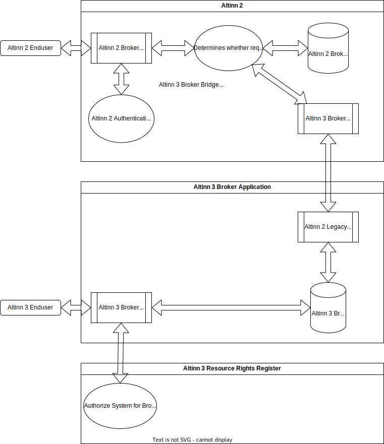

## Om

Altinn 3 Broker Transition Service Bridge er en intern komponent i Altinn 2 som overfører Broker forespørsler fra Altinn 2 til Altinn 3 for en gitt forespørsel, basert på ServiceCode/ServiceEdition kombinasjon av forespørselen.
Dette er en implementering av den myke skiftløsningen beskrevet [her](../../solution-architecture/#myk-overgang-fra-altinn-2-til-altinn-3).

## Teknisk oversikt

Altinn 2 lar sluttbrukere i Altinn 2 komme med Broker service forespørsler om spesifikke Broker tjenester som vil bli overført til Altinn 3 i stedet for å bli lagret i Altinn 2.
Filer overført på denne måten vil være tilgjengelige for Altinn 3 og Altinn 2 brukere.

1. Forespørsler som har muligheten til å spesifisere ServiceCode / ServiceEdition.
I dette tilfellet vil Altinn umiddelbart avgjøre at forespørselen skal overføres til Altinn 3 via Altinn 3 Broker Bridge.
I tilfeller der SC/SE kan spesifiseres, men er ikke, vil ikke forespørsler bli overført til Altinn 3.
2. Forespørsler som ikke har muligheten til å spesifisere SC/SE.
I dette tilfellet vil det først bli ringt til Altinn 2  Broker lagring.Hvis ingenting blir funnet i Altinn 2, vil det bli ringt en samtale til Altinn 3.
3. Filer i Altinn 3 kan ikke være større enn 1 GB, da dette er den maksimale fil størrelsen i Altinn 2. Ressursen Altinn 3 skal konfigureres med denne MaxFileSize begrensningen.
4. Fil data og metadata vil bli lagret i Altinn 3 butikken, mens Altinn 2 ganske enkelt vil ringe Altinn 3.
5. Kvitteringer vil ikke lenger bli lagret i Altinn 2, i stedet vil en pseudokvittering bli generert fra Altinn 3 metadata.Kvitteringsendpunkt i Altinn 2 vil ikke lenger brukes til overførte Broker tjenester.Hvis du trenger bruk av endepunktet for kvitteringer, må du sende inn en funksjonsforespørsel.
6. Bruk av manifestfilen i de innsendte fil data er utdatert i Altinn 3 og overførte Broker tjenester.Hvis dette er et kritisk krav, kan du sende inn en funksjonsforespørsel.

## Bytt over  hva du kan forvente
Når Altinn 3 Broker Transition Solution funksjonen er aktivert i Altinn 2, oppstår følgende:
1. Tjenesteeiere kan be om at Altinn 2 Broker Services blir overført til Altinn 3 ressurser.
2. Sluttbrukere som bruker disse tjenestene vil deretter overføre data til Altinn 3 i stedet for Altinn 2 datalagre.
3. Filer som var tilgjengelige i Altinn 2 for Broker tjenesten vil ikke lenger være tilgjengelige.
4. Alle nye filer og statusendringer vil skje i Altinn 3 Broker Service Solution.
5. Tjenesteeiere med overførte Broker tjenester må administrere tilgangsrettigheter i både Altinn 3 og Altinn 2 samtidig, da disse ikke automatisk blir synkronisert.



