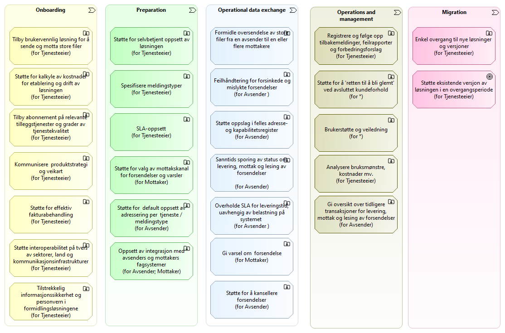

## Verdistrømanalyse

Å definere funksjonelle egenskaper innenfor verdistrømsteg 
gir kontekst til navngivning og beskrivelser av egenskapene. 
Figuren nedenfor viser en verdistrømmodell for Altinn Formidling og hovedtypene av brukere, 
dvs. avsendere (datatilbydere), mottakere (datakonsumenter) og tjenesteeiere.

<!--
[](https://altinn.github.io/ark/models/archi-all/?view=id-10895c7502b84511bb272d77e91ecb00)
-->

## Overordnede brukerbehov
For å se hvilke egenskaper som kreves av Altinn Broker-løsningen, starter vi med å vurdere brukernes behov. 
Følgende diagram uttrykker de overordnede brukerbehovene for hvert verdistrømsteg.

Brukerbehovene er her uttrykt som overordnede brukerhistorier, eller epos, 
som tilsvarer "brukerkapabilitter", dvs. hva brukerne trenger å være i stand til.

<!--
_Note: This way of expressing used needs as  high level user stories, or epics, 
is in line with by common frameworks for  agile development. See e.g. [the Scaled Agile Framework for Enterprises (SAFe)](https://scaledagileframework.com/)._
-->

Eksempler på hvordan man leser diagrammet:

* Som en tjenesteeier trenger jeg (evnen) til å tilrettelegge brukervennlige løsninger for å sende og motta store filer.
* Som en avsender trenger jeg (evnen) til å sende store  filer til en eller flere mottakere .

##  Overordnet systemfunksjonalitet

Følgende modell viser overordnede systemkapabiliteter, tilsvarende overordnede brukerbehov som beskrevet i forrige avsnitt.

_Merk: Systemkapabiliteter trenger ikke å matche brukerepos (eller brukerkapabiliteter) én-til-én, 
selv om dette ofte kan være tilfeller._

<!-- Erik TO_DO: Diagram with mapping from user needs (or user capabilities) to system capabilities -->

## System features
For further breakdown of the high-level system capabilities into features, see the [Altinn Broker epics on Github](https://github.com/orgs/Altinn/projects/54/views/11).

_Note: Documentation of the breakdown into features is planned to also be included here._

## Non-functional requirements

Performance Requirements:

- Support for storage and transfer of large files. _Note: Exact file size specifications TBD._
- High throughput to handle large volumes of data transactions efficiently.
- Low latency in data processing and transmission.

Scalability:

- Ability to scale up or down based on the demand and number of users.
- Support for horizontal and vertical scaling strategies.

Availability and Reliability:

- High availability, aiming for near 100% uptime.
- Robust failover and redundancy mechanisms to ensure continuous  operation.
- Reliable file transfers. _Note: Detailed requirements TBD._

Security:

- Strong encryption for data in transit and at rest.
- Comprehensive access control and authentication mechanisms.
- Regular security audits and compliance with relevant data protection regulations.

Maintainability and Upgradability:

- Ease of maintenance and updates without significant downtime.
- Modular design to facilitate updates and integration of new features.

Disaster Recovery and Data Backup:

- Effective disaster recovery plan to handle system failures.
- Regular data backups and secure storage solutions.

Usability:

- User-friendly interface for both administrators and end-users.
- Comprehensive documentation and user support.

Interoperability:

- Compatibility with various data formats and systems used by businesses
  and government agencies.
- APIs for integration with external systems and services.

Compliance and Legal Requirements:

- Adherence to national and international standards and regulations.
- Regular compliance audits and updates as per legal changes.

Monitoring and Logging:

- Extensive monitoring of system performance and security.
- Detailed logging of transactions and user activities for audit
  purposes.

Data Integrity and Quality:

- Mechanisms to ensure the accuracy and consistency of data.
- Validation checks to maintain data quality.

Load Balancing:

- Effective distribution of workload across servers and resources.
- Load balancing to optimize resource use and maximize throughput.

Environmental and Operational Conditions:

- Designed to operate under the specified environmental conditions
  (e.g., data center temperature and humidity).
- Consideration for operational conditions like power consumption and
  cooling requirements.

Also see:

1. [Altinn Studio Non-Functional Requirements](https://docs.altinn.studio/technology/architecture/requirements/non_functional/)
2. Further descriptions regarding information security in separate sections.