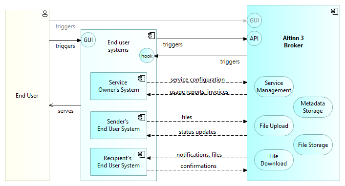
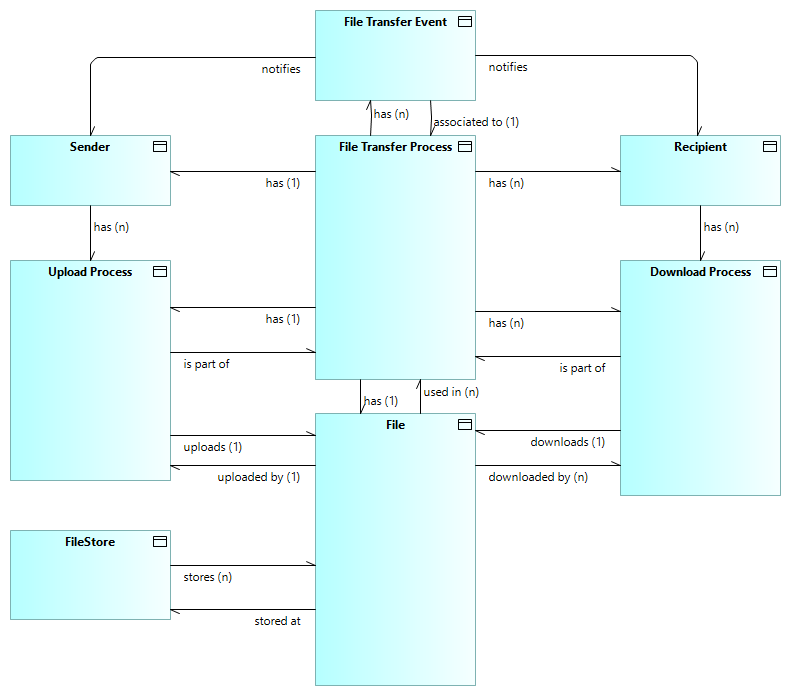
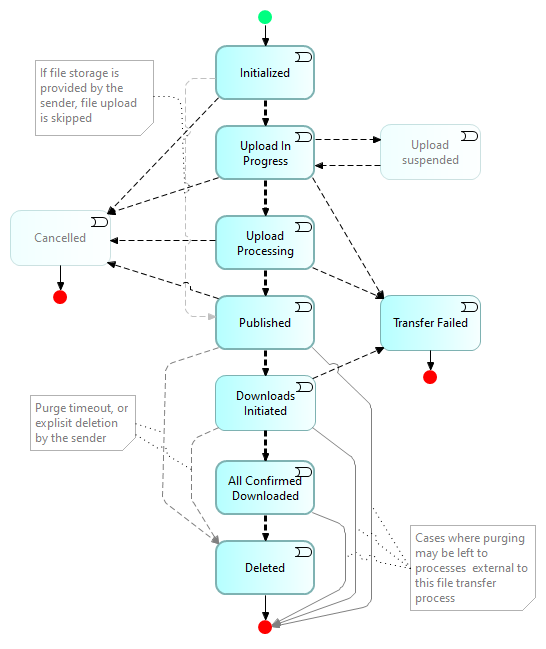

## Context overview

The following diagram gives a high level overview of Altinn 3 Broker actors, services and information flow.

<!--
[](https://altinn.github.io/ark/models/archi-all/?view=id-5824a04f89d04341aba661be649270b4)
-->

Explanation to the diagram:

* The main service provided by Altinn Broker is managed file transfer from one sender (provider) to one or more recipients (consumers) with intermediary storage of files and metadata.
* File Upload and File Download services are configurable.
* All features are accessible to End User Systems via APIs.
* Human End Users communicate with Altinn Broker via GUIs provided by either their custom End User Systems or GUI-s provided ny Altinn Broker. 
  _Note: Service owners may choose to leverage Altinn Studio for building GUIs._
* End User Systems may be triggered by events via notifications to [Webhooks](https://en.wikipedia.org/wiki/Webhook). The same events may alternatively be detected by polling the APIs, 
  however supporting Webhooks in the End User Systems is recommended over API polling.
* Service Owners configure the services and receive usage reports, invoices and other information according to the agreed service levels.
* Senders upload files and receive status updates about processing and delivery to recipients.
* Recipients receive notifications about available files.
* Recipients confirm successful downloads. 

## Terminology

The following table gives brief descriptions of the main terms used to describe
Altinn 3 Broker. Also see https://docs.altinn.studio/technology/terms/ and <https://data.norge.no/concepts>.

| **Term**                       | **Explanation**                                                                                                                                                                                                                                          |
|--------------------------------|----------------------------------------------------------------------------------------------------------------------------------------------------------------------------------------------------------------------------------------------------------|
| Broker                         | A 'broker' facilitates transactions, negotiations, or agreements between two parties, such as buyers and sellers, or providers and consumers. |
| Customer                       | In the context of Altinn, 'customer' is  associated with 'service owner'. |
| Data Consumer                  | A 'data consumer' is an individual or system that uses data provided by data sources or services. Also see 'recipient.
| Data Holder                    | ‘Data holder’ means a legal person, including public sector bodies and international organisations, or a natural person who is not a data subject with respect to the specific data in question, which, in accordance with applicable law, has the right to grant access to or to share certain personal data or non-personal data. |
| Data Provider                  | A 'data provider' is an entity that supplies or grants access to data.  Also see 'sender. |
| Document                       | A 'document' refers to any form of recorded content, whether in digital or paper format, used to communicate, store, or present information, ranging from text and images to diagrams and multimedia. It serves various purposes, including legal evidence, historical records, educational material, or business transactions, facilitating the sharing and preservation of knowledge.                                                                                                                                                                                                                                                      |
| End user                       | An 'end user' is the final consumer of the services in questions, typically human users through a graphical user interface (GUI).  |
| End user system                | An 'end user system' provides the services and user interface for end users. |
| File                           | A digital container used to store, manage, and manipulate data on a computer system or network. It can consist of text, images, audio, video, or other types of data, and is typically organized within a file system that allows for easy retrieval and access. |
| File transfer                  | The process of moving or copying data over a computer network or through data storage devices.                                                                                                                                                                                                                                                      |
| File transfer broker           | A 'file transfer broker' is a system or service that acts as an intermediary to facilitate the secure and efficient exchange of files between different parties or systems. Also see 'message broker'. |
| Intermediary                   | An 'intermediary' is an entity that acts as a middleman or mediator between two parties in a transaction or communication process. |
| Managed File Transfer (MFT)    | 'Managed file transfer' is a solution or service that facilitates and manages the secure transfer of data between systems. It provides a more reliable and secure alternative to traditional file transfer methods, by ensuring the encryption of data in transit and at rest, and offering better management and monitoring capabilities. |
| Message Broker                 | A ‘message broker’ is a system or service that acts as an intermediary to facilitate message exchange between different parties or systems. |
| On-premise                     | 'On-premise' means installation and operation of software and technology infrastructure directly within an organization's physical facilities, rather than hosted remotely or in the cloud. |
| Process                        | A series of actions or steps taken to achieve a particular end.                                                                                                                                                                                                                                                      |
| Recipient                      | An individual or entity that receives a message, package, or service from a sender. Also see Data Consumer. |
| Sender                         | An individual or entity that initiates the transmission of a message or data to one or more recipients. Also see Data Provider. |
| Service Owner                  | In the context of Altinn, a 'service owner' refers to an entity responsible for the development, management, and maintenance of a particular service within the Altinn platform. |
| User Journey                   | A 'user journey' is a visual or narrative representation of a user's interactions with a product or service from start to finish. |

<!--

A longer list of terms. kept as a comment until further: 

| **Term**                       | **Explanation**                                                                                                                                                                                                                                          |
|--------------------------------|----------------------------------------------------------------------------------------------------------------------------------------------------------------------------------------------------------------------------------------------------------|
| Case                           | TBD                                                                                                                                                                                                                                                      |
| Case folder                    | TBD                                                                                                                                                                                                                                                      |
| Case management                | TBD                                                                                                                                                                                                                                                      |
| Cloud                          | TBD                                                                                                                                                                                                                                                      |
| Consumer                       | TBD                                                                                                                                                                                                                                                      |
| Data Broker                    | TBD                                                                                                                                                                                                                                                      |
| Data Holder                    | ‘Data holder’ means a legal person, including public sector bodies and international organisations, or a natural person who is not a data subject with respect to the specific data in question, which, in accordance with applicable Union or national law, has the right to grant access to or to share certain personal data or non-personal data. |
| Dialog                         | A 'dialog' is a conversation between two or more people or entities, typically characterized by an exchange of ideas, information, or sentiments.                                                                                                                                                                                                                                                      |
| Document                       | A 'document' refers to any form of recorded content, whether in digital or paper format, used to communicate, store, or present information, ranging from text and images to diagrams and multimedia. It serves various purposes, including legal evidence, historical records, educational material, or business transactions, facilitating the sharing and preservation of knowledge.                                                                                                                                                                                                                                                      |
| End-to-end process             | TBD                                                                                                                                                                                                                                                      |
| End user                       | TBD                                                                                                                                                                                                                                                      |
| End user system                | TBD                                                                                                                                                                                                                                                      |
| Enterprise                     | TBD. Note: Virtual enterprise, end-to-end processes and seamless services                                                                                                                                                                                |
| File                           | A digital container used to store, manage, and manipulate data on a computer system or network. It can consist of text, images, audio, video, or other types of data, and is typically organized within a file system that allows for easy retrieval and access. |
| File transfer                  | The process of moving or copying data over a computer network or through data storage devices.                                                                                                                                                                                                                                                      |
| Graphical User Interface (GUI) | A visual interface that allows human users to interact with electronic devices using icons, buttons, and other graphical elements instead of text-based command lines. |
| Intermediary                   | an entity that acts as a middleman or mediator between two parties in a transaction or communication process. |
| Managed File Transfer (MFT)    | A solution or service that facilitates and manages the secure transfer of data between systems. It provides a more reliable and secure alternative to traditional file transfer methods, by ensuring the encryption of data in transit and at rest, and offering better management and monitoring capabilities. |
| Message Broker                 | A solution or service that enables communication between different applications by translating and routing messages. |
| On-premise                     | Installation and operation of software and technology infrastructure directly within an organization's physical facilities, rather than hosted remotely or in the cloud.                                                                                                                                                                                                                                                      |
| Process                        | A series of actions or steps taken to achieve a particular end.                                                                                                                                                                                                                                                      |
| Provider                       |                                                                                                                                                                                                                                                |
| Recipient                      | An individual or entity that receives a message, package, or service from a sender. |
| Seamless services              | TBD                                                                                                                                                                                                                                                      |
| Sender                         | An individual or entity that initiates the transmission of a message or data to one or more recipients. |
| Service-based Routing          | See https://www.ehelse.no/standardisering/om-standardisering-i-e-helse/tjenestebasert-adressering                                                                                                                                                                                                                                                      |
| User Journey                   | A 'user journey' is a visual or narrative representation of a user's interactions with a product or service from start to finish. |

-->

Notes: 
* In the context of Altinn Broker, the terms _Data Provider_ and _Sender_ may be assumed to mean the same.
* In the context of Altinn Broker, the terms _Data Consumer_ and _recipient_ may be assumed to mean the same.
  <!-- are used interchangeably. -->

## Conceptual information model

A high level conceptual information model for Altinn 3 Broker is shown in the below figure. 
This model is used as basis for the more detailed information model of Altinn Broker _Metadata Storage_.

Explanation:

* The overall File Transfer Process includes exactly one Upload Process by a Sender and one or more Download Processes corresponding to the number of Recipients.
* Each File Transfer Process considers one File only. The same applies for each Upload Process and Download Process. 
* The same File may be used in several File Transfer Processes and consequently in several Download Processes.
* Only one Upload Process per File is considered. Note that if the same file is uploaded more than once, Altinn Broker will  consider the files as different and assign different identifiers.
* Notifications about File Transfer Events are given to Senders and recipients depending on subscription setup. E.g. recipients may be notified about new messages, and senders may be notified about delivery events. 
* Each File Transfer Event relates to one File Transfer Process, and consequently only one File, however any number of events may occur for the same File Transfer Process.

## File Transfer Process States {#file-transfer-process-states}

The overall transfer process is depicted by the following model. It shows the main states and state transitions of the overall file transfer process,
as relevant for Altinn Broker and status reporting to the sender.

The above figure depicts a _Finite State Machine_ with the following states:

* __Initialized__: The transfer prosess is initialized by the sender. _Note: This state machine description does not consider preceeding events. 
The file transfer could e.g. be a reply to a single request from a single party, 
or it could be a publication to an y number of known or unknown subscribers._

* __Upload in Progress__: Large files may take time to upload. Altinn Broker will keep track of the progress.

* __Upload Processing__: Uploaded files are validated and checked for viruses.

* erik  ver.2    __Cancelled__: Altinn Broker supports cancelling of file transfers 
as long as no download process has started. 

* __Published__: Ready for downloads.
   
* __Downloads Initiated__:One or more recipients has started downloading.

* __TransferFailed__: The overall transfer process failed, for some reason, either during upload, upload processing or during download by one or more repepients.
  
* __All Confirmed Downloaded__: All required recipients have confirmed download.

* __Deleted__: The uploaded file has been purged. This could be upon specific request by the sender, 
                or upon agreed criteria for purging, 
                e.g. when all required recipients have confirmed download.
                Note that the concept allows for files to remain in Altinn Broker File Store,
                to support file sharing for other purposes than a single file transfer process. 
                In such cases, the process ends when the file has been uploaded and published, 
                with separate processes for downloading and purging.

<!-- 
Erik's note per 2024-04-06: Capabilities and features for general file sharing yet to be specified.
-->

