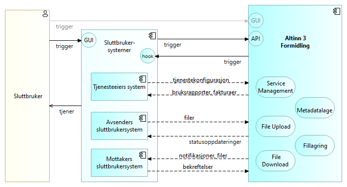
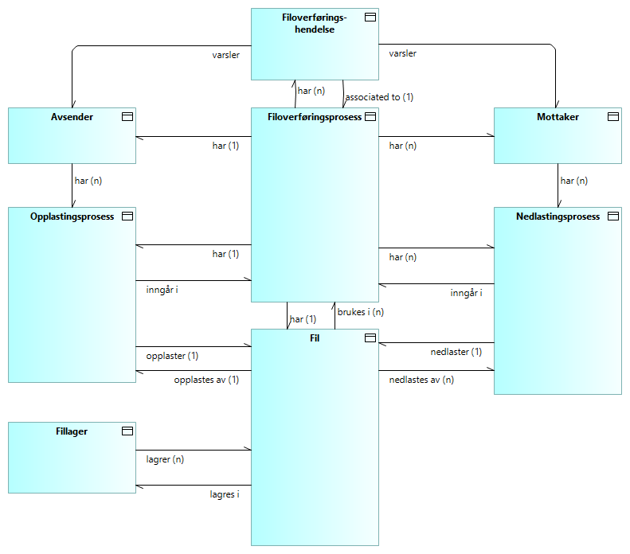
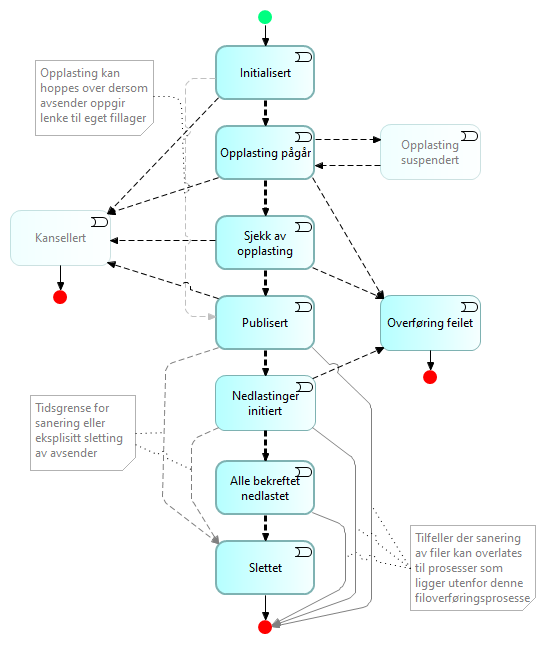

## Kontekstoversikt - aktører og informasjonsflyt {#context-overview}

Følgende diagram gir en høy-nivå oversikt over aktører, tjenester og informasjonsflyt i Altinn 3 Formidling.

Forklaring til diagrammet:

* Hovedtjenesten levert av Altinn Formidling er styrt filoverføring fra en avsender (tilbyder) til en eller flere mottakere (konsumenter), med mellomlagring av filer og metadata.
* Opplasting og nedlasting av filer er konfigurerbare tjenester.
* Alle funksjoner er tilgjengelige for sluttbrukersystemer via API-er.
* Menneskelige sluttbrukere kommuniserer med Altinn Formidling via grafiske brukergrensesnitt (GUI) levert enten av deres tilpassede sluttbrukersystemer eller GUI-er levert av Altinn Formidling.
  _Merk: Tjenesteeiere kan velge å utnytte Altinn Studio for å bygge GUI-er._
* Sluttbrukersystemer kan trigges av hendelser via varslinger til [Webhooks](https://en.wikipedia.org/wiki/Webhook). De samme hendelsene kan alternativt oppdages ved å spørre API-ene, men det anbefales å støtte Webhooks i sluttbrukersystemene fremfor API-spørringer.
* Tjenesteeiere konfigurerer tjenestene og mottar bruksrapporter, fakturaer og annen informasjon i henhold til de avtalte tjenestenivåene.
* Avsendere laster opp filer og mottar statusoppdateringer om behandling og levering til mottakere.
* Mottakere mottar varsler om tilgjengelige filer.
* Mottakere bekrefter vellykkede nedlastinger.

## Begreper {#terminology}

Her følger en tabell som gir korte beskrivelser av hovedbegrepene som brukes for å beskrive Altinn 3 Formidling. 
Se også https://docs.altinn.studio/technology/terms/ og <https://data.norge.no/concepts>.

| **Begrep**                       | **Forklaring**                                                                                                                                                                                                                                          |
|----------------------------------|----------------------------------------------------------------------------------------------------------------------------------------------------------------------------------------------------------------------------------------------------------|
| Avsender                         | En person eller enhet som initierer overføringen av en melding eller data til en eller flere mottakere. Se også Datatilbyder. |
| Brukerreise                      | En 'brukerreise' er en visuell eller narrativ representasjon av en brukers interaksjoner med et produkt eller en tjeneste fra start til slutt. |
| Dataholder                       | ‘Dataholder’ betyr en juridisk person eller en fysisk person som med hensyn til aktuelle data, i henhold til gjeldende lov, har rett til å gi tilgang til eller dele visse opplysninger, herunder personopplysninger. |
| Datakonsument                    | En 'datakonsument' er en person eller et system som bruker data levert av datakilder eller tjenester. Se også 'mottaker'. |
| Datatilbyder                     | En 'datatilbyder' er en enhet som leverer eller gir tilgang til data. Se også 'avsender'. |
| Dokument                         | Et 'dokument' refererer til enhver form for registrert innhold, enten i digitalt format eller papirformat, brukt til å kommunisere, lagre eller presentere informasjon, i spennet fra ustrukturt til strukturert og tekst til multimedia. Det tjener ulike formål, inkludert juridisk bevis, historiske poster, utdanningsmateriell eller forretningstransaksjoner. |
| Fil                              | En 'fil' er en digital beholder brukt til å lagre, håndtere og manipulere data på et datamaskinsystem eller nettverk. Det kan bestå av tekst, bilder, lyd, video eller andre typer data, og er typisk organisert innenfor et filsystem som tillater enkel henting og tilgang. |
| Filoverføring                    | Prosessen med å flytte eller kopiere data over et datanettverk eller gjennom datalagringsenheter. |
| Filoverføringsmegler             | En 'filoverføringsmegler' er et system eller en tjeneste som fungerer som en mellommann for å legge til rette for sikker og effektiv utveksling av filer mellom ulike parter eller systemer. Se også 'meldingsmegler'. |
| Formilder                        | En 'formidler' er her å oppfatte som en 'megler' mellom tilbydere og konsumenter av data. |
| Kunde                            | I sammenhengen av Altinn, er 'kunde' assosiert med 'tjenesteeier'. |
| Megler                           | En 'megler' ('broker' på engelsk) legger til rette for og formidler transaksjoner, forhandlinger eller avtaler mellom to eller flere parter, som kjøpere og selgere, eller tilbydere og konsumenter. |
| Mellommann                       | En 'mellommann' er en enhet som fungerer som en megler eller formidler mellom to parter i en transaksjon eller kommunikasjonsprosess. |
| Meldingsmegler                   | En ‘meldingsmegler’ er et system eller en tjeneste som fungerer som en mellommann for å legge til rette for meldingsutveksling mellom ulike parter eller systemer. |
| Mottaker                         | En person eller enhet som mottar en melding, pakke eller tjeneste fra en avsender. Se også Dataforbruker. |
| Om-premise                        | 'On-premise' betyr installasjon og drift av programvare og teknologiinfrastruktur direkte innenfor en organisasjons fysiske fasiliteter, i stedet for vertskap eksternt eller i skyen. |
| Prosess                          | En rekke handlinger eller trinn for å oppnå et bestemt mål. |
| Sluttbruker                      | En 'sluttbruker' er den endelige forbrukeren av aktuelle tjenester, typisk menneskelige brukere gjennom et grafisk brukergrensesnitt (GUI). |
| Sluttbrukersystem                | Et 'sluttbrukersystem' tilbyr tjenester og brukergrensesnitt for sluttbrukere. |
| Styrt Filoverføring (MFT)        | 'Styrt filoverføring' er en løsning eller tjeneste som legger til rette for og håndterer sikker overføring av data mellom systemer. Den tilbyr et mer pålitelig og sikkert alternativ til tradisjonelle filoverføringsmetoder, ved å sikre kryptering av data under overføring og i hvile, og tilbyr bedre håndterings- og overvåkningsmuligheter. |
| Tjenesteeier                     | I sammenhengen av Altinn, refererer en 'tjenesteeier' til en enhet ansvarlig for utvikling, håndtering og vedlikehold av en spesifikk tjeneste innenfor Altinn-plattformen. |

Merk: 
* I kontekst av Altinn Formidling, benyttes begrepene _datatilbyder_ og _avsender_ om det samme.
* I kontekst av Altinn Formidling, benyttes begrepene _datakonsument_ og _mottaker_ om det samme.
  <!-- are used interchangeably. -->

## Konseptuell informasjonsmodell {#conceptual-information-model}

En høy-nivå konseptuell informasjonsmodell for Altinn 3 Formidling er vist i figuren nedenfor.

Forklaring:

* Den overordnede filoverføringsprosessen inkluderer nøyaktig én opplastingsprosess av en avsender og én eller flere nedlastingsprosesser tilsvarende antall mottakere.
* Hver filoverføringsprosess vurderer kun én fil. Det samme gjelder for hver opplastingsprosess og nedlastingsprosess.
* Den samme filen kan brukes i flere filoverføringsprosesser og dermed i flere nedlastingsprosesser.
* Kun én opplastingsprosess per fil betraktes. Merk at hvis samme fil lastes opp mer enn én gang, vil Altinn Formidling betrakte filene som forskjellige og tildele forskjellige identifikatorer.
* Varsler om hendelser i filoverføringsprosessen gis til avsendere og mottakere avhengig av abonnementsoppsett. F.eks. kan mottakere bli varslet om nye meldinger, og avsendere kan bli varslet om leveringshendelser.
* Hver hendelse i filoverføringsprosessen relaterer seg til én filoverføringsprosess, og dermed kun én fil, men et hvilket som helst antall hendelser kan inntreffe for samme filoverføringsprosess.

## Tilstandsdiagram for filoverføringsprosessen {#file-transfer-process-states}

Den overordnede overføringsprosessen vises i følgende modell. 
Her vises de viktigste tilstandene og tilstandsovergangene for den samlede filoverføringsprosessen, 
slik det er relevant for Altinn Formidling og statusrapportering til avsenderen.

Figuren over fremstiller en _Endelig Tilstandsmaskin_ med følgende tilstander:

* __Initialisert__: Overføringsprosessen er initialisert av avsenderen. _Merk: Denne tilstandsmaskinbeskrivelsen tar ikke hensyn til foregående hendelser. Filoverføringen kunne for eksempel være et svar på en enkelt forespørsel fra en enkelt part, eller det kunne være en publisering til et y antall kjente eller ukjente abonnenter._

* __Opplasting pågår__: Store filer kan ta tid å laste opp. Altinn Formidling vil holde styr på fremgangen.

* __Sjekk av opplasting__: Opplastede filer valideres og sjekkes for virus.

* __Avbrutt__: Altinn Formidling støtter avbrytelse av filoverføringer så lenge ingen nedlastingsprosess har startet.

* __Publisert__: Klar for nedlastinger.

* __Nedlastinger initiert__: En eller flere mottakere har startet nedlastingen.

* __Overføring feilet__: Den samlede overføringsprosessen mislyktes, av en eller annen grunn, enten under opplasting, behandling av opplasting eller under nedlasting av en eller flere mottakere.

* __Alle bekreftet nedlastet__: Alle nødvendige mottakere har bekreftet nedlastingen.

* __Slettet__: Den opplastede filen har blitt slettet. 
 Dette kan være på spesifikk forespørsel fra avsenderen, 
 eller etter avtalte kriterier for sanering, 
 f.eks. når alle nødvendige mottakere har bekreftet nedlastingen. 
 Merk at konseptet tillater at filer forblir i _Altinn Broker File Store_, for å støtte fildeling for andre formål enn en enkelt filoverføringsprosess. I slike tilfeller avsluttes prosessen når filen har blitt lastet opp og publisert, med separate prosesser for nedlasting og fjerning.

<!-- 
Erik's note per 2024-04-06: Capabilities and features for general file sharing yet to be specified.
-->

