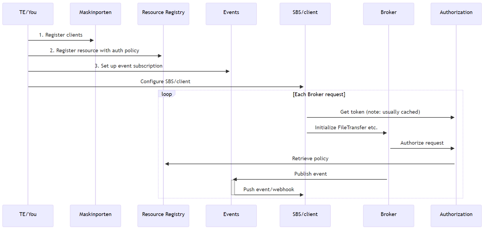



{}
Denne delen av dokumentasjonen er under arbeid.
Det er seksjoner med manglende eller bare delvis dokumentasjon.
{}

Siden Altinn Formidling er åpen kildekode, kan du få tilgang til koden vår i [vårt offentlige GitHub-repo](https://github.com/Altinn/altinn-broker) og bygge en lokal Docker-instans for å teste mot.

Vi ønsker bidrag til løsningen velkommen.

Se [Readme-filen på GitHub](https://github.com/Altinn/altinn-broker/blob/main/README.md) for en introduksjon til Altinn 3 Formidling, og hvordan du bygger og kjører den i din utviklermiljø.

Repoet inneholder også en [Postman-samling](https://github.com/Altinn/altinn-broker/blob/main/altinn-broker-postman-collection.json) med eksempler.

Swagger for filoverførings-APIet er vert [her](/api/broker/spec).

## Generell API-operasjon {#overall-api-operation}

For å forstå hvordan Formidling-APIet fungerer, inkludert avhengighetene og konfigurasjonsstegene, henvises det til informasjonen nedenfor:

Du må ha utført stegene i [Hvordan komme i gang](../../getting-started) for å sette opp tilgangskravene.

## Generell prosess {#overall-process}

Generell prosessflyt gjenspeiler den implementerte virkeligheten av [filoverføringsprosessen](../../explanation/basic-concepts/#file-transfer-process-states)

Alle operasjoner er asynkrone, med mindre annet er angitt.
Som sådan bør du implementere hendelsesabonnementer for å optimalisere prosessen din i stedet for å stole på polling for status.

## Autentisering {#authentication}

For alle operasjoner må du autentisere deg ved å bruke din Maskinporten-klient og 
deretter [skaffe en Altinn-token fra Altinn-autentisering](https://docs.altinn.studio/authentication/reference/architecture/accesstoken/).

Bruk Altinn-tokenet som en Bearer-token for alle Formidling API-forespørsler sammen med APIM-abonnementsnøkkelen som en header med nøkkelen `Ocp-Apim-Subscription-Key`.
