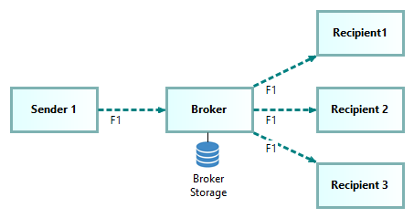

## What is Altinn Broker?

The main use case for Altinn Broker is Managed File Transfer (MFT). It
facilitates secure transmission of files of any size from one sender
to one or more recepients. As such, it offers many
benefits compared to alternative ad-hoc peer-to-peer file transfer
solutions typically built on file transfer protocol (FTP), 
hypertext transfer protocol (HTTP) or secure file transfer protocol (SFTP).

<!--

-->

While transfer of individual files is the main use case and original purpose of
Altinn Broker, Altinn 3 Broker has been designed with some more advanced
use cases and possible future extensions in mind. Advanced
use cases and possible extensions are further described in separate
sections.

## Benefits of Altinn Broker 

Compared to alternatives such as e.g., email, FTP or peer-to-peer file
transfers, Altinn Broker offers a number of benefits. Some of the main
benefits are:

- Managed service: Take the burden off Service owners and their solution
  vendors - security, maintenance, certified compliance with relevant
  vendors - security, maintenance, certified compliance with relevant
  legislation and regulations.

- Fault tolerance and resilience: Altinn Broker will support fault
  tolerant delivery of very large files (several gigabytes and possibly
  terabytes). [^1]

- Scalability and availability: Cloud hosting, DDOS protection.

- Connect to any system or user: Senders and recipients are de-coupled
  by separate upload and download processes; thus, each side is free to
  choose the preferred protocol for upload and download.

- Support for several patterns and addressing schemes: One-to-one,
  one-to-many, content-based routing, and pub-sub.

- Real-Time Data Transfer: Altinn Broker use APIs and system events to
  trigger uploads and downloads.

- Observability and Auditability: End-to-end visibility of all activity, 
  so you know the who, what, where, and when of data transfers. Quickly
  access file-transfer logs and analytics to audit transfer activity
  whenever needed.

- Advanced monitoring: With the in-built support for adding metadata to file transfers, 
  it is possible to analyse file transfer sequences between multiple actors involved in e.g. a case management process. 

- Observability and Auditability: End-to-end visibility of all activity, 
  so you know the who, what, where, and when of data transfers. Quickly
  access file-transfer logs and analytics to audit transfer activity
  whenever needed.

- Advanced monitoring: With the in-built support for adding metadata to file transfers, 
- it is possible to analyse file transfer sequences between multiple actors involved in e.g. a case management process.

## How to get started?

Information about how to get started is given in the following role spesific user guides:

- [Developer's User Guide](../user-guides#developers-user-guide)

- [Service Owner's User Guide](../user-guides/#service-owners-user-guide)

- [Sender's User Guide](../user-guides/#senders-user-guide).

- [Recipient’s User Guide](../user-guides/#recipients-user-guide).
