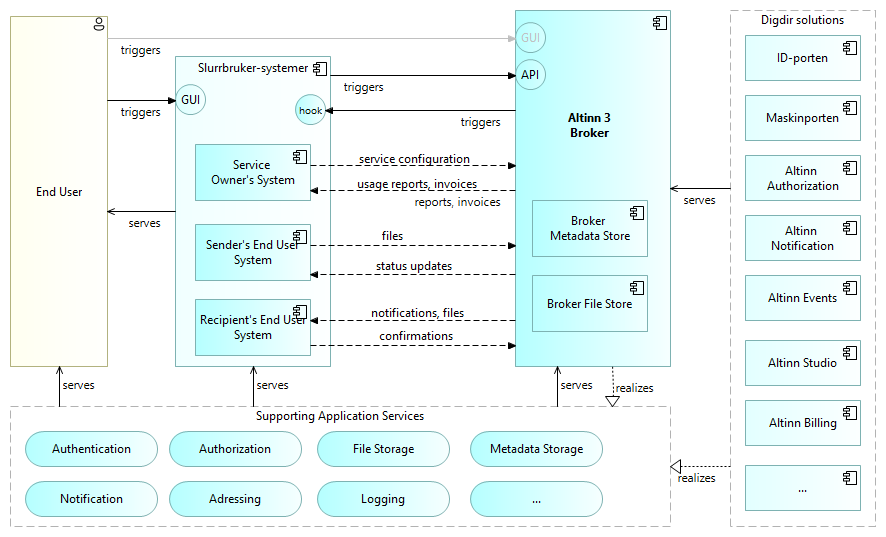
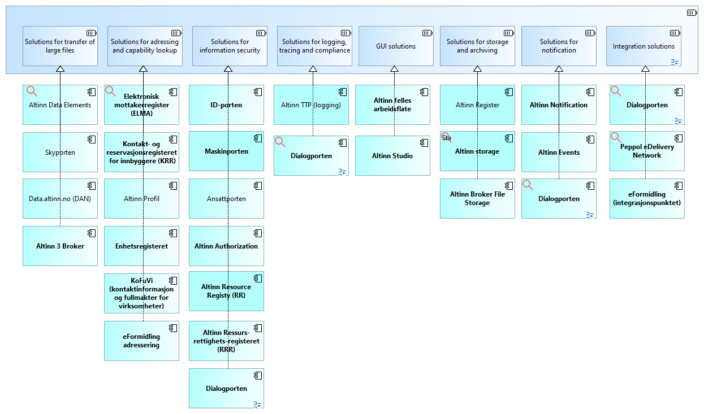
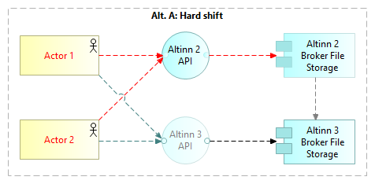
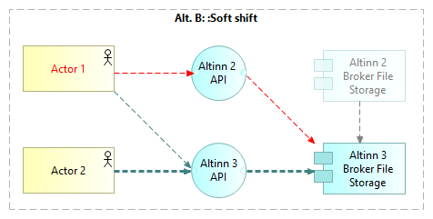
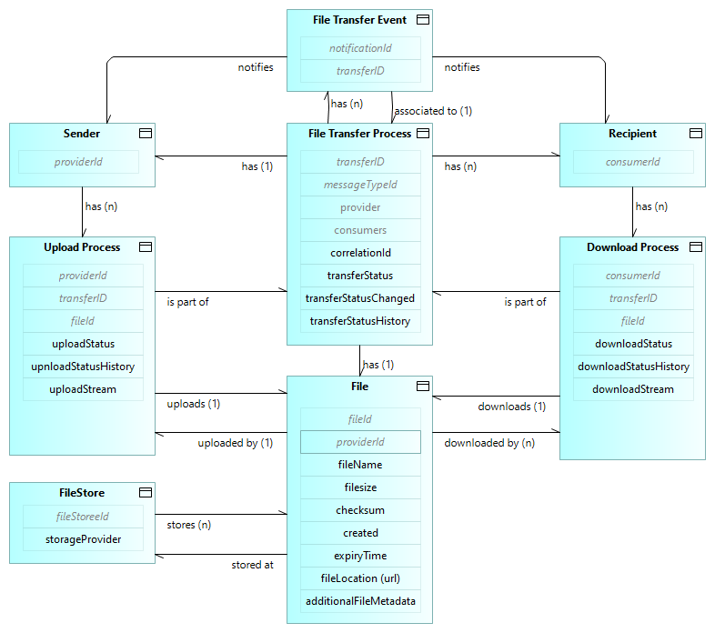

 <!-- info -->
The solution architecture described here is the foundation architecture for Altinn Broker,
as relevant for the basic use cases of managed file transfers. 
Further descriptions of the solution architecture related to advanced use cases
and possible future extensions 
will build on this foundation architecture.


<!--
  
-->

## Guiding Architecture Principles

### Overarching architectural principles for digitization of the public sector

[The overarching architectural principles for digitization of the public sector](https://www.digdir.no/digital-samhandling/overordnede-arkitekturprinsipper/1065>) in Norway are a support for work with enterprise architecture and are intended to contribute to increased interoperability across enterprises and sectors.

These high level principals apply.

### General Altinn 3 Architecture Principles

The [Altinn 3 Architecture Principles](/principles) apply.

<!--
### Architecture Principles for Messaging and Data Sharing

Altinn 3 Broker is one of several Digdir products within the product groups for 
Messaging and Data Sharing. 
Architecture principles for these product groups are under construction.
-->

### Further considerations

Altinn 3 Broker is one of several Digdir products within the product groups for 
Messaging and Data Sharing. 
_Architecture principles for these product groups are under construction._

Pending architecture principles for the relevant procuct areas, 
here are some important considerations for the Altinn 3 Broker solution architeture:

* __Support for on-premise hosting and data storage__. 
  Due to information security concerns, some customers will not tolerate cloud hosting and storage 
  on the cloud platform chosen by Altinn.
  The solution architecture should therefore allow for on premise hosting and storage on a per customer basis.
  
* __Future readiness in general__. The international landscape of regulations, standards, technologies  and solutions 
  is evolving. The solution architecture should take this into account, and prepare for 
  compliance, interoperability and reuse. Examples: [Semantic Web](https://en.wikipedia.org/wiki/Semantic_Web)
  and [Linked Data](https://en.wikipedia.org/wiki/Linked_data), 
  [Self Souvereign Identity](https://en.wikipedia.org/wiki/Self-sovereign_identity) and 
  [Verifiable Credentials](https://en.wikipedia.org/wiki/Verifiable_credentials).

* __Compliance with EU regulations and standards__. 
  European regulations and standards for data sharing will apply for Norway in the coming years.
  Compliance will be mandated, and interoperability will be essential for cross border value chains. 
  See e.g. [Digdir's overview of EU legislation for data sharing](https://www.digdir.no/datadeling/oversikt-over-eu-regelverk-om-deling-og-bruk-av-data/3251)
and [Data Spaces Support Center om "Regulatory Compliance"](https://dssc.eu/space/BVE/357074696/Regulatory+Compliance)
  
  
  the [Data Spaces Support Center knowledge base](https://dssc.eu/page/knowledge-base) 

<!--
* Multi-channel and omni-channel support
-->

## High Level Solution Overview – main building blocks

The following figure gives a high level solution overview.

This diagram expands on 
the [basic context overview](../basic-concepts#context-overview) 
by indicating the involved building blocks.

<!--
[context diagram](../../1.%20Introduction/image2.png) of 
the [introduction](../../1.%20Introduction/_index.en.md) by indicating the involved building blocks. 
-->

The Altinn application components (right side) realize the functionality as indicated by the 
high level application services (bottom). 
The exact mapping between services and conponents is not shown in this, high level diagram.

In addition to general descriptions of each of the application components given elsewhere, 
here's a summary of how these components relates to and serves Altinn 3 Broker:

* [ID-porten](https://www.digdir.no/felleslosninger/id-porten/864): Auhentication of human end users.
* [Maskinporten](https://www.digdir.no/felleslosninger/maskinporten/869): Authentication and authorization of machines (End User Systems). 
  Authorization features are realized in cooperation with the Altinn Authorization component.
* [Altinn Authorization](../../authorization/). Register services resources and authorize access.
* [Altinn Notifications](../../notifications/). Notifications to human end users via e-mail and sms.
* [Altinn Events](../../events/). Notifications to webhooks in End User Systems.
* [Altinn Studio](../../altinn-studio/). Applications and user interface for self service configuration of the solutions.
* Altinn Billing. Invoicing of customers.

## Related solutions

An overview of related solutions is provided in the following diagram.
This serves as a starting point for assessing interaction with, as well as the use and reuse of, other solutions
in the detailed solution architecture for Altinn Broker.
The most relevant solutions are highlighted in bold.

## Transition Architecture - Altinn 2 to Altinn 3

### General
Two migration options are supported for migration of Altinn Broker services - 
_hard shift_ and _soft switch_.

### Hard shift from Altinn 2 to Altinn 3 for all users of a service

 With the _Hard shift_ option, all users and End User Systems make a coordinated shift to Altinn 3. 

This option is recommended in cases where such a   coordinated shift is feasible. No transition solution is needed and all features of Altinn 3 may be used 
as soon as the shift has been made.

Uploaded files are stored om Altinn 2 Broker File Storage up until the shift. 

_Note: In this case, it is assumed that Altinn 2 Broker files have been purged 
and are not needed in Altinn 3 Broker. 
However, if required, it will be possible to move files from Altinn 2 to Altinn 3 Broker File Storage after the transition._

### Soft shift from Altinn 2 to Altinn 3

With the _Soft shift_ option, users and End User Systems shift to Altinn 3 on an
individual basis, when ready. 
The transition solution bridges between Altinn 2 and Altinn 3.

During the transition period, uploaded files will always be stored on Altinn 3 Broker Storage.

<!--
### Solution Details

#### Solution for uploading to Altinn 3 via Altinn 2
TBD by Ragnar?

#### Solution for downloading Altinn 3 files to Altinn 2
TBD by Ragnar?
-->

## File storage

Broker File Storage is based MS Azure Blob Storage, and isolated to a storage account per Service Owner.

Stored Files are always encrypted; ref. [Azure Storage encryption for
data at rest \| Microsoft
Learn](https://learn.microsoft.com/en-us/azure/storage/common/storage-service-encryption).

## Metadata storage

The following information model details the
[conceptual information model under basic concepts](../basic-concepts#conceptual-information-model).

## Addressing and Routing

The basic Altinn 3 Broker adressing and routing mechanisms are:

* Specific adressing of recipients
* Addressing via subscription

_Note: Further adressing capabilities are considered, including criteria based om role, service and context._

### Specific adressing of recipients
TBD.

### Addressing via subscription
TBD.

## Notifications

### Notifications to human end users

For notifications to human recipients via e-mail and sms,
Altinn Broker uses the [Altinn Notifications](../../notifications/) component.

### Notifications to End User Systems

End User Systems may register custom webhooks for receiving events; see [Altinn Events](../../events/).

See [the Altinn 3 Broker OpenAPI specification](https://github.com/Altinn/altinn-broker/blob/main/altinn-broker-v1.json) 
for specification of the supported events.

## API Management

[Azure API Management (APIM)](https://azure.microsoft.com/en-us/products/api-management) 
is used for scaling, operational insights, and securing Altinn Broker APIs.

Altinn Broker runs on an APIM instance that is shared with other platform services in Altinn.

## Logging and Monitoring
TBD

## Clearing and Billing
TBD

## Security Controls {#security-controls}

 <!-- info -->
The documentation of security controls is work in progress, 
first in Norwegian, then to be translated to English.


## Security Controls via Azure API Management

### Security Controls via Azure VNet

### Authentication and Authorization

### Checksum control

### Virus check

### In-transit protection {#in-transit-protection}

### At rest protection {#at-rest-protection}

#### Altinn Broker File Storage

#### Support for custom storage solutions

### DDoS attack prevention

### Hosting options

### Coding practices

### Key Vault

### Penetration testing

<!--

### Authentication and Authorization

TBD: Maskinporten and Altinn Authorization...

### Checksum

TBD

### Virus check

When a file is uploaded to Broker, it undergoes a scan by Microsoft Defender Antivirus. 
If no viruses are detected, the file is promptly published and made available for download by recipients. However, in cases where a virus is found or the scan fails, the file is removed, and the transfer status is updated to provide detailed information regarding the scan failure.

### In-transit protection

Encrypted file transfers with TLS/HTTPS.

### At rest protection

Encrypted Broker File Storage; ref. [Azure Storage encryption for data
at rest \| Microsoft
Learn](https://learn.microsoft.com/en-us/azure/storage/common/storage-service-encryption).

Encrypted Broker Metadata Storage, Metadata storage using the PostgreSQL Database. Details TBD.

TBD: Specific encryption solution... firewall,  V-net... 

### Alternative file storage solutions

TBD

### DDoS attack prevention

DDoS attack prevention via Azure API Management.

### Hosting

Private cloud hosting

On-premises hosting

### Coding practices

TBD Open source

### Key Vault

Azure Key Vault, Private keys, internals... identities (hidden tokens); secrets,  Altinn authentication

### Penetration testing

TBD

## Further Solution Resources

-->