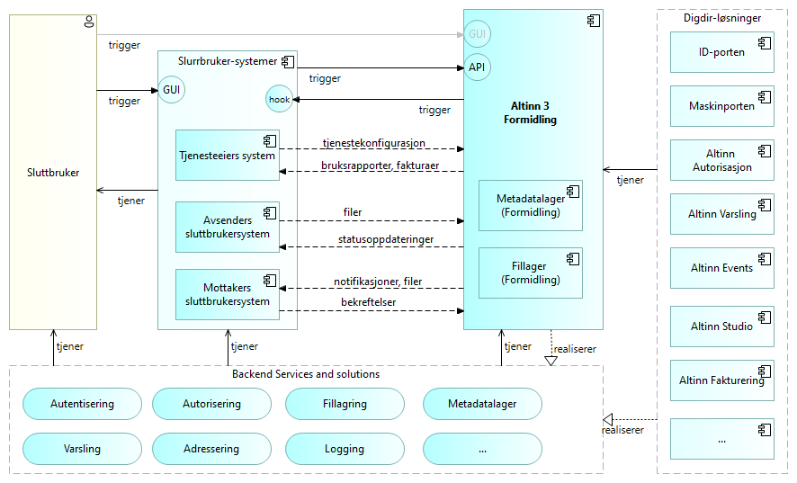
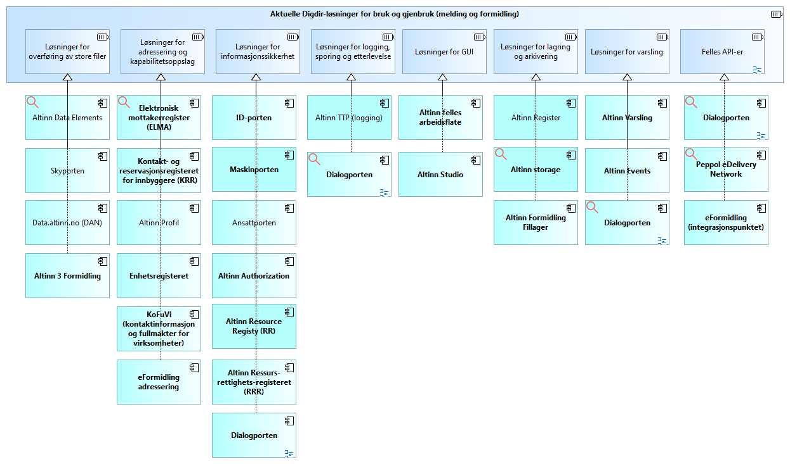
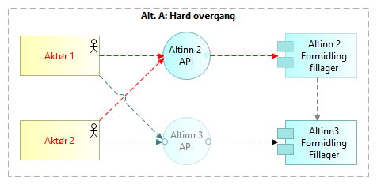
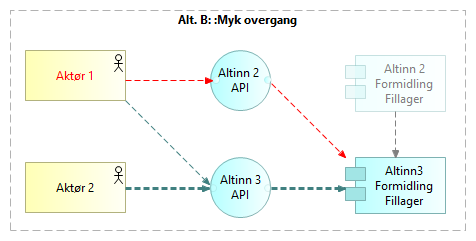
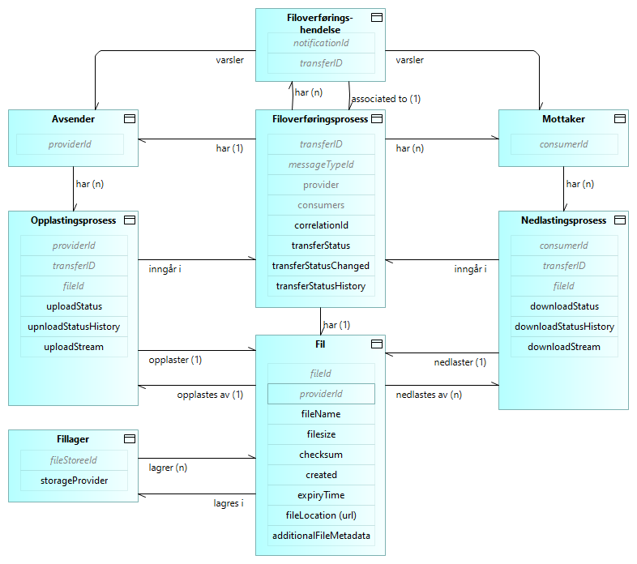

 <!-- info -->

Løsningsarkitekturen beskrevet her er grunnarkitekturen for Altinn Formidling, 
slik den er relevant for de grunnleggende brukstilfellene av styrte filoverføringer. 
Ytterligere beskrivelser av løsningsarkitekturen relatert til avanserte brukstilfeller 
og mulige fremtidige utvidelser vil bygge på denne grunnarkitekturen.



<!--
  
-->

## Arkitekturprinsipper

### Overordnede arkitekturprinsipper for digitalisering av offentlig sektor

[Overordnede arkitekturprinsipper for digitalisering av offentlig sektor](https://www.digdir.no/digital-samhandling/overordnede-arkitekturprinsipper/1065>) 
i Norge skal være en støtte til arbeid med virksomhetsarkitektur og bidra til økt samhandlingsevne på tvers av virksomheter og sektorer.
Disse prinsippene gjelder.

### General Altinn 3 Architecture Principles

[Altinn 3 arkitekturprinsipper ](/principles) gjelder.

<!--
### Architecture Principles for Messaging and Data Sharing

Altinn 3 Broker is one of several Digdir products within the product groups for 
Messaging and Data Sharing. 
Architecture principles for these product groups are under construction.
-->

### Ytterligere betraktninger

Altinn 3 Formidling er ett av flere Digdir-produkter innen områdene meldingsutveksling og datadeling.
Tilpassede arkitekturprinsipper for disse områdene er under utvikling.
I påvente av arkitekturprinsipper for de relevante produktområdene,
følger her noen betraktninger for løsningsarkitekturen til Altinn 3 Formidling.

__Støtte for lokal hosting og datalagring.__
Grunnet bekymringer knyttet til informasjonssikkerhet, 
kan noen kunder og brukere ha problemer med å akseptere hosting eller lagring på en skyplattform valgt av Altinn.
Løsningsarkitekturen bør derfor tillate lokal hosting og lagring for kunder og brukere som ønsker det.

__Framtidssikker arkitektur__. 

* Det internasjonale landskapet av forskrifter, standarder, teknologier og løsninger
er i endring. Løsningsarkitekturen bør ta hensyn til dette, og forberede for
samsvar, samhandling og gjenbruk.
Eksempler:
[Semantisk web](https://en.wikipedia.org/wiki/Semantic_Web),
[lenkede data](https://en.wikipedia.org/wiki/Linked_data),
[selvstyrt identitet](https://en.wikipedia.org/wiki/Self-sovereign_identity) og
 ["verifiable credentials"](https://en.wikipedia.org/wiki/Verifiable_credentials).

* __Etterlevelse av EU-regler og -standarder__. 
Europeiske regler og standarder for datadeling vil gjelde for Norge i de kommende årene.
Etterlevelse vil være påkrevd, og  samhandling vil være essensielt for grensekryssende verdikjeder.
Se f.eks. [Digdirs oversikt over EU-regelverk om deling og bruk av data](https://www.digdir.no/datadeling/oversikt-over-eu-regelverk-om-deling-og-bruk-av-data/3251)
og [Data Spaces Support Center om "Regulatory Compliance"](https://dssc.eu/space/BVE/357074696/Regulatory+Compliance)

<!--
* Multi-channel and omni-channel support
-->

## Overordnet løsningsarkitektur

Følgende figur gir en oversikt over de vikigste byggeklossene i overordnet løsningsarktitektur for Altinn 3 Formidling.

Dette diagrammet bygger videre på 
[den overordnede kontekstoversikten](../../explanation/basic-concepts#context-overview) 
ved å angi de viktigste Digdir-løsningene.
Applikasjonskomponenter i form av Digdir-løsninger (på høyre side) realiserer funksjonaliteten 
som indikert av  applikasjonstjenestene (nederst).
<!--Den eksakte tilordningen mellom tjenester og komponenter er ikke vist i dette høynivådiagrammet.-->
Generelle beskrivelser av hver applikasjonskomponent er gitt andre steder. 
Her gis et sammendrag av hvordan disse komponentene forholder seg til og tjener Altinn 3 Formidling:

* [ID-porten](https://www.digdir.no/felleslosninger/id-porten/864): Autentisering av menneskelige sluttbrukere.
* [Maskinporten](https://www.digdir.no/felleslosninger/maskinporten/869): Autentisering og autorisering av 
  maskiner (sluttbrukersystemer). Autorisasjonsfunksjonene realiseres i samarbeid med Altinn-autorisasjonskomponenten.
* [Altinn Autorisasjon](../../../authorization/). Registrer tjenesteressurser og autoriser tilgang.
* Altinn Notifications. Varsler til menneskelige sluttbrukere via e-post og SMS.
* Altinn Events. Varsler til webhooks i sluttbrukersystemer.
* [Altinn Studio](../../../altinn-studio/). Verktøy for utvikling av digitale tjenester for innbyggere og virksomheter. Brukes også til applikasjoner og brukergrensesnitt for selvbetjent konfigurasjon av løsningskomponenenter i Altinn.

<!-- * Altinn Fakturering. Fakturering av kunder. -->

## Relaterte løsninger

En oversikt over relaterte løsninger er gitt i følgende diagram.
De mest relevante løsningene er angitt med uthevet skrift.
Dette er et utgangspunkt for å vurdere samspill med, samt bruk og gjenbruk av, andre løsningskomponenter 
i løsningsarkitekturen for Altinn Formidling.  

## Overgangsarkitektur - Altinn 2 til Altinn 3

### Generelt
To migreringsalternativer støttes for migrering av Altinn Formidlingstjenester -
_hard overgang_ og _myk overgang_.

### Hard overgang fra Altinn 2 til Altinn 3 for alle brukere av en tjeneste

Med alternativet _Hard overgang_ må alle brukere og sluttbrukersystemer gjøre en koordinert og samtidig overgang til Altinn 3.

Dette alternativet anbefales i tilfeller hvor en slik koordinert overgang er gjennomførbar. 
Ingen overgangsløsning er nødvendig, 
og alle funksjoner i Altinn 3 kan brukes så snart overgangen er gjennomført.

Opplastede filer lagres i Altinn 2 Formidling Fillager frem til overgangen.

_Merk: I dette tilfellet antas det at filer fra Altinn 2 Formidling er slettet
og ikke behøves i Altinn 3 Formidling.
Hvis nødvendig, vil det likevel være mulig å flytte filer 
fra Altinn 2 til Altinn 3 Formidling Fillager etter overgangen._

### Myk overgang fra Altinn 2 til Altinn 3

Med alternativet _Myk_ overgang gjør brukere og sluttbrukersystemer 
overgangen til Altinn 3 på individuell basis, når de er klare.
Overgangsløsningen fungerer som en bro mellom Altinn 2 og Altinn 3.

I overgangsperioden vil opplastede filer alltid lagres i Altinn 3 Formidling Fillager.

<!--
### Solution Details

#### Solution for uploading to Altinn 3 via Altinn 2
TBD by Ragnar?

#### Solution for downloading Altinn 3 files to Altinn 2
TBD by Ragnar?
-->

## Fillager

Altinn 3 Formidling Fillager er basert på Microsoft Azure Blob Storage.

Lagrede filer vil bestandig være krypterte; ref. [Azure Storage encryption for
data at rest \| Microsoft
Learn](https://learn.microsoft.com/en-us/azure/storage/common/storage-service-encryption).

## Metadatalager

Følgende informasjonsmodell detaljerer 
[den konseptuelle informasjonsmodellen under _grunnleggende konsepter_:](../../explanation/basic-concepts#conceptual-information-model). 
Her angis hvilke data som lagres, som utgangspunkt for vurdering av behov for 
sikkerhetskontroller.

## Adressering og ruting
De grunnleggende adresserings- og ruteringsmekanismene for Altinn 3 Formidling er:

* Spesifikk adressering av mottakere
* Abonnementsbasert adressering

<!-- _Merk: Ytterligere adresseringsfunksjoner vurderes, slik som kriterier basert på rolle, tjeneste og kontekst._ -->

Løsningene for disse mekanismee beskrives nærmere i det følgende.

### Spesifikk adressering av mottakere

Avsender gir inn en liste med en eller flere mottakere
ved initalisering av ny filoveføring (API-kall). For hver mottaker angis om nedlasting er påkrevd.

Altinn Formidling sender notifikasjoner (varsler) gjennom webhooks til hver mottaker (sluttbrukersystem)
gjennom Altinn Events 
straks filen er ferdig opplastet og kontrollert, 
for de sluttbrukersystemene som abonnerer på slike varsler.

Mottakere kan også polle Altinn Formidling for oversikt over tilgjengelige filer for nedlasting.

Rettigheter til nedlasting av filer som er lagret i Altinn Fillager settes opp og kontrolleres
gjennom Altinn Autorisasjon.

### Abonnementsbasert adressering

Abonnementsbasert adressering gjøres gjennom Altinn Events.

Løsningen tilsvarer notifikasjon (varsling) gjennom webhooks til spesifikt adresserte mottakere.

* I begge tilfeller vil mottaker kunne laste ned fil fra angitt fillager og rapportere status.
* Rettigheter til nedlasting av filer som er lagret i Altinn Fillager settes opp og kontrolleres
gjennom Altinn Autorisasjon.
* Selv om det i utgangspunktet ikke er kjent for avsender hvem som er mottakere,
  kan Altinn Formidling avgjøre dette ved å se på oppsettet av abonnementer.
* Logikk for statusrapportering og sanering av filer kan gjøres helt tilsvarende og bygge på samme kode,
  forutsatt at det i oppsettet er angitt om nedlasting er påkrevd.

## Varsling

### Varsler til menneskelige sluttbrukere

<!--  Erik 2024-04-28: 
Altinn Notifications mangler norsk oversettelse , så bruk url i stedet for relativ lenke så lenge
Relativ lenke: [Varslingskomponenten i Altinn](../../notifications/)
-->

Varsler til menneskelige sluttbrukere via e-post og sms
er realisert via [Varslingskomponenten i Altinn](https://docs.altinn.studio/notifications/).

### Varsler til sluttbrukersystemer

<!--  Erik 2024-04-28: 
Altinn Events mangler norsk oversettelse , så bruk url i stedet for relativ lenke så lenge
Relativ lenke: [Altinn Events](../../events/)
-->
Altinn Formidling baserer seg på støtten i [Altinn Events](https://docs.altinn.studio/events/)
for å sende varsler til _webhooks_ i sluttbrukersystemene.

Det må da settes opp abonnementer i [Altinn Events](https://docs.altinn.studio/events/), 
med tilgangsstyring av aktuelle tjenesteressurser i [Altinn Autorisasjon](../../../authorization/).

Se også [Altinn 3 Broker OpenAPI specification](https://github.com/Altinn/altinn-broker/blob/main/altinn-broker-v1.json) 
for spesifikasjon av  hendelser som støttes av Altinn Formidling.

## API Management

[Azure API Management (APIM)](https://azure.microsoft.com/en-us/products/api-management) benyttes for skalering, operasjonell innsikt
og sikring av Altinn Formidling API-er.

Altinn Formidling kjører på en APIM-instans som deles med andre plattformtjenester i Altinn.

## Nettverksvirtualisering

Nettverksvirtualisering er realisert gjennom Microsoft Azure VNet.

## Logging og monitorering
TBD (avklaringer i arbeid vår 2024).

## Avregning og fakturering
TBD (avklaringer i arbeid vår 2024).

## Sikkerhetskontroller {#security-controls}

### Autentisering og Autorisasjon

Autentisering og autorisasjon støttes gjennom Maskinporten og Altinn Autorisasjon.

Dette beskytter særlig mot følgende trusler:

* Uautorisert tilgang: Autentisering hjelper til med å sikre at bare legitimerte brukere kan få tilgang til systemet ved å verifisere deres identitet. Dette kan forebygge tilgang av uautoriserte brukere, inkludert hackere eller andre med ondsinnede hensikter.
* Identitetstyvery: Autentiseringstiltak som tofaktorautentisering (2FA) og multifaktorautentisering (MFA) kan redusere risikoen for identitetstyveri. Disse metodene krever mer enn bare brukernavn og passord for å bekrefte identiteten til en bruker.
* Privilegiumeskalering: Autorisasjon sørger for at brukere bare har tilgang til de ressursene og funksjonene som er nødvendige for deres roller. Dette hindrer brukere fra å utføre handlinger utenfor deres tillatte privilegier, noe som kan beskytte mot interne trusler og feilaktig bruk av systemet.
* Session Hijacking: Sterke autentiseringsteknikker kan også bidra til å forhindre session hijacking, der en angriper tar over en brukersesjon etter at autentiseringen er gjennomført.
* Datalekkasjer: Ved å sørge for at bare autoriserte brukere har tilgang til sensitiv informasjon, reduserer man risikoen for utilsiktet eller ondsinnet spredning av konfidensielle data.

### Sjekksumkontroll
Altinn Formidling kontrollerer opplastede filer ved å sammenlikne sjekksum angitt av avsender med 
sjekksum generert ved mottak.

Kontroll av sjekksum kan også gjøres av mottakers sluttbrukersystem.

Forutsatt at mottatt sjekksum er korrekt, sikrer dette integriteten
til både opplastede og nedlastede filer.

Sjekksummens integritet sikres gjennom kryptering, både under overføring og lagring.

Se også:

* [Beskyttelse under overføring](#in-transit-protection)
* [Beskyttelse under lagring](#at-rest-protection)

### Viruskontroll

Når en fil lastes opp til Altinn Formidling, skannes den av Microsoft Defender Antivirus.
Hvis det ikke oppdages virus, publiseres filen umiddelbart
og gjøres tilgjengelig for nedlasting av mottakere.

Imidlertid, i tilfeller der det oppdages et virus eller skanningen mislykkes, 
fjernes filen, og overføringsstatusen oppdateres
for å gi detaljert informasjon om skanningsfeilen.

### Beskyttelse under overføring {#in-transit-protection}

Filoverføringer krypteres og sendes via TLS/HTTPS, både fra avsender mot Altinn Formidling
og fra Altinn Formidling mot mottakere.

### Beskyttelse under lagring {#at-rest-protection}

#### Altinn Formidling Fillager

<!-- Brannmur på databasen??? -->

Kryptert lagring av filer i Altinn 3 Formidling Fillager gjøres gjennom  [Azure Storage encryption for data
at rest \| Microsoft Learn](https://learn.microsoft.com/en-us/azure/storage/common/storage-service-encryption).

Kryptert lagring av metadata i Altinn 3 Formidling Metadatalager gjøres gjennom
funksjoner i PostgreSQL-databasen.

<!-- @Roar: Mer spesifikt om dette -  krypteringsløsning... brannmur, V-net... -->

#### Støtte for alternative lagringsløsninger

Avsendere kan velge å peke til egne lagringsløsninger i stedet for å laste opp filer
til Altinn 3 Formidling Fillager.

### Forebygging av DDoS-angrep

Forebygging av DDoS-angrep gjøres via Azure API Management.

### Alternativ hosting og skyleverandør

Som alternativ til default Altinn hosting, kan programvaren hostes ut fra tjenesteiers valg,
enten i form av egen (privat) sky-hosting eller on-premise hosting.

Løsnigens sikkerhet er dermed ikke begrenset av Altinns valg av hosting- og skyleverandør.

### God kodepraksis

God kodepraksis er grunnleggende for å styrke informasjonssikkerheten i programvareutvikling.
Altinn Formidling følger retningslinjer for god kodepraksis i Altinn.
Disse bidrar til å sikre programvarens integritet og beskytte mot sikkerhetstrusler.  

<!--
Aktuelle kodepraksiser som bidrar til å sikre programvarens integritet og beskytte mot sikkerhetstrusler:

* Minste privilegiums prinsipp: Utviklere bør designe programvare slik at hvert komponent, prosess og bruker har de minst mulige privilegiene som er nødvendige for å utføre sine funksjoner. Dette begrenser skadepotensialet dersom et sikkerhetsbrudd skulle oppstå.
* Inputvalidering: All brukerinnsendt data bør valideres både på klient- og serversiden for å hindre vanlige angrep som SQL-injeksjon og cross-site scripting (XSS). Validering innebærer å sjekke at inndata er av riktig type, lengde, format og innenfor forventede grenser.
* Feilhåndtering: Sikker og konsistent feilhåndtering er viktig. Programmet bør ikke lekke sensitiv informasjon gjennom feilmeldinger eller loggfiler. Unngå å bruke generiske eller uklare feilmeldinger som kan gi angripere innsikt i systemets struktur.
* Kryptering: Bruk sterk kryptering for å beskytte data i hvile og overføring. Dette inkluderer bruk av HTTPS for webapplikasjoner, samt sikring av databaser og lagringsmedier.
* Regelmessig oppdatering og patching: Hold alle systemer, biblioteker og avhengigheter oppdaterte med de siste sikkerhetspatchene for å beskytte mot kjente sårbarheter.
* Kodegjennomgang og parprogrammering: Regelmessig kodegjennomgang og parprogrammering kan hjelpe med å identifisere og rette sikkerhetsrelaterte feil før de blir implementert i produksjon. Dette inkluderer å sjekke for logiske feil, uventede sideeffekter og andre sikkerhetsbrister.
* Bruk av sikkerhetsvurderingsverktøy: Automatiserte verktøy som statisk og dynamisk kodeanalyse kan hjelpe med å oppdage potensielle sikkerhetssvakheter i koden. Disse verktøyene bør integreres i utviklingsprosessen.
* Sikkerhetsopplæring for utviklere: Kontinuerlig opplæring og bevisstgjøring om de nyeste sikkerhetstruslene og beste praksiser er avgjørende for å hjelpe utviklere med å skrive sikrere kode.
* Bruk av trygge og velprøvde biblioteker: Foretrekk å bruke velprøvde biblioteker og rammeverk med et sterkt fokus på sikkerhet, i stedet for å skrive egen kode for komplekse funksjoner, særlig når det gjelder kryptering og autentisering.
-->

### Åpen kildekode

Altinn Formidling kode er åpen kildekode.

Fra et sikkerhetsperspektiv fungerer åpen kildekode  som en sikkerhetskontroll 
gjennom det som ofte kalles "sikkerhet gjennom gjennomsiktighet." Noen av fordelene er:

* Forbedret sikkerhetsgjennomgang: Flere øyne på koden kan øke sannsynligheten for å oppdage feil og sårbarheter.
* Raskere feilretting: Et aktivt fellesskap kan bidra til raskere patching av sikkerhetshull.
* Økt tillit: Brukere og organisasjoner kan selv vurdere sikkerheten i koden, noe som kan øke tilliten til programvaren.

### Nøkkelhvelv

Azure Key Vault er en skylagringstjeneste fra Microsoft som tilbyr
sikker håndtering av krypteringsnøkler,
noe som er sentralt for å beskytte sensitiv informasjon.
Her er en kort oppsummering av funksjonaliteten relatert til nøkkelhåndtering i Azure Key Vault
med fokus på sikkerhetskontroller:

* Sentralisert nøkkelhåndtering: Key Vault tillater opprettelse, lagring, og administrasjon av krypteringsnøkler i et sikkert miljø. Dette inkluderer funksjoner for import og eksport av nøkler, noe som gir fleksibilitet i håndtering av nøkler på tvers av ulike miljøer.
* Automatisert nøkkelrotering: Nøkkelrotering er en viktig sikkerhetspraksis for å redusere risikoen for nøkkelkompromittering. Azure Key Vault støtter automatisering av nøkkelrotering, hvor gamle nøkler automatisk erstattes med nye på en sikker måte uten å forstyrre applikasjonens funksjonalitet.
* Tilgangskontroll: Integrert med Azure Active Directory, gir Key Vault detaljerte tilgangskontroller som bestemmer hvilke brukere eller systemer som kan se, bruke, eller administrere nøklene. Dette styrker sikkerheten ved å begrense tilgang til nøkler til bare autoriserte entiteter.
* Sikkerhet og Overvåking: Alle operasjoner på nøkler, inkludert tilgang og modifikasjoner, logges for å tilby fullstendig revisjonsspor. Integrering med Azure Security Center muliggjør avansert overvåking og varsling for sikkerhetstrusler.
* Kryptering av data i ro: Nøklene lagres i hvile ved bruk av sterk kryptering, sikret av enten Microsofts administrerte nøkler eller brukeradministrerte nøkler. Dette sikrer at nøklene er beskyttet mot uautorisert tilgang og datalekkasjer.

### Sikkerhetskontroller gjennom Azure API Management

* Rate Limiting og Quotas: Disse funksjonene begrenser antall forespørsler 
  en bruker kan sende til et API i en gitt tidsperiode, 
  noe som hjelper til med å beskytte APIer mot overbelastningsangrep og misbruk.
* IP-filtrering: APIM tillater konfigurering av tillatte eller blokkerte IP-adresser, 
  som gir en ekstra lag med sikkerhet ved å begrense hvem som kan sende forespørsler til APIene.
* Beskyttelse mot angrep: Selv om ikke på samme nivå som dedikerte sikkerhetsløsninger, 
  tilbyr APIM noen kapabiliteter for å identifisere og blokkere potensielt skadelige forespørsler 
  og angrep som  SQL-injeksjonsangrep.

### Sikkerhetskontroller gjennom Azure VNet

* Isolasjon: Ved å virtualisere nettverkene kan vi skille 
  utviklings-, test- og produksjonsmiljøer, eller forskjellige applikasjonsstacks. 
  Dette hindrer uautorisert tilgang og datalekkasje mellom systemer.
* Segmentering: Nettverkssegmentering gjør det mulig å kontrollere trafikkflyten mellom nettverkssegmentene strengt,
   noe som reduserer angrepsflaten ved å begrense en angripers evne til å bevege seg lateralt i nettverket.
* Tilgangskontroll: Implementering av sikkerhetstiltak som nettverkssikkerhetsgrupper (NSGs) 
  og brannmurer innen et VNet tillater detaljert styring av tilgangsregler og policyer på nettverksnivå, 
  basert på behovene til hvert segment.
* Sikker kommunikasjon: Ved å benytte VPN (Virtual Private Network) og andre krypteringsmekanismer, 
  kan nettverksvirtualisering sikre dataene som overføres mellom forskjellige deler av nettverket 
  eller mellom skyen og on-premises infrastruktur.

### Penetrasjonstesting

Grundig penetrasjonstesting (pen testing) benyttes for å
teste robustheten til systemets sikkerhetsmekanismer og oppdage eventuelle sikkerhetshull
før de kan bli utnyttet av ondsinnede aktører.
