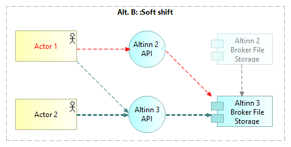
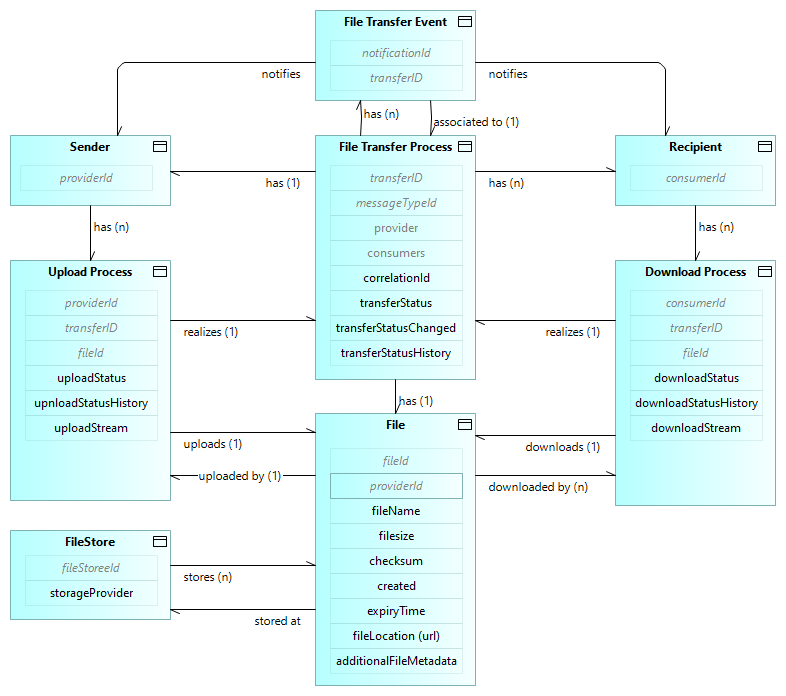

 <!-- info -->

Løsningsarkitekturen beskrevet her er grunnarkitekturen for Altinn Broker, 
slik den er relevant for de grunnleggende brukstilfellene av styrte filoverføringer. 
Ytterligere beskrivelser av løsningsarkitekturen relatert til avanserte brukstilfeller 
og mulige fremtidige utvidelser vil bygge på denne grunnarkitekturen.



<!--
  
-->

## Arkitekturprinsipper

### Overordnede arkitekturprinsipper for digitalisering av offentlig sektor

[Overordnede arkitekturprinsipper for digitalisering av offentlig sektor](https://www.digdir.no/digital-samhandling/overordnede-arkitekturprinsipper/1065>) 
i Norge skal være en støtte til arbeid med virksomhetsarkitektur og bidra til økt samhandlingsevne på tvers av virksomheter og sektorer.
Disse prinsippene gjelder.

### General Altinn 3 Architecture Principles

[Altinn 3 arkitekturprinsipper ](/principles) gjelder.

<!--
### Architecture Principles for Messaging and Data Sharing

Altinn 3 Broker is one of several Digdir products within the product groups for 
Messaging and Data Sharing. 
Architecture principles for these product groups are under construction.
-->

### Ytterligere betraktninger

Altinn 3 Formidling er ett av flere Digdir-produkter innen områdene meldingsutveksling og datadeling.
Tilpassede arkitekturprinsipper for disse områdene er under utvikling.
I påvente av arkitekturprinsipper for de relevante produktområdene,
følger her noen betraktninger for løsningsarkitekturen til Altinn 3 Broker.

__Støtte for lokal hosting og datalagring.__
Grunnet bekymringer knyttet til informasjonssikkerhet, 
kan noen kunder og brukere ha problemer med å akseptere hosting eller lagring på en skyplattform valgt av Altinn.
Løsningsarkitekturen bør derfor tillate lokal hosting og lagring for kunder og brukere som ønsker det.

__Framtidssikker arkitektur__. 

* Det internasjonale landskapet av forskrifter, standarder, teknologier og løsninger
er i endring. Løsningsarkitekturen bør ta hensyn til dette, og forberede for
samsvar, samhandling og gjenbruk.
Eksempler:
[Semantisk web](https://en.wikipedia.org/wiki/Semantic_Web),
[lenkede data](https://en.wikipedia.org/wiki/Linked_data),
[selvstyrt identitet](https://en.wikipedia.org/wiki/Self-sovereign_identity) og
 ["verifiable credentials"](https://en.wikipedia.org/wiki/Verifiable_credentials).

* __Etterlevelse av EU-regler og -standarder__. 
Europeiske regler og standarder for datadeling vil gjelde for Norge i de kommende årene.
Etterlevelse vil være påkrevd, og  samhandling vil være essensielt for grensekryssende verdikjeder.
Se f.eks. [Digdirs oversikt over EU-regelverk om deling og bruk av data](https://www.digdir.no/datadeling/oversikt-over-eu-regelverk-om-deling-og-bruk-av-data/3251)
og [Data Spaces Support Center om "Regulatory Compliance"](https://dssc.eu/space/BVE/357074696/Regulatory+Compliance)

<!--
* Multi-channel and omni-channel support
-->

## Overordnet løsningsarkitektur - byggeklosser

Følgende figur gir en oversikt over byggeklossene i overordnet løsningsarktitektur for Altinn 3 Formidling.

Dette diagrammet bygger videre på 
[den overordnede kontekstoversikten](../basic-concepts#kontekstoversikt---aktører-og-informasjonsflyt) 
ved å angi de viktigste Digdir-løsningene.

<!--
[context diagram](../../1.%20Introduction/image2.png) of 
the [introduction](../../1.%20Introduction/_index.en.md) by indicating the involved building blocks. 
-->

Applikasjonskomponenter i form av Digdir-løsninger (på høyre side) realiserer funksjonaliteten 
som indikert av  applikasjonstjenestene (nederst).
Den eksakte tilordningen mellom tjenester og komponenter er ikke vist i dette høynivådiagrammet.

Generelle beskrivelser av hver av disse applikasjonskomponentene  gitt andre steder. 
Her gis et sammendrag av hvordan disse komponentene forholder seg til og tjener Altinn 3 Broker:

* [ID-porten](https://www.digdir.no/felleslosninger/id-porten/864): Autentisering av menneskelige sluttbrukere.
* [Maskinporten](https://www.digdir.no/felleslosninger/maskinporten/869): Autentisering og autorisering av 
  maskiner (sluttbrukersystemer). Autorisasjonsfunksjonene realiseres i samarbeid med Altinn-autorisasjonskomponenten.
* [Altinn Authorization](../../authorization/). Registrer tjenesteressurser og autoriser tilgang.
* Altinn Notifications. Varsler til menneskelige sluttbrukere via e-post og SMS.
* Altinn Events. Varsler til webhooks i sluttbrukersystemer.
* [Altinn Studio](../../altinn-studio/). Applikasjoner og brukergrensesnitt for selvbetjeningskonfigurasjon av løsningene.
* Altinn Billing. Fakturering av kunder.

## Transition Architecture - Altinn 2 to Altinn 3

### General
Two migration options are supported for migration of Altinn Broker services - 
_hard shift_ and _soft switch_.

### Hard shift from Altinn 2 to Altinn 3 for all users of a service

 With the _Hard shift_ option, all users and End User Systems make a coordinated shift to Altinn 3. 

This option is recommended in cases where such a   coordinated shift is feasible. No transition solution is needed and all features of Altinn 3 may be used 
as soon as the shift has been made.

Uploaded files are stored om Altinn 2 Broker File Storage up until the shift. 

_Note: In this case, it is assumed that Altinn 2 Broker files have been purged 
and are not needed in Altinn 3 Broker. 
However, if required, it will be possible to move files from Altinn 2 to Altinn 3 Broker File Storage after the transition._

### Soft shift from Altinn 2 to Altinn 3

With the _Soft shift_ option, users and End User Systems shift to Altinn 3 on an
individual basis, when ready. 
The transition solution bridges between Altinn 2 and Altinn 3.

During the transition period, uploaded files will always be stored on Altinn 3 Broker Storage.

<!--
### Solution Details

#### Solution for uploading to Altinn 3 via Altinn 2
TBD by Ragnar?

#### Solution for downloading Altinn 3 files to Altinn 2
TBD by Ragnar?
-->

## File storage

Broker File Storage is based MS Azure Blob Storage.

Stored Files are always encrypted; ref. [Azure Storage encryption for
data at rest \| Microsoft
Learn](https://learn.microsoft.com/en-us/azure/storage/common/storage-service-encryption).

## Metadata storage

The following information model details the
[conceptual information model under basic concepts](../basic-concepts#konseptuell-informasjonsmodell).

## Addressing and Routing

The basic Altinn 3 Broker adressing amd routing mechanisms are:

* Specific adressing of recipients
* Addressing via subscription

_Note: Further adressing capabilities are considered, including criteria based om role, service and context._

### Specific adressing of recipients
TBD.

### Addressing via subscription
TBD.

## Notifications

### Notifications to human end users

Notifications to human recipients are supported by e-mail and sms, 
see Altinn Notifications.

### Notifications to End User Systems

End User Systems may register custom webhooks for receiving events; see Altinn Events.

See [the Altinn 3 Broker OpenAPI specification](https://github.com/Altinn/altinn-broker/blob/main/altinn-broker-v1.json) 
for the evnets 

<!-- 
Erik: The specific events supported, ref. the Broker OpenAPI...
-->

## API Management

Azure API Management (APIM) plays a vital role in enhancing the security, management, and operational insights of Altinn API's. By placing APIM in front of the broker service, we can leverage a range of capabilities to ensure secure, efficient, and scalable file transfer operations. We run on an APIM instance that is shared with other platform services in Altinn.

## Logging and Monitoring
TBD

## Clearing and Billing
TBD

## Security Controls

 <!-- info -->
The documentation of security contols is work in progress


### Authentication and Authorization

TBD: Maskinporten and Altinn Authorization...

### Checksum

TBD

### Virus check

When a file is uploaded to Broker, it undergoes a scan by Microsoft Defender Antivirus. 
If no viruses are detected, the file is promptly published and made available for download by recipients. However, in cases where a virus is found or the scan fails, the file is removed, and the transfer status is updated to provide detailed information regarding the scan failure.

### In-transit protection

Encrypted file transfers with TLS/HTTPS.

### At rest protection

Encrypted Broker File Storage; ref. [Azure Storage encryption for data
at rest \| Microsoft
Learn](https://learn.microsoft.com/en-us/azure/storage/common/storage-service-encryption).

Encrypted Broker Metadata Storage, Metadata storage using the PostgreSQL Database. Details TBD.

TBD: Specific encryption solution... firewall,  V-net... 

### Alternative file storage solutions

TBD

### DDoS attack prevention

DDoS attack prevention via Azure API Management.

### Hosting

Private cloud hosting

On-premises hosting

### Coding practices

TBD Open source

### Key Vault

Azure Key Vault, Private keys, internals... identities (hidden tokens); secrets,  Altinn authentication

### Penetration testing

TBD

## Further Solution Resources

