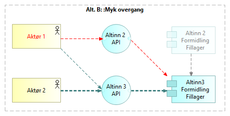
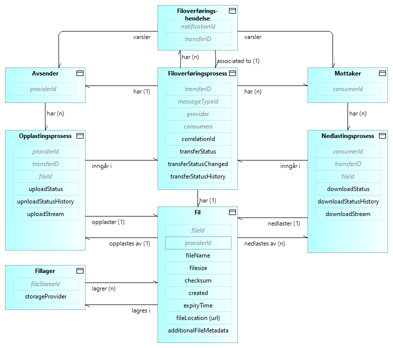

 <!-- info -->

Løsningsarkitekturen beskrevet her er grunnarkitekturen for Altinn Broker, 
slik den er relevant for de grunnleggende brukstilfellene av styrte filoverføringer. 
Ytterligere beskrivelser av løsningsarkitekturen relatert til avanserte brukstilfeller 
og mulige fremtidige utvidelser vil bygge på denne grunnarkitekturen.



<!--
  
-->

## Arkitekturprinsipper

### Overordnede arkitekturprinsipper for digitalisering av offentlig sektor

[Overordnede arkitekturprinsipper for digitalisering av offentlig sektor](https://www.digdir.no/digital-samhandling/overordnede-arkitekturprinsipper/1065>) 
i Norge skal være en støtte til arbeid med virksomhetsarkitektur og bidra til økt samhandlingsevne på tvers av virksomheter og sektorer.
Disse prinsippene gjelder.

### General Altinn 3 Architecture Principles

[Altinn 3 arkitekturprinsipper ](/principles) gjelder.

<!--
### Architecture Principles for Messaging and Data Sharing

Altinn 3 Broker is one of several Digdir products within the product groups for 
Messaging and Data Sharing. 
Architecture principles for these product groups are under construction.
-->

### Ytterligere betraktninger

Altinn 3 Formidling er ett av flere Digdir-produkter innen områdene meldingsutveksling og datadeling.
Tilpassede arkitekturprinsipper for disse områdene er under utvikling.
I påvente av arkitekturprinsipper for de relevante produktområdene,
følger her noen betraktninger for løsningsarkitekturen til Altinn 3 Broker.

__Støtte for lokal hosting og datalagring.__
Grunnet bekymringer knyttet til informasjonssikkerhet, 
kan noen kunder og brukere ha problemer med å akseptere hosting eller lagring på en skyplattform valgt av Altinn.
Løsningsarkitekturen bør derfor tillate lokal hosting og lagring for kunder og brukere som ønsker det.

__Framtidssikker arkitektur__. 

* Det internasjonale landskapet av forskrifter, standarder, teknologier og løsninger
er i endring. Løsningsarkitekturen bør ta hensyn til dette, og forberede for
samsvar, samhandling og gjenbruk.
Eksempler:
[Semantisk web](https://en.wikipedia.org/wiki/Semantic_Web),
[lenkede data](https://en.wikipedia.org/wiki/Linked_data),
[selvstyrt identitet](https://en.wikipedia.org/wiki/Self-sovereign_identity) og
 ["verifiable credentials"](https://en.wikipedia.org/wiki/Verifiable_credentials).

* __Etterlevelse av EU-regler og -standarder__. 
Europeiske regler og standarder for datadeling vil gjelde for Norge i de kommende årene.
Etterlevelse vil være påkrevd, og  samhandling vil være essensielt for grensekryssende verdikjeder.
Se f.eks. [Digdirs oversikt over EU-regelverk om deling og bruk av data](https://www.digdir.no/datadeling/oversikt-over-eu-regelverk-om-deling-og-bruk-av-data/3251)
og [Data Spaces Support Center om "Regulatory Compliance"](https://dssc.eu/space/BVE/357074696/Regulatory+Compliance)

<!--
* Multi-channel and omni-channel support
-->

## Overordnet løsningsarkitektur - byggeklosser

Følgende figur gir en oversikt over byggeklossene i overordnet løsningsarktitektur for Altinn 3 Formidling.

Dette diagrammet bygger videre på 
[den overordnede kontekstoversikten](../basic-concepts#kontekstoversikt---aktører-og-informasjonsflyt) 
ved å angi de viktigste Digdir-løsningene.

<!--
[context diagram](../../1.%20Introduction/image2.png) of 
the [introduction](../../1.%20Introduction/_index.en.md) by indicating the involved building blocks. 
-->

Applikasjonskomponenter i form av Digdir-løsninger (på høyre side) realiserer funksjonaliteten 
som indikert av  applikasjonstjenestene (nederst).
Den eksakte tilordningen mellom tjenester og komponenter er ikke vist i dette høynivådiagrammet.

Generelle beskrivelser av hver av disse applikasjonskomponentene  gitt andre steder. 
Her gis et sammendrag av hvordan disse komponentene forholder seg til og tjener Altinn 3 Broker:

* [ID-porten](https://www.digdir.no/felleslosninger/id-porten/864): Autentisering av menneskelige sluttbrukere.
* [Maskinporten](https://www.digdir.no/felleslosninger/maskinporten/869): Autentisering og autorisering av 
  maskiner (sluttbrukersystemer). Autorisasjonsfunksjonene realiseres i samarbeid med Altinn-autorisasjonskomponenten.
* [Altinn Authorization](../../authorization/). Registrer tjenesteressurser og autoriser tilgang.
* Altinn Notifications. Varsler til menneskelige sluttbrukere via e-post og SMS.
* Altinn Events. Varsler til webhooks i sluttbrukersystemer.
* [Altinn Studio](../../altinn-studio/). Verktøy for utvikling av digitale tjenester for innbyggere og virksomheter. Brukes også til applikasjoner og brukergrensesnitt for selvbetjent konfigurasjon av løsningskomponenenter i Altinn.

<!-- * Altinn Fakturering. Fakturering av kunder. -->

## Overgangsarkitektur - Altinn 2 til Altinn 3

### Generelt
To migreringsalternativer støttes for migrering av Altinn Broker-tjenester -
_hard overgang_ og _myk overgang_.

### Hard overgang fra Altinn 2 til Altinn 3 for alle brukere av en tjeneste

Med alternativet _Hard overgang_ må alle brukere og sluttbrukersystemer gjøre en koordinert og samtidig overgang til Altinn 3.

Dette alternativet anbefales i tilfeller hvor en slik koordinert overgang er gjennomførbar. 
Ingen overgangsløsning er nødvendig, 
og alle funksjoner i Altinn 3 kan brukes så snart overgangen er gjennomført.

Opplastede filer lagres i Altinn 2 Formidling Fillager frem til overgangen.

_Merk: I dette tilfellet antas det at filer fra Altinn 2 Broker er slettet
og ikke behøves i Altinn 3 Broker.
Hvis nødvendig, vil det likevel være mulig å flytte filer 
fra Altinn 2 til Altinn 3 Broker Fillager etter overgangen._

### Myk overgang fra Altinn 2 to Altinn 3

Med alternativet _Myk_ overgang gjør brukere og sluttbrukersystemer 
overgangen til Altinn 3 på individuell basis, når de er klare.
Overgangsløsningen fungerer som en bro mellom Altinn 2 og Altinn 3.

I overgangsperioden vil opplastede filer alltid lagres i Altinn 3 Formidling Fillager.

<!--
### Solution Details

#### Solution for uploading to Altinn 3 via Altinn 2
TBD by Ragnar?

#### Solution for downloading Altinn 3 files to Altinn 2
TBD by Ragnar?
-->

## Fillager

Altinn 3 Formidling Fillager er basert på Microsoft Azure Blob Storage.

Lagrede filer vil bestandig være krypterte; ref. [Azure Storage encryption for
data at rest \| Microsoft
Learn](https://learn.microsoft.com/en-us/azure/storage/common/storage-service-encryption).

## Metadatalager

Følgende informasjonsmodell detaljerer 
[den konseptuelle informasjonsmodellen under _grunnleggende konsepter_:](../basic-concepts#konseptuell-informasjonsmodell).

## Adressering og ruting
De grunnleggende adresserings- og ruteringsmekanismene for Altinn 3 Formidling er:

* Spesifikk adressering av mottakere
* Abonnementsbasert adressering og ruting

_Merk: Ytterligere adresseringsfunksjoner vurderes, slik som kriterier basert på rolle, tjeneste og kontekst._

### Spesifikk adressering av mottakere
TBD.

### Abonnementsbasert adressering og ruting
TBD.

## Varsling

### Varsler til menneskelige sluttbrukere

<!--  Erik 2024-04-28: 
Altinn Notifications mangler norsk oversettelse , så bruk url i stedet for relativ lenke så lenge
Relativ lenke: [Varslingskomponenten i Altinn](../../notifications/)
-->

Varsler til menneskelige sluttbrukere via e-post og sms
er realisert via [Varslingskomponenten i Altinn](https://docs.altinn.studio/notifications/).

### Varsler til sluttbrukersystemer

<!--  Erik 2024-04-28: 
Altinn Events mangler norsk oversettelse , så bruk url i stedet for relativ lenke så lenge
Relativ lenke: [Altinn Events](../../events/)
-->
Altinn Formidling baserer seg på støtten i [Altinn Events](https://docs.altinn.studio/events/)
for å sende varsler til _webhooks_ i sluttbrukersystemene.

Det må da settes opp abonnementer i [Altinn Events](https://docs.altinn.studio/events/), 
med tilgangsstyring av aktuelle tjenesteressurser i [Altinn Autorisasjon](../../authorization/).

Se også [Altinn 3 Broker OpenAPI specification](https://github.com/Altinn/altinn-broker/blob/main/altinn-broker-v1.json) 
for spesifikasjon av  hendelser som støttes av Altinn Formidling.

## API Management

[Azure API Management (APIM)](https://azure.microsoft.com/en-us/products/api-management) benyttes for skalering, operasjonell innsikt
og sikring av Altinn Formidling API-er.

Altinn Formidling kjører på en APIM-instans som deles med andre plattformtjenester i Altinn.

## Logging og monitorering
TBD

## Avregning og fakturering
TBD

## Sikkerhetskontroller {#security-controls}

 <!-- info -->
Dokumentasjonen av sikkerhetskontroller er under arbeid.


### Autentisering og Autorisasjon

TBD: Maskinporten og Altinn Autorisasjon...

### Sjekksum

TBD

### Viruskontroll

Når en fil lastes opp til Altinn Formidling, skannes den av Microsoft Defender Antivirus.
Hvis det ikke oppdages virus, publiseres filen umiddelbart 
og gjøres tilgjengelig for nedlasting av mottakere. 
Imidlertid, i tilfeller der det oppdages et virus eller skanningen mislykkes, 
fjernes filen, og overføringsstatusen oppdateres 
for å gi detaljert informasjon om skanningsfeilen.

### Beskyttelse under overføring

Krypterte filoverføringer med TLS/HTTPS.

### Beskyttelse under lagring

Kryptert lagring av filer i Altinn 3 Formidling Fillager; ref. [Azure Storage-kryptering for data
i ro \| Microsoft
Learn](https://learn.microsoft.com/en-us/azure/storage/common/storage-service-encryption).

Kryptert lagring av metadata i Altinn 3 Formidling Metadatalager...
Metadata lagring ved bruk av PostgreSQL-databasen...

TBD: Spesifikk krypteringsløsning... brannmur, V-net...

### Alternative lagringsløsninger for filer

TBD

### Forebygging av DDoS-angrep

DDoS-angrepsforebygging via Azure API Management.

### Hosting

* Privat sky-hosting
* On-premise hosting 

### Kodepraksiser

TBD  Åpen kildekode...

### Nøkkelhvelv

Azure Key Vault, Private nøkler, intern... identiteter (skjulte tokens); hemmeligheter,  Altinn autentisering

### Penetrasjonstesting

TBD

## Oversikt over relaterte  løsninger

